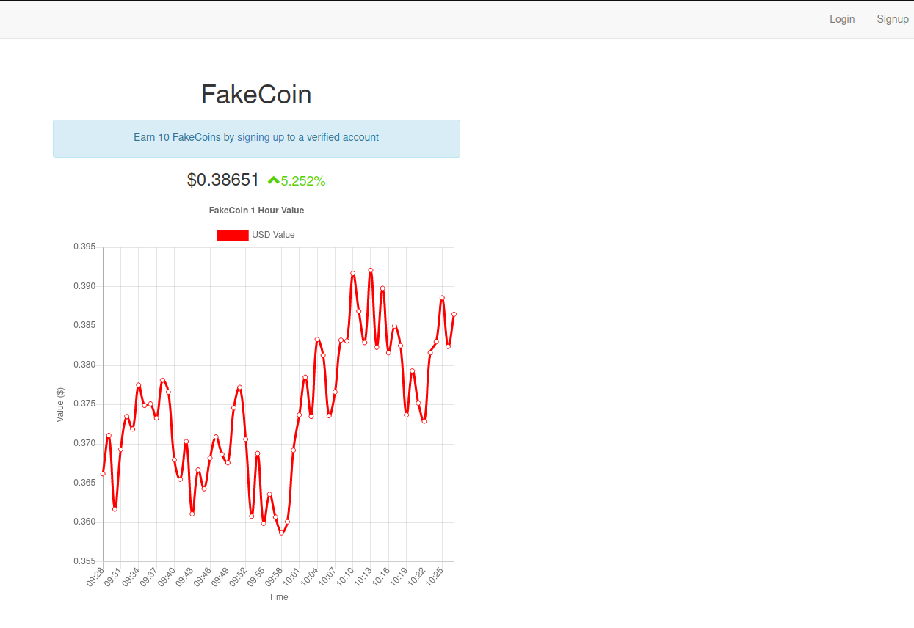
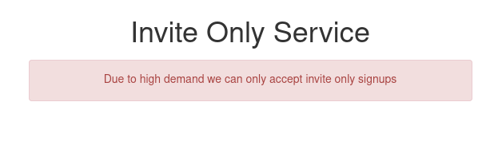
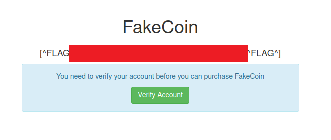
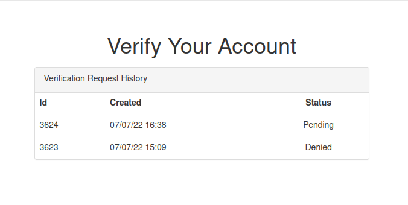
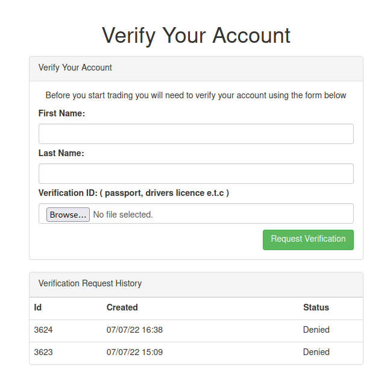
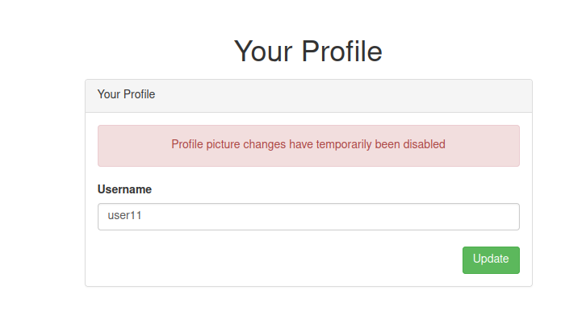

# FakeCoin

http://www.fakecoin.co.uk/ - 4 flags to find



So very quick check with assetfinder and the subdomain wordlist shows there are no known subdomains from this method. So lets focus on the main app. 

Quick content discovery gives me hits for

- assets
- dashboard - redirect to login
- dashboard/profile - redirect to login
- login
- logout
- signup

OK so assets, we can see on the main page that app.js is included wit the following contents

```javascript
function getVerification(id){
    $.getJSON('/verify/' + id + '.json',function(resp){
        let profile_picture = '/user/' + resp.user.username + '/profile.jpg';
        let confirm_link = '/verify/' + resp.user.hash + '/confirm';
        let deny_link = '/verify/' + resp.id + '/deny';
        let client_name = resp.firstname + '' + resp.lastname;
        $('div.client_name').html(client_name);
        $('img.profile_picture').attr('src',profile_picture);
        $('img.proof_picture').attr('src', resp.proof_img );
        $('a.confirm_link').attr('href',confirm_link);
        $('a.deny_link').attr('href',deny_link);
    }).fail(function(){
        alert('failed');
    });
}


function checkUsername(e){
    e.val(e.val().toLowerCase().replace(/[\W_]+/g,""));
}

$('input[name="update_frm_username"]').keyup( function(){
    checkUsername($(this));
});

$('input[name="update_frm_username"]').change( function(){
    checkUsername($(this));
});

$('input[name="signup_frm_username"]').change( function(){
    checkUsername($(this));
});

$('input[name="signup_frm_username"]').keyup( function(){
    checkUsername($(this));
});
```

One thing to note, when this script is included in the page the request is like so

```
GET /assets/app.js?_x=1656585535
```

I'm guessing the _x query param has some significance not sure what yet....

Also to note from the javascript I can deduce there is two paths which need investigation

- /verify/\<id>.json - so there must be some json files in this directory, but what format does the id take? Requires login
- /verify/<respo.user.hash>/confirm - some sort of confirm action which accepts some hash. Requires login
- /verify/<respo.id>/deny - some sort of deny action which accepts an id. Requires login
- /user/\<username>/profile.jpg - looks like users will have profile pictures

So can I create a new account via the signup page?



Apparently not!

OK ummm how about doing a user fuzz on /user/FUZZ/profile.jpg with the username wordlist we have.

I think this gives lots of false positives however, as I get thousands of 200 OK responses which leads to this profile image


And on some results I get a 404 not found response with the JSON

```
["User does not exist"]
```

I decided to study the response of the signup page again and noticed that the response had a HTML form in it before it did the redirect to invite-only

```html
<form method="post">
    <div><label>Username:</label></div>
    <div><input name="signup_frm_username" class="form-control"></div>
    <div style="margin-top:7px"><label>Password:</label></div>
    <div><input type="password" name="signup_frm_password" class="form-control"></div>
    <div style="margin-top:7px" class="text-right">
        <input type="submit" class="btn btn-success" value="Create Account">
    </div>
</form>
```

Quick POST request to signup

```
POST /signup HTTP/1.1
Host: www.fakecoin.co.uk
User-Agent: Mozilla/5.0 (X11; Linux x86_64; rv:91.0) Gecko/20100101 Firefox/91.0
Accept: text/html,application/xhtml+xml,application/xml;q=0.9,image/webp,*/*;q=0.8
Accept-Language: en-US,en;q=0.5
Accept-Encoding: gzip, deflate
Connection: close
Referer: http://www.fakecoin.co.uk/
Cookie: ctfchallenge=xxx
Upgrade-Insecure-Requests: 1
Content-Type: application/x-www-form-urlencoded
Content-Length: 53

signup_frm_username=user&signup_frm_password=password
```

Back to the login page to use these credentials and....



Flag no.1

Go through to Verify submit the details and its pending confirmation



After a minute or so it is denied



So perhaps an admin is auto denying it. Now that I'm signed in I wonder if I can confirm it myself, here's a request

```
GET /verify/3624/confirm HTTP/1.1
Host: www.fakecoin.co.uk
User-Agent: Mozilla/5.0 (X11; Linux x86_64; rv:91.0) Gecko/20100101 Firefox/91.0
Accept: text/html,application/xhtml+xml,application/xml;q=0.9,image/webp,*/*;q=0.8
Accept-Language: en-US,en;q=0.5
Accept-Encoding: gzip, deflate
Connection: close
Cookie: ctfchallenge=xxx; token=xxx
Upgrade-Insecure-Requests: 1
```

And it's response

```
HTTP/1.1 403 Forbidden
server: nginx/1.21.1
date: Thu, 07 Jul 2022 16:43:03 GMT
content-type: application/json
set-cookie: ctfchallenge=xxx; Max-Age=2592000; Path=/; domain=.fakecoin.co.uk
connection: close
Content-Length: 48

["You do not have access to view this resource"]
```

That'll be a no. OK so the confirm is just a GET request so perhaps I can inject a fake image HTML into the form which the admin will load then auto confirm, eg.

```
POST /dashboard/verify HTTP/1.1
Host: www.fakecoin.co.uk
User-Agent: Mozilla/5.0 (X11; Linux x86_64; rv:91.0) Gecko/20100101 Firefox/91.0
Accept: text/html,application/xhtml+xml,application/xml;q=0.9,image/webp,*/*;q=0.8
Accept-Language: en-US,en;q=0.5
Accept-Encoding: gzip, deflate
Content-Type: multipart/form-data; boundary=---------------------------42307343064255150259641081413
Content-Length: 451
Origin: http://www.fakecoin.co.uk
Connection: close
Referer: http://www.fakecoin.co.uk/dashboard/verify
Cookie: ctfchallenge=xxx; token=xxx
Upgrade-Insecure-Requests: 1

-----------------------------42307343064255150259641081413
Content-Disposition: form-data; name="firstname"


-----------------------------42307343064255150259641081413
Content-Disposition: form-data; name="lastname"


-----------------------------42307343064255150259641081413
Content-Disposition: form-data; name="id"; filename="test"
Content-Type: application/octet-stream


-----------------------------42307343064255150259641081413--
```

OK still denied. But the link would've been wrong anyway after checking the app.js again

```javascript
let confirm_link = '/verify/' + resp.user.hash + '/confirm';
```

I don't know what the user hash is. There's a profile screen in the dashboard where I can update my username



Taking a look at the form on the page there's a hidden field with the hash I'm looking for

```
<input type="hidden" name="user_hash" value="58NGtP9w">
```

OK let's try the trick above again

```
POST /dashboard/verify HTTP/1.1
Host: www.fakecoin.co.uk
User-Agent: Mozilla/5.0 (X11; Linux x86_64; rv:91.0) Gecko/20100101 Firefox/91.0
Accept: text/html,application/xhtml+xml,application/xml;q=0.9,image/webp,*/*;q=0.8
Accept-Language: en-US,en;q=0.5
Accept-Encoding: gzip, deflate
Content-Type: multipart/form-data; boundary=---------------------------42307343064255150259641081413
Content-Length: 451
Origin: http://www.fakecoin.co.uk
Connection: close
Referer: http://www.fakecoin.co.uk/dashboard/verify
Cookie: ctfchallenge=xxx; token=xxx
Upgrade-Insecure-Requests: 1

-----------------------------42307343064255150259641081413
Content-Disposition: form-data; name="firstname"


-----------------------------42307343064255150259641081413
Content-Disposition: form-data; name="lastname"


-----------------------------42307343064255150259641081413
Content-Disposition: form-data; name="id"; filename="test"
Content-Type: application/octet-stream


-----------------------------42307343064255150259641081413--
```

And no same issue. Also tried sending it as a link

```html
<a href="http://www.fakecoin.co.uk/verify/58NGtP9w/confirm">click me</a>
```

Same denied result.

Let's review the javascript again

```javascript
function getVerification(id){
    $.getJSON('/verify/' + id + '.json',function(resp){
        let profile_picture = '/user/' + resp.user.username + '/profile.jpg';
        let confirm_link = '/verify/' + resp.user.hash + '/confirm';
        let deny_link = '/verify/' + resp.id + '/deny';
        let client_name = resp.firstname + '' + resp.lastname;
        $('div.client_name').html(client_name);
        $('img.profile_picture').attr('src',profile_picture);
        $('img.proof_picture').attr('src', resp.proof_img );
        $('a.confirm_link').attr('href',confirm_link);
        $('a.deny_link').attr('href',deny_link);
    }).fail(function(){
        alert('failed');
    });
}
```

So it's loading some data from a json file for the ID of the verification request ID, it then uses the that data to set attributes of images and links as well as setting the html of a div with a class of client_name. It seems logical that this is the HTML the admin views to action the verification...

I suspect the firstname/lastname values come from the POST request for verification.

So because of the lines

```javascript
let client_name = resp.firstname + '' + resp.lastname;
$('div.client_name').html(client_name);
```

It SHOULD be possible to inject HTML into that div, and the `````` SHOULD do a get request as the admin to that link....