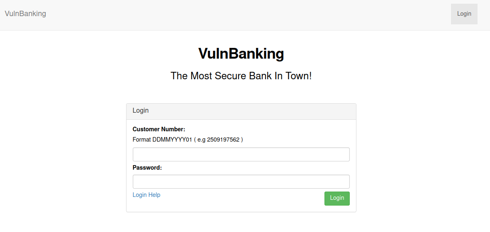
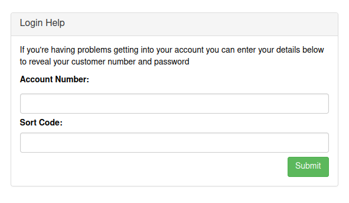

# VulnBanking

http://www.vulnbanking.co.uk - 4 flags to find



OK let's check subdomains first

```
└─$ assetfinder -subs-only vulnbanking.co.uk
vulnbanking.co.uk
hostmaster.vulnbanking.co.uk
```

OK so just the one, let's check that out later. For now just some content discovery

So doing a content fuzz on http://www.vulnbanking.co.uk/FUZZ gives the following

- /css/
- /js/
- /logout/

So not much. Just checking out the resources and links on the page however leads another couple of potential paths to check out.

First off there is inline javascript included 

```javascript
$('input.auth').click( function(){
    $.post('/api/login',{
        customer_number :   $('input[name="customer_number"]').val(),
        password        :   $('input[name="password"]').val()
    },function(resp){
        alert('Login Successful');
        window.location = '/session/' + resp.token;
    }).fail(function(){
        alert('Customer Number / Password combination invalid');
    })
});
```

And the login help link. So now I have a few extra things to check out

- /api/login - perhaps additional api endpoints to discover?
- /session/token - where token is some token received from a successful login
- /template-manager - the main style.css is loaded from this location. 
- /login-help - link on the login page

The template manager has another login form associated with it and its own app.js file

```javascript
templateManager = function (t) {
  for (ApiFire = function (t, e) {
    xhttp = new XMLHttpRequest,
    xhttp.open('POST', t, !0),
    xhttp.setRequestHeader('Content-type', 'application/x-www-form-urlencoded'),
    xhttp.send('value=' + e)
  }, ApiCall = function (t) {
    console.log(t),
    url = '/template-manager/api/set-' + t,
    v = document.getElementById('val').value,
    ApiFire(url, v)
  }, i = 0; i < t.length; i++) try {
    document.getElementById(t[i]).addEventListener('click', function (t) {
      ApiCall(t.srcElement.id.replace('btn-', ''))
    })
  } catch (t) {
  }
}(['btn-background-color',
'btn-font-type',
'btn-font-color',
'btn-font-size']);
```

OK so template manager has more API endpoints. Which I think are POST requests to the following endpoints

- /template-manager/api/set-background-color
- /template-manager/api/set-font-type
- /template-manager/api/set-font-color
- /template-manager/api/set-font-size

Lets try these eg.

```
POST /template-manager/api/set-background-color HTTP/1.1
Host: www.vulnbanking.co.uk
User-Agent: Mozilla/5.0 (X11; Linux x86_64; rv:91.0) Gecko/20100101 Firefox/91.0
Accept: text/html,application/xhtml+xml,application/xml;q=0.9,image/webp,*/*;q=0.8
Accept-Language: en-US,en;q=0.5
Accept-Encoding: gzip, deflate
Connection: close
Cookie: ctfchallenge=xxx
Upgrade-Insecure-Requests: 1
Content-Type: application/x-www-form-urlencoded
Content-Length: 13

value=red
```

With a response

```
HTTP/1.1 401 Unauthorized
server: nginx/1.21.1
date: Tue, 12 Jul 2022 16:44:09 GMT
content-type: application/json
set-cookie: ctfchallenge=xxx; Max-Age=2592000; Path=/; domain=.vulnbanking.co.uk
connection: close
Content-Length: 27

["User must be authorised"]
```

We get the same response for all apart from set-font-color which gives the following response

```
HTTP/1.1 201 Created
server: nginx/1.21.1
date: Tue, 12 Jul 2022 16:46:24 GMT
content-type: application/json
set-cookie: ctfchallenge=xxx; Max-Age=2592000; Path=/; domain=.vulnbanking.co.uk
connection: close
Content-Length: 79

{"message":"Value Set","flag":"[^FLAG^xxx^FLAG^]"}
```

There's flag no.1, disclaimer I did find the next bit first :D. Always read and understand the javascript people! :)

The login help has another form associated with it



So starting at the top of the last set of content I found and doing a fuzz on http://www.vulnbanking.co.uk/api/FUZZ, I get one additional result back

- logs

Which gives me a json array of logs

```json
[{"date":"Tue, 12 Jul 2022 14:43:24 +0000","endpoint":"\/api\/login","auth_hash":"5e6f59f4f4150be8e61eaa20bec51a75","result":"success","flag":"[^FLAG^xxx^FLAG^]"},...,...}]
```

Flag no.2 found

OK so what next? I suspect I need to find a valid customer number and password, which leads me to the login-help page.

```
If you're having problems getting into your account you can enter your details below to reveal your customer number and password
```