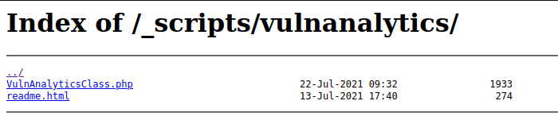
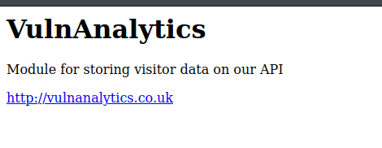
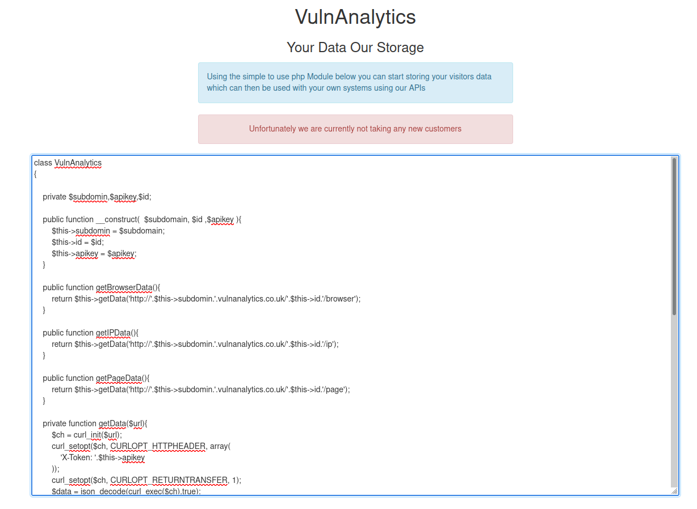
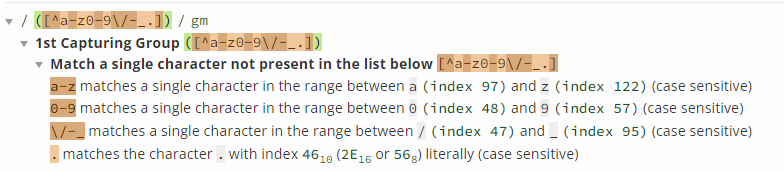
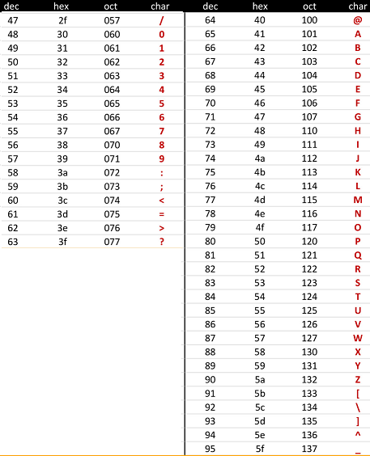

# VulnCompany

http://www.vulncompany.co.uk - 5 flags to find


Subs first

```
└─$ assetfinder -subs-only vulncompany.co.uk
vulncompany.co.uk
vulncompany.co.uk
vulncompany.co.uk
```

OK nothing there and also nothing with the subdomain wordlist. Time for some content discovery. Only one hit

- _scripts

Which gives me an index page with flag 1 and new directory to check out. Which also leads to another index page :)



VulnAnalyticsClass.php appears blank when loaded but perhaps I might be able to get the source code?

The readme.html is a link to another domain



OK so this is it



So I can immediately see that the code is talking about subdomains so lets quickly check that

```
└─$ assetfinder -subs-only vulnanalytics.co.uk
vulnanalytics.co.uk
hostmaster.vulnanalytics.co.uk
vulnanalytics.co.uk
vulnanalytics.co.uk
```

And running the subdomain wordlist mostly gives back 404 responses with the JSON

```
["Subdomain Invalid"]
```

Also content discovery does not reveal anything interesting. Let's analyse the PHP class VulnAnalytics

```php
private $subdomin,$apikey,$id;

public function __construct(  $subdomain, $id ,$apikey ){
    $this->subdomin = $subdomain;
    $this->id = $id;
    $this->apikey = $apikey;
}
```

OK so an instance of this class is constructed with a subdomain, an id and an apikey

```php
public function getBrowserData(){
    return $this->getData('http://'.$this->subdomin.'.vulnanalytics.co.uk/'.$this->id.'/browser');
}

public function getIPData(){
    return $this->getData('http://'.$this->subdomin.'.vulnanalytics.co.uk/'.$this->id.'/ip');
}

public function getPageData(){
    return $this->getData('http://'.$this->subdomin.'.vulnanalytics.co.uk/'.$this->id.'/page');
}
```

OK so on a configured subdomain there is data of some sort with the id and the paths browser, ip and page. So I'd need to know the subdomain and the id an instance of this was created with in order to get at that data.

And here's the getData method these things are calling

```php
private function getData($url){
    $ch = curl_init($url);
    curl_setopt($ch, CURLOPT_HTTPHEADER, array(
        'X-Token: '.$this->apikey
    ));
    curl_setopt($ch, CURLOPT_RETURNTRANSFER, 1);
    $data = json_decode(curl_exec($ch),true);
    return $data;
}
```

OK so this sets an X-Token header using the API key. So in order to get this data I'd also have to know the API key! It decodes the json response in a php var as an associative array, by setting the second parameter of json_decode to true.

```php
public function pageView(){
    $url = 'http://'.$this->subdomin.'.vulnanalytics.co.uk/'.$this->id.'/data';
    $data = array(
        'ip'        =>  $_SERVER["REMOTE_ADDR"],
        'page'      =>  $this->cleanInput($_SERVER["REQUEST_URI"]),
        'browser'   =>  $_SERVER["HTTP_USER_AGENT"]
    );
    $ch = curl_init($url);
    curl_setopt($ch, CURLOPT_CUSTOMREQUEST, 'POST' );
    curl_setopt($ch, CURLOPT_POSTFIELDS, http_build_query($data) );
    curl_setopt($ch, CURLOPT_HTTPHEADER, array('Content-Length: ' . strlen( http_build_query($data) )));
    curl_setopt($ch, CURLOPT_HTTPHEADER, array(
        'X-Token: '.$this->apikey
    ));
    curl_setopt($ch, CURLOPT_RETURNTRANSFER, 1);
    $response = curl_exec($ch);
    echo $response;
}
```

OK so this makes some POST request to the data path, I assume this gets called with every page view to update the analytics for the site, again need to know the subdomain, the id and the API key in order to be able to call this. The parameters for the POST are ip, page and browser. The page param is potentially interesting as it calls the cleanInput function.

```php
private function cleanInput( $str ){
    $str = preg_replace('/([^a-z0-9\/-_.])/','',$str);
    return $str;
}
```

So this strips all characters not in the range mentioned, perhaps of some further use....

In fact here's regex101.com's explanation of this regex, better than mine! :D



So the a-z, A-Z ranges are quite self explanatory, but here's some info on the index 47-95 range



Here's an example of the replace in action

```
└─$ php -a
Interactive shell

php > $s = "h,e,l,lo w+o+r+l+d";
php > echo preg_replace('/([^a-z0-9\/-_.])/','',$s);
helloworld
```

And the input being passed to this function is ```$_SERVER["REQUEST_URI"]```, so for example with a URL such as http://www.vulncompany.co.uk/_scripts/vulnanalytics/VulnAnalyticsClass.php the value of this would be /_scripts/vulnanalytics/VulnAnalyticsClass.php

Right I think I may need VulnAnalyticsClass.php, the missing info must be in there!

I'll assume that the vulncompany site is configured with this module, and every page view triggers the POST request mentioned in the function.

So does the key lie in creating some payload via the request uri of the vulncompany domain? If so how?!