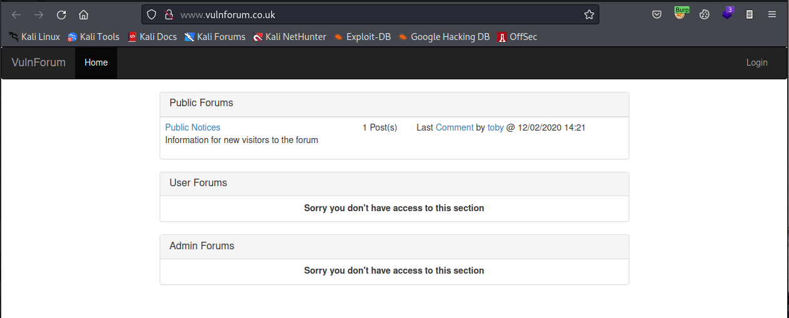
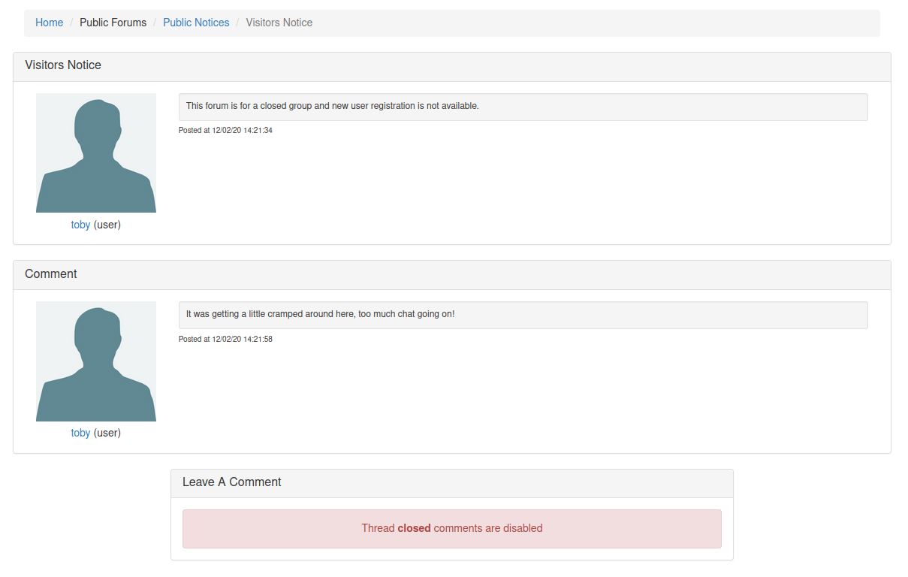
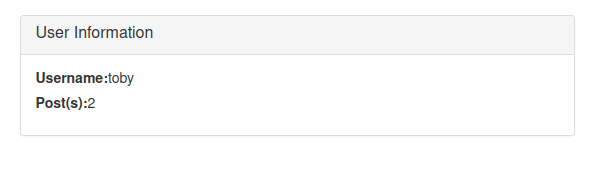
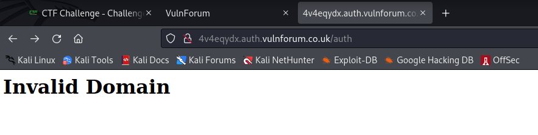
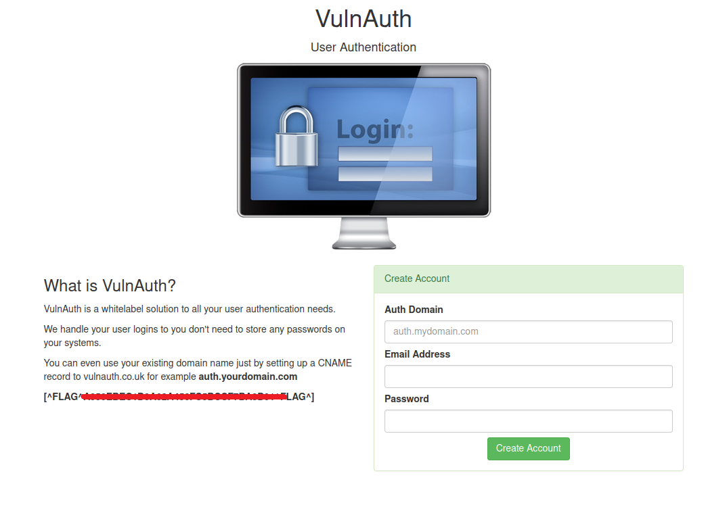
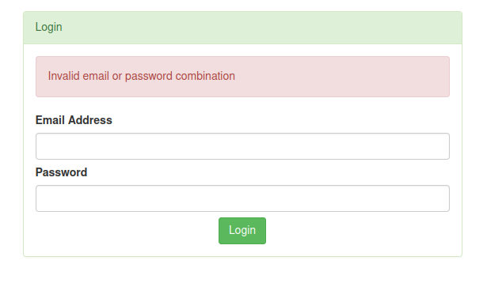

# VulnForum

http://www.vulnforum.co.uk/ - 4 flags to find

Front page shows us



Links are
- Public Notices - /1
- Comment - /1/1
- toby - /user/1ac9c036aaf12a755084dc6a326ed7f5

In order these are the pages shown






So questions:
1. Are there more hidden forums apart from public notices?
2. Are there more hidden comments in the public notices forums?
3. Are there more users than just toby?
4. What format is toby's ID? Looks like MD5 hash?

<ins>1. Are there more hidden forums apart from public notices?</ins>

I tried in the range 1-200 and only 1 returned a 200 OK response

<ins>2. Are there more hidden comments in the public notices forums?</ins>

Again going in the range 1-200 only 1 returned a 200 OK response within the public notices forum

<ins>3. Are there more users than just toby?
4. What format is toby's ID? Looks like MD5 hash?</ins>

I'll take these questions together, so yes according to the hash-id python script this is an MD5 hash. Are there more users? Not sure yet I can't seem to swap the hash for a number....

Moving on for now, there's a login page let's look at that.

Using toby as our user name we can observe this request

```
POST /login HTTP/1.1
Host: www.vulnforum.co.uk
User-Agent: Mozilla/5.0 (X11; Linux x86_64; rv:91.0) Gecko/20100101 Firefox/91.0
Accept: */*
Accept-Language: en-US,en;q=0.5
Accept-Encoding: gzip, deflate
Content-Type: application/x-www-form-urlencoded; charset=UTF-8
X-Requested-With: XMLHttpRequest
Content-Length: 36
Origin: http://www.vulnforum.co.uk
Connection: close
Referer: http://www.vulnforum.co.uk/login
Cookie: ctfchallenge=xxx

username=toby&password=&method=local
```

This is triggered by a click event on the login button

```javascript
$('.loginBtn').click( function(){

    $.post( "/login", {
        'username'  :   $('input[name="username"]').val(),
        'password'  :   $('input[name="password"]').val(),
        'method'    :   $('input[name="method"]').val(),
    },function( data ) {
        alert( data.display_msg );
        window.location.href = '/';
    }).fail(function(err){
        alert( err.responseJSON.display_msg );
    });
});
```

And the response

```
HTTP/1.1 401 Unauthorized
server: nginx/1.21.1
date: Sun, 05 Jun 2022 19:22:44 GMT
content-type: application/json
set-cookie: ctfchallenge=xxx; Max-Age=2592000; Path=/; domain=.vulnforum.co.uk
connection: close
Content-Length: 65

{"display_msg":"Invalid Username or Password","technical_msg":""}
```

Method seems a bit weird, it's a hard coded hidden input field in the HTML

```html
<input name="method" type="hidden" value="local" class="form-control">
```

Let's try changing it to remote in Burp Repeater. Here's the response

```
HTTP/1.1 403 Forbidden
server: nginx/1.21.1
date: Sun, 05 Jun 2022 19:33:06 GMT
content-type: application/json
set-cookie: ctfchallenge=xxxxxx; Max-Age=2592000; Path=/; domain=.vulnforum.co.uk
connection: close
Content-Length: 187

{"display_msg":"Server Error","technical_msg":"Server \"http:\/\/4v4eqydx.auth.vulnforum.co.uk\/auth\" responded with a 404 error","flag":"[^FLAG^XXXXXXXXXXXXXXXXX^FLAG^]"}
```

Wooo that's flag no. 1 done :)

It also revealed a hidden subdomain with a path ```http://4v4eqydx.auth.vulnforum.co.uk/auth``` let's visit that



OK, well it responded with content so it can't be that invalid surely? Let's try some content discovery from the root path.

Whilst that runs in the background I decided to check the subdomains via assetfinder

```
└─$ assetfinder -subs-only vulnforum.co.uk  
www.vulnforum.co.uk
vulnforum.co.uk
vulnforum.co.uk
vulnforum.co.uk
*.www.vulnforum.co.uk
auth.vulnforum.co.uk
*.vulnforum.co.uk
vulnforum.co.uk
*.www.vulnforum.co.uk
```

So auth is on there, but it doesn't respond. I should probably try fuzzing the subdomain such as ```FUZZ.auth.vulnforum.co.uk```

Yeah the content discovery at the root of the 'invalid domain' returned nothing so lets start the subdomain fuzz...

Nope nothing. OK let's attempt content discovery again this time from ```4v4eqydx.auth.vulnforum.co.uk/auth/FUZZ```

Again nothing...

OK let's step back take a closer look at that ```4v4eqydx.auth.vulnforum.co.uk``` subdomain. Let's check it with the host command

```
└─$ host 4v4eqydx.auth.vulnforum.co.uk
4v4eqydx.auth.vulnforum.co.uk is an alias for vulnauth.co.uk.
vulnauth.co.uk has address 68.183.255.206
```

Ahhh a new domain entirely, let's check it!

Yay finally! Have flag no.2



Playing around with the form so far I always receive an error in the validation

```html
<div class="alert alert-danger" role="alert">
    <p>domain name has already been registered </p>
    <p>Email address is already signed up </p>
</div>
```

OK let's do some more subdomain enumeration on our new domain

```
└─$ assetfinder -subs-only vulnauth.co.uk 
vulnauth.co.uk
admin.vulnauth.co.uk
hostmaster.vulnauth.co.uk
```

So hostmaster gives me the same 'invalid domain' response I've seen before, but admin presents me with a redirect to a login screen



I don't have any email addresses to try yet!