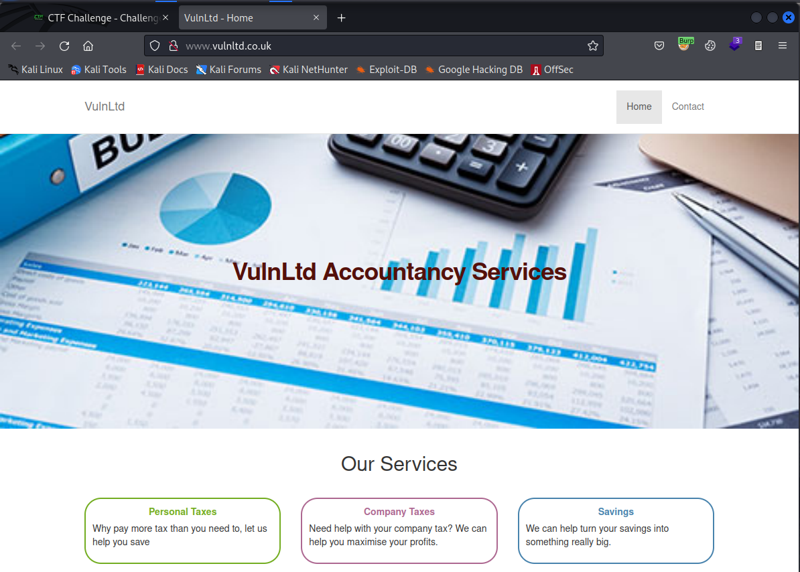
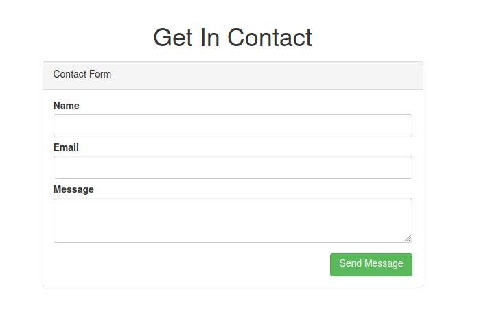
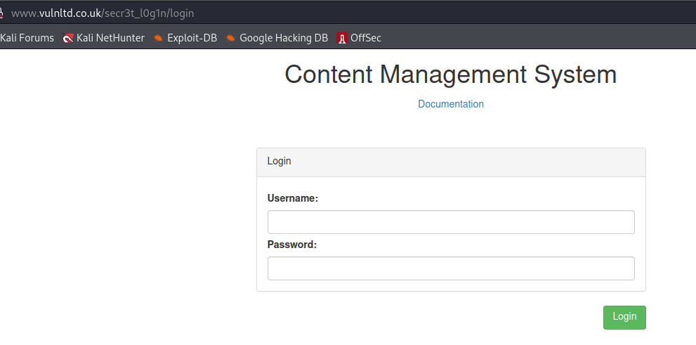
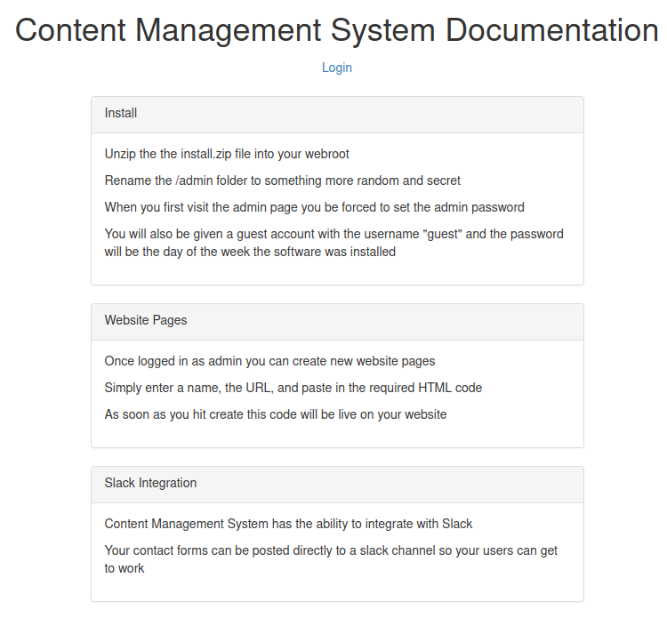
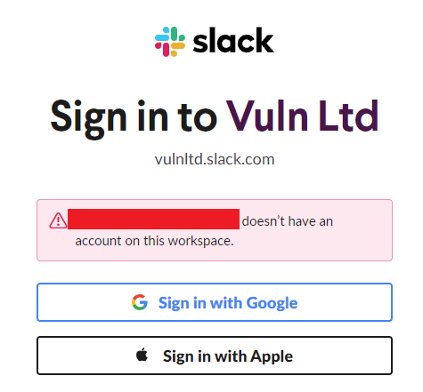
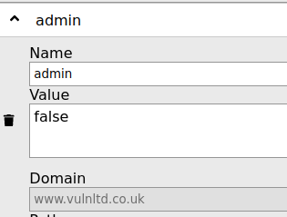
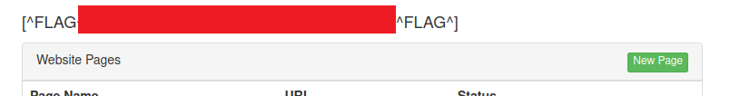

# VulnLtd

http://www.vulnltd.co.uk/ - 7 flags to find



So this is the front page, not a lot, no custom js just jQuery and Bootstrap and a link to a contact page.

Which has a form



Which when you submit the form we get a message back saying

```
Your slack token has expired
```

Note there's nothing in the request that looks like a token

```
POST /contact HTTP/1.1
Host: www.vulnltd.co.uk
User-Agent: Mozilla/5.0 (X11; Linux x86_64; rv:91.0) Gecko/20100101 Firefox/91.0
Accept: text/html,application/xhtml+xml,application/xml;q=0.9,image/webp,*/*;q=0.8
Accept-Language: en-US,en;q=0.5
Accept-Encoding: gzip, deflate
Content-Type: application/x-www-form-urlencoded
Content-Length: 31
Origin: http://www.vulnltd.co.uk
Connection: close
Referer: http://www.vulnltd.co.uk/contact
Cookie: ctfchallenge=xxx
Upgrade-Insecure-Requests: 1

name=sss&email=sss&message=ssss
```

OK fine lets start the usual enumeration starting with any subdomains we might find.

Nothing with assetfinder

```
└─$ assetfinder -subs-only vulnltd.co.uk
vulnltd.co.uk
vulnltd.co.uk
vulnltd.co.uk
```

So lets use the subdomain wordlist. And..... I get a hit with support.vulnltd.co.uk

Which gives me some support ticket search form


Which just tells me could not find ticket when it's submitted, this is the request which gets sent

```
POST / HTTP/1.1
Host: support.vulnltd.co.uk
User-Agent: Mozilla/5.0 (X11; Linux x86_64; rv:91.0) Gecko/20100101 Firefox/91.0
Accept: text/html,application/xhtml+xml,application/xml;q=0.9,image/webp,*/*;q=0.8
Accept-Language: en-US,en;q=0.5
Accept-Encoding: gzip, deflate
Content-Type: application/x-www-form-urlencoded
Content-Length: 14
Origin: http://support.vulnltd.co.uk
Connection: close
Referer: http://support.vulnltd.co.uk/
Cookie: ctfchallenge=xxx
Upgrade-Insecure-Requests: 1

ticket_ref=sss
```

OK I'm going to leave this for now and come back to it. Time to do some content discovery with fuzzing on www.vulnltd.co.uk/FUZZ

And yup get a hit with robots.txt

```
User-agent: *
Disallow: /secr3t_l0g1n/


# [^FLAG^XXX^FLAG^]
```

Flag 1 :). The secret path takes me through to this login form



The docs give me some info to look at



OK so lets login to the CMS as guest with a password which is probably monday-sunday :D

And yes, 'tuesday' gets me in


Clicking on one of the links which takes the format /page/x (where x is a number) just tells me

```
Guest users cannot edit pages
```

I have a similar issue if I click on the new page link

```
Guest users cannot create pages
```

And trying to sign in to the slack workspace with my own account just tells me no



However... look at this cookie!



Change it to true and I get another flag (no. 2) when I refresh the page :)



I can now edit and create pages, having a look at the draft contact page I can spot some PHP code at the top which is interesting

```php
<?php
/**
 * We've dropped slack for receiving contact messages for the website and we're only going to use it for company communications only.
 * This will now send an to email start-ticket@vulnltd.co.uk which will create a support ticket which links in with our support desk app.
 */
$sent_message = false;
$message_error = false;
if( isset($_POST["name"],$_POST["email"],$_POST["message"]) ){
    $sent_message = true;
    try{
        $message = \Model\Email::send('start-ticket@vulnltd.co.uk',$_POST["email"], 'Support Message', 'Name: '.$_POST["name"].' Message: '.$_POST["message"]  );
    }catch (Exception $e ){
        $message_error = 'Error sending Email';
    }
}
?>
```

Tried sending an email from my gmail to this address thinking I might get an email back with some reference, but nothing...

Also if I try to update the contents of the page I get the message

```
Web service does not have writable access to that directory
```

Same message when trying to create a new page. 

There's nothing obvious in the request which could indicate I can control the directory eg.

```
POST /secr3t_l0g1n/page/new HTTP/1.1
Host: www.vulnltd.co.uk
User-Agent: Mozilla/5.0 (X11; Linux x86_64; rv:91.0) Gecko/20100101 Firefox/91.0
Accept: text/html,application/xhtml+xml,application/xml;q=0.9,image/webp,*/*;q=0.8
Accept-Language: en-US,en;q=0.5
Accept-Encoding: gzip, deflate
Content-Type: application/x-www-form-urlencoded
Content-Length: 54
Origin: http://www.vulnltd.co.uk
Connection: close
Referer: http://www.vulnltd.co.uk/secr3t_l0g1n/page/new
Cookie: ctfchallenge=xxx=; token=80e779b9be92a08349c06ed7b2fd9d22; user_id=2; admin=true
Upgrade-Insecure-Requests: 1

name=testing&url=%2Ftesting&html=%3Ch1%3Ehi%3C%2Fh1%3E
```

Removing the name parameter from the request does appear to remove the error message but there is also no sign of a success either. Inserting path traversal strings as a value for name still results in the same error message.

The paths available to us under /secr3t_l0g1n are as follows

- /docs
- /page/1
- /page/2
- /page/3
- /page/new

Also interesting is we have a cookie called 'user_id', which is set to 2 after signing in as guest. Removing the cookie will prompt a redirect to the login page, but the value can be blank or seemingly any other value and it will still serve the same pages....

I might be done here, time to turn my focus back to the support subdomain.

So quick reminder the support page has a form which takes a parameter called ticket_ref, we don't know of any tickets or even the format of the reference to fuzz it.

Tried a fuzz on http://support.vulnltd.co.uk/FUZZ, nothing interesting

- /css/
- /js/

Hmmm emailing 'start-ticket@vulnltd.co.uk' felt like it was going to give me something!?!