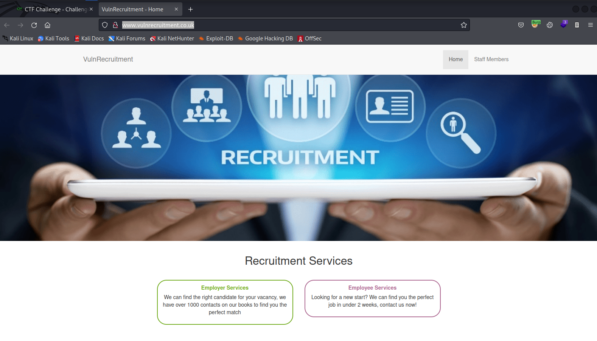

# VulnRecruitment

http://www.vulnrecruitment.co.uk/ - 4 flags to find

Front page



I think i'll start with some subdomain enumeration and then come back to the main app and do content discovery etc.

```
└─$ assetfinder -subs-only vulnrecruitment.co.uk
b38f1-uploads.vulnrecruitment.co.uk
vulnrecruitment.co.uk
vulnrecruitment.co.uk
vulnrecruitment.co.uk
```

OK let's quickly check the subdomain we found


Nice easy one there, flag no.1. Note the "google search" link could be an open re-direct to use later.

```http://b38f1-uploads.vulnrecruitment.co.uk/redirect?url=https://www.google.com```

Whilst I'm looking at subdomain enumeration I might as well check if I get any hits with the wordlist.

And yes looks like admin is also a subdomain


OK let's do what I said and go back and do some content discovery on the main domain first. So I didn't find anything beyond the staff path which is linked on the main page


The view profile buttons link to 

- /staff/1
- /staff/2
- /staff/4

Interesting what happened to 3?


OK disgruntled ex employee perhaps?

What's also strange is how employee images are retrieved

```
GET /staff/2/image?id=0fbbd14791d5032e57cb38013a08c791 HTTP/1.1
Host: www.vulnrecruitment.co.uk
User-Agent: Mozilla/5.0 (X11; Linux x86_64; rv:91.0) Gecko/20100101 Firefox/91.0
Accept: image/webp,*/*
Accept-Language: en-US,en;q=0.5
Accept-Encoding: gzip, deflate
Connection: close
Referer: http://www.vulnrecruitment.co.uk/staff/2
Cookie: ctfchallenge=xxx
```

The ID is also a bit weird, it's an MD5 hash which crackstation can match to a timestamp string of '11:18'. Is this relevant?

- /staff/1 - 955dc852b26e9375c7b7858b438f80f6 = 03:28
- /staff/2 - 0fbbd14791d5032e57cb38013a08c791 = 11:18
- /staff/4 - 33379393610f7c99f05c85f9f92deaef = 19:33

Let's try changing the ID to one which won't exist

```
GET /staff/2/image?id=xxx HTTP/1.1
Host: www.vulnrecruitment.co.uk
User-Agent: Mozilla/5.0 (X11; Linux x86_64; rv:91.0) Gecko/20100101 Firefox/91.0
Accept: image/webp,*/*
Accept-Language: en-US,en;q=0.5
Accept-Encoding: gzip, deflate
Connection: close
Referer: http://www.vulnrecruitment.co.uk/staff/2
Cookie: ctfchallenge=xxx
```

Oooo look at that, our previously discovered subdomain domain is mentioned in the response!

```
HTTP/1.1 200 OK
server: nginx/1.21.1
date: Tue, 07 Jun 2022 14:17:06 GMT
content-type: image/jpeg
set-cookie: ctfchallenge=xxx; Max-Age=2592000; Path=/; domain=.vulnrecruitment.co.uk
connection: close
Content-Length: 87

404 - Resource (http://b38f1-uploads.vulnrecruitment.co.uk/uploads/2_xxx.jpg) not found
```

So the direct link to Archie's picture would be ```http://b38f1-uploads.vulnrecruitment.co.uk/uploads/2_0fbbd14791d5032e57cb38013a08c791.jpg```

I suspect whoever employee no.3 is, still has stuff in here!

In the meantime I've also done content fuzzing against ```b38f1-uploads.vulnrecruitment.co.uk/FUZZ``` and ```admin.vulnrecruitment.co.uk/FUZZ```