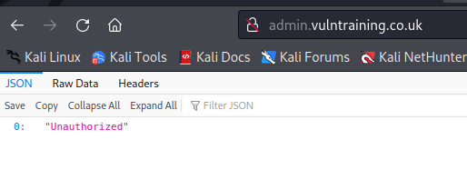
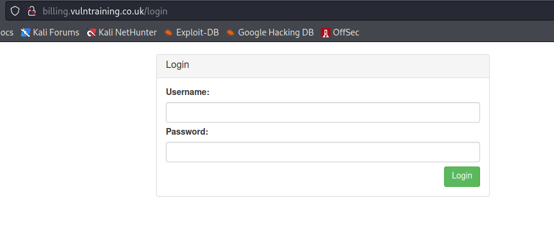
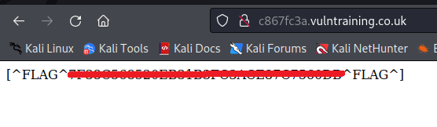
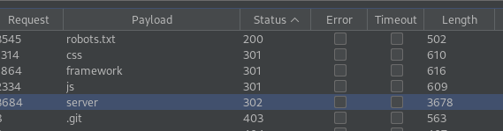
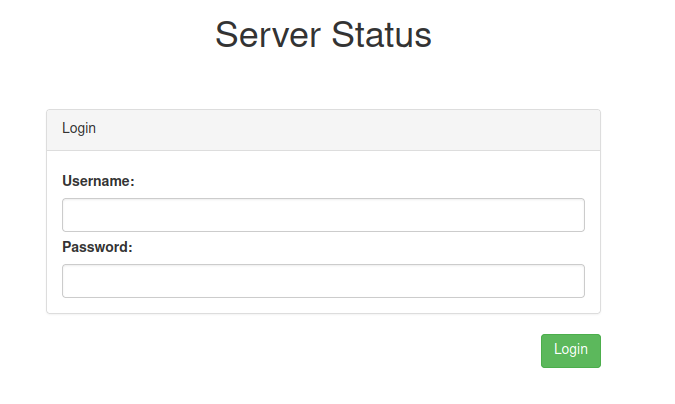
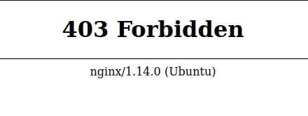

# VulnTraining

http://www.vulntraining.co.uk/ - 11 flags to find

Front page


Quick inspection of the HTML and I spot flag no.5 straight away!

```html
<meta name="flag" content="[^FLAG^XXXX^FLAG^]">
```

Quick use of assetfinder and there are 3 subdomains 

```
└─$ assetfinder -subs-only vulntraining.co.uk
vulntraining.co.uk
admin.vulntraining.co.uk
billing.vulntraining.co.uk
c867fc3a.vulntraining.co.uk
vulntraining.co.uk
vulntraining.co.uk
```

admin



billing



c867fc3a - flag no.1



OK let's start with content discovery at the root domain. This brings back a few interesting results



.git and framework just give the standard nginx 403 forbidden page. 

robots.txt reveals a hidden directory

```
User-agent: *
Disallow: /s3cr3T_d1r3ct0rY/
```

Which gives me a flag (no.2)

```
[^FLAG^xxx^FLAG^]
```

server gives me a 301 redirect to /server/login



BUT if I study the content of the response from /server before it does the redirect. It has flag no.4

```html
<h3 class="text-center">[^FLAG^xxx^FLAG^]</h3>
```

And a 'secret' link

```html
<a href="http://vulntraining.co.uk/php-my-s3cret-admin">http://vulntraining.co.uk/php-my-s3cret-admin</a>
```

Which takes you through to a phpMyAdmin portal, default credentials do not work.

I can also see the following technical details

- nginx v 1.16.1 ports 80 + 443
- php v 7.2.24 - /var/run/php/php7.2-fpm.sock
- mysql v 8.0

Next to do a fuzz on the framework location so www.vulntraining.co.uk/framework/FUZZ and we have

- /framework/controllers/ - 403 nginx page
- /framework/models/ - 403 nginx page
- /framework/routes/ - 403 nginx page
- /framework/templates/ - 403 nginx page

All of which still give the nginx 403 page, will fuzz further.

- /framework/controllers/FUZZ - nothing
- /framework/models/FUZZ - nothing
- /framework/routes/FUZZ - nothing
- /framework/templates/FUZZ - nothing

Whilst the fuzzing was happening I by chance noticed that the background image for the page is specified in the CSS of the page

```
div.headerinto {
    background-image: url('https://vulntraining.s3.eu-west-2.amazonaws.com/assets/heading.jpg');
    background-size: cover;
    background-position: bottom;
    background-repeat: no-repeat;
}
```

An S3 bucket with a flag.txt in it! (no. 3)

```
[^FLAG^xxx^FLAG^]
```

I should cover off the /server/FUZZ path fuzzing too

- /server/login - already known

Another quick check of the .git path shows me the 403 page of nginx



The version is different 1.14.0 other pages have shown 1.18.0. A quick google suggests that this version could be vulnerable to HTTP request smuggling!