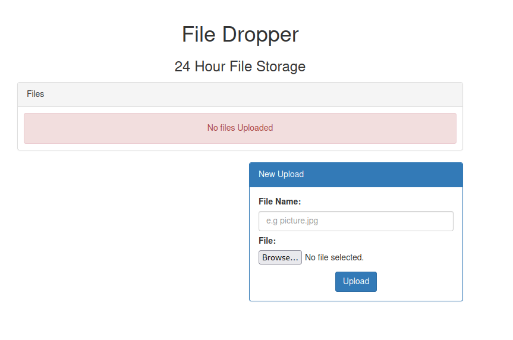

# Y2FuIHlvdSByZWNvbj8/

https://ctf.hacker101.com/ctf/start/247

So this challenge has an interesting name, what's that in Base64?

```
can you recon??
```

Lets' find out! So the main page seems to have this with some upload functionality



OK so what happens when I upload some text file


OK the request worked but it's not appearing in the list of files table, hmmm what does Burp say about the request?

```
POST / HTTP/2
Host: xxx.ctf.hacker101.com
Cookie: _ga=GA1.2.2088535546.1649282063; _gid=GA1.2.536591466.1653431291
User-Agent: Mozilla/5.0 (X11; Linux x86_64; rv:91.0) Gecko/20100101 Firefox/91.0
Accept: text/html,application/xhtml+xml,application/xml;q=0.9,image/webp,*/*;q=0.8
Accept-Language: en-US,en;q=0.5
Accept-Encoding: gzip, deflate
Content-Type: multipart/form-data; boundary=---------------------------3606468458223557603682334515
Content-Length: 345
Origin: https://xxx.ctf.hacker101.com
Referer: https://xxx.ctf.hacker101.com/
Upgrade-Insecure-Requests: 1
Sec-Fetch-Dest: document
Sec-Fetch-Mode: navigate
Sec-Fetch-Site: same-origin
Sec-Fetch-User: ?1
Te: trailers

-----------------------------3606468458223557603682334515
Content-Disposition: form-data; name="filename"

something
-----------------------------3606468458223557603682334515
Content-Disposition: form-data; name="upload"; filename="testing.log"
Content-Type: text/x-log

xxx
-----------------------------3606468458223557603682334515--
```

Can I access testing.log from the browser at ```https://xxx.ctf.hacker101.com/testing.log```?

```
HTTP/2 404 Not Found
Date: Wed, 25 May 2022 14:55:06 GMT
Content-Type: text/html; charset=iso-8859-1
Content-Length: 312
Server: openresty/1.21.4.1

<!DOCTYPE HTML PUBLIC "-//IETF//DTD HTML 2.0//EN">
<html><head>
<title>404 Not Found</title>
</head><body>
<h1>Not Found</h1>
<p>The requested URL was not found on this server.</p>
<hr>
<address>Apache/2.4.41 (Ubuntu) Server at xxx.ctf.hacker101.com Port 80</address>
</body></html>
```

Nope, what if I modify the filename path in the upload request to be in ```/var/www/html```

```
-----------------------------3606468458223557603682334515
Content-Disposition: form-data; name="filename"

something
-----------------------------3606468458223557603682334515
Content-Disposition: form-data; name="upload"; filename="/var/www/html/testing.log"
Content-Type: text/x-log

xxx
-----------------------------3606468458223557603682334515--
```

Still nope

```
HTTP/2 404 Not Found
Date: Wed, 25 May 2022 14:55:06 GMT
Content-Type: text/html; charset=iso-8859-1
Content-Length: 312
Server: openresty/1.21.4.1

<!DOCTYPE HTML PUBLIC "-//IETF//DTD HTML 2.0//EN">
<html><head>
<title>404 Not Found</title>
</head><body>
<h1>Not Found</h1>
<p>The requested URL was not found on this server.</p>
<hr>
<address>Apache/2.4.41 (Ubuntu) Server at xxx.ctf.hacker101.com Port 80</address>
</body></html>
```

OK let's park that for now, lets do some directory/file fuzzing

```
ffuf -u 'https://xxx.ctf.hacker101.com/FUZZ' -w /usr/share/seclists/Discovery/Web-Content/raft-medium-directories.txt

        /'___\  /'___\           /'___\       
       /\ \__/ /\ \__/  __  __  /\ \__/       
       \ \ ,__\\ \ ,__\/\ \/\ \ \ \ ,__\      
        \ \ \_/ \ \ \_/\ \ \_\ \ \ \ \_/      
         \ \_\   \ \_\  \ \____/  \ \_\       
          \/_/    \/_/   \/___/    \/_/       

       v1.3.1 Kali Exclusive <3
________________________________________________

 :: Method           : GET
 :: URL              : https://xxx.ctf.hacker101.com/FUZZ
 :: Wordlist         : FUZZ: /usr/share/seclists/Discovery/Web-Content/raft-medium-directories.txt
 :: Follow redirects : false
 :: Calibration      : false
 :: Timeout          : 10
 :: Threads          : 40
 :: Matcher          : Response status: 200,204,301,302,307,401,403,405
________________________________________________

admin                   [Status: 403, Size: 315, Words: 20, Lines: 10]
server-status           [Status: 403, Size: 315, Words: 20, Lines: 10]
                        [Status: 200, Size: 2306, Words: 584, Lines: 58]
:: Progress: [30000/30000] :: Job [1/1] :: 192 req/sec :: Duration: [0:03:22] :: Errors: 2 ::
```

OK so we have an admin directory, but a 403 status, how about files in the same directory?

```
ffuf -u 'https://xxx.ctf.hacker101.com/FUZZ' -w /usr/share/seclists/Discovery/Web-Content/raft-medium-files.txt 

        /'___\  /'___\           /'___\       
       /\ \__/ /\ \__/  __  __  /\ \__/       
       \ \ ,__\\ \ ,__\/\ \/\ \ \ \ ,__\      
        \ \ \_/ \ \ \_/\ \ \_\ \ \ \ \_/      
         \ \_\   \ \_\  \ \____/  \ \_\       
          \/_/    \/_/   \/___/    \/_/       

       v1.3.1 Kali Exclusive <3
________________________________________________

 :: Method           : GET
 :: URL              : https://xxx.ctf.hacker101.com/FUZZ
 :: Wordlist         : FUZZ: /usr/share/seclists/Discovery/Web-Content/raft-medium-files.txt
 :: Follow redirects : false
 :: Calibration      : false
 :: Timeout          : 10
 :: Threads          : 40
 :: Matcher          : Response status: 200,204,301,302,307,401,403,405
________________________________________________

.htaccess               [Status: 403, Size: 315, Words: 20, Lines: 10]
.html                   [Status: 403, Size: 315, Words: 20, Lines: 10]
.php                    [Status: 403, Size: 315, Words: 20, Lines: 10]
.htpasswd               [Status: 403, Size: 315, Words: 20, Lines: 10]
.htm                    [Status: 403, Size: 315, Words: 20, Lines: 10]
.htpasswds              [Status: 403, Size: 315, Words: 20, Lines: 10]
.htgroup                [Status: 403, Size: 315, Words: 20, Lines: 10]
wp-forum.phps           [Status: 403, Size: 315, Words: 20, Lines: 10]
.htaccess.bak           [Status: 403, Size: 315, Words: 20, Lines: 10]
.htuser                 [Status: 403, Size: 315, Words: 20, Lines: 10]
.ht                     [Status: 403, Size: 315, Words: 20, Lines: 10]
.htc                    [Status: 403, Size: 315, Words: 20, Lines: 10]
:: Progress: [17129/17129] :: Job [1/1] :: 211 req/sec :: Duration: [0:01:37] :: Errors: 0 ::
```

So standard Apache files, .htaccess is probably blocking us from viewing the admin directory. Let's take a pause and have a look at the hint given

```
How can you abuse the site to disable or rewrite the Apache rule?
```

Yup that definately sounds like htaccess to me, OK so can I upload my own version of .htaccess. Something like this from Burp repeater

```
POST / HTTP/2
Host: xxx.ctf.hacker101.com
Content-Type: multipart/form-data; boundary=---------------------------116011291533425845832555597320
Content-Length: 410

-----------------------------116011291533425845832555597320
Content-Disposition: form-data; name="filename"

something
-----------------------------116011291533425845832555597320
Content-Disposition: form-data; name="upload"; filename="/var/www/html/.htaccess"
Content-Type: plain/text

<Directory /admin>
Allow from all
</Directory>

-----------------------------116011291533425845832555597320--
```

OK so the response looks alright

```html
<div class="alert alert-success text-center">
    <p>File uploaded successfully</p>
</div>
```

But I still can't access the admin path! I feel like I need to work out (a) Is the upload actually working? (b) If so where the hell is it actually uploading to?

TBC....