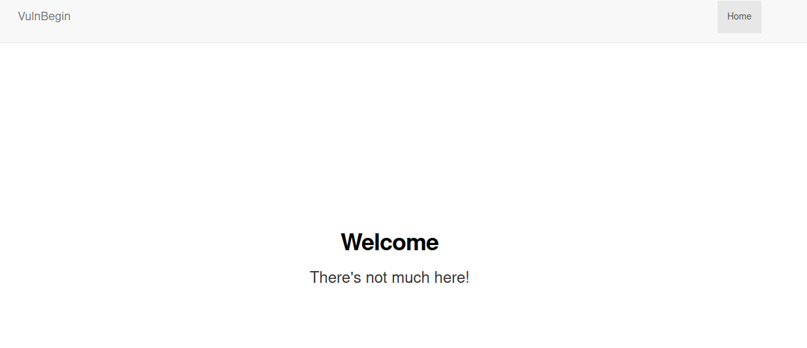
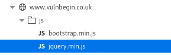

# VulnBegin

http://www.vulnbegin.co.uk/ - 9 flags to find

OK so we're greeted with well not a lot really....



Dev tools reveal there are no particularly interesting javascript for this page just jquery and bootstrap



Ok lets check if there's a robots.txt

```
User-agent: *
Disallow: /secret_d1rect0y/
```

Woo yup, this reveals a flag (no. 4)

```
[^FLAG^XXXXXXXXXXXXXXXXXXXXXXXXXXXXXXX^FLAG^]
```

Ok let's try some directory fuzzing. So first things first I have to work out how to set a cookie with my fuzzing tool of choice ffuf. Because....

```
If using automation tools you need to make sure you are setting the ctfchallenge cookie with every request or it will NOT work
```

Quick check of the help

```
ffuf -h                                                                                                                                     
Fuzz Faster U Fool - v1.3.1 Kali Exclusive <3

HTTP OPTIONS:
  -H                  Header `"Name: Value"`, separated by colon. Multiple -H flags are accepted.
```

Also need to limit the number of requests

```
Important Information

To avoid overloading the challenges please limit your requests to 10 per second

If you receive a HTTP status code 429 this is because you are requesting too much information from the challenges
```

Another check of the help reveals we can limit the threads with the -t and set the delay between requests with -p so we have a command similar to the below

```
ffuf -u 'https://www.vulnbegin.co.uk/FUZZ' -w /usr/share/wordlists/ctfchallenge/content.txt -H "Cookie: ctfchallenge=xxxxx" -t 1 -p 0.1
```

cppanel

admin